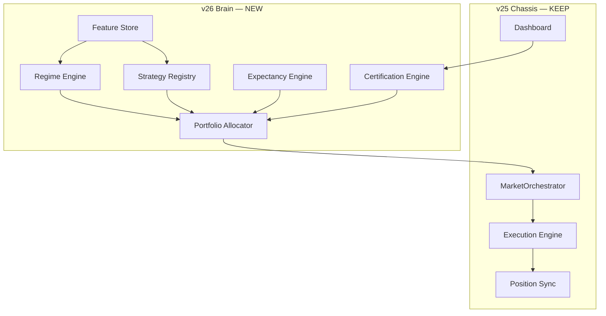

# IG Agent v26 — Strategic Framework

**v2 | June 2026 | CONFIDENTIAL**

| Field | Value |
|-------|-------|
| Lineage | v25.6+ operational chassis → **v26 profit engine** |
| Capital model | **£50,000** (demo or live) |
| Data assumption | **Unlimited** historical + feature compute |
| Daily target | **£1,000 net** (certified, not hoped) |
| Mode | **DEMO-first proof**, then live promotion |
| Status | **FRAMEWORK** — architectural north-star |

**Companion docs:** `IG_Agent_v26_PROFITABILITY_SPEC.md` (metrics/gates), `docs/V26_IMPLEMENTATION_PROCESS.md` (cadence)

---

## 0. Executive answer — rebuild or extend?

**Do not greenfield.** v25 solved hard production problems (REST budget, position sync, lifecycle, dashboard, multi-market threads, deal reconciliation). Throwing that away would reset risk, not edge.

**Do replace the brain.** v25 is a *single-strategy gate pipeline* (EMA/RSI rules + small ML blend). That architecture **caps** expectancy and market coverage. v26 keeps the **chassis** and installs a **portfolio decision system** on top.

| Layer | v25 | v26 |
|-------|-----|-----|
| **Chassis (keep)** | FastAPI, dashboard, `MarketOrchestrator`, execution engine, sync, watchdog, instance lock | Unchanged core |
| **Sensing (extend)** | OHLC cache, Lightstreamer, Yahoo seeder | **Feature store** + multi-timeframe + cross-asset |
| **Brain (replace)** | One `signal_engine` + ML blend | **Strategy registry** + regime router + portfolio allocator |
| **Risk (replace)** | Per-epic `risk_cap_gbp` | **Portfolio heat** in £ across strategies/markets |
| **Learning (upgrade)** | SQLite + XGBoost 4 features | Offline training farm + walk-forward + ensemble + attribution |
| **Proof (new)** | Ad-hoc replay | **Certification ladder** L0–L5 (replay → demo soak) |



---

## 1. Target maths at £50k (why this is now realistic)

```
Daily P&L ≈ Σ (strategy_s × markets_m × trades × E£) − friction
```

**£1,000 on £50k = 2.0% daily** — aggressive but **structurally plausible** with a diversified book, not lottery-tier (10% on £10k).

### 1.1 Certified profile (demo £1k)

| Input | Target |
|-------|--------|
| Active strategies | 3–4 (rules + momentum + session FX + ML meta) |
| Active markets | **12–20** epics (dynamic universe) |
| Qualified trades/day | **15–25** |
| Portfolio E£ | **£45–£70** |
| Friction budget | ≤ **15%** of gross wins |
| Concurrent risk | ≤ **£6,000** (12% of £50k) |
| Daily loss halt | **£2,000** (4%) |

**Example:** 18 trades × £58 E£ ≈ **£1,044** net.

### 1.2 Milestone ladder (£50k demo)

| ID | Median 14d daily | % capital | Certification |
|----|------------------|-----------|---------------|
| M1 | £200 | 0.4% | Replay + 7d forward |
| M2 | £500 | 1.0% | 14d forward, PF ≥ 1.4 |
| M3 | £750 | 1.5% | 14d forward, PF ≥ 1.5 |
| **M4** | **£1,000** | **2.0%** | **10/14 days ≥ £1k**, L5 audit |

---

## 2. Capital envelope (£50k)

```json
"capital_envelope": {
  "account_balance_gbp": 50000,
  "max_margin_pct": 0.25,
  "max_concurrent_risk_gbp": 6000,
  "max_daily_risk_deployed_gbp": 15000,
  "max_daily_loss_gbp": 2000,
  "max_daily_profit_target_gbp": 1000,
  "profit_cap_halt_new_entries": true,
  "min_available_gbp": 5000,
  "reserve_pct": 0.15
}
```

| Rule | Rationale |
|------|-----------|
| £6k concurrent | ~15 positions × ~£400 avg stop-risk |
| £15k daily deploy | Supports 20+ entries with rotation |
| £2k halt | 4% — room to recover intraday without week-kill |
| **Profit cap at £1k** | Proves target; prevents overtrading after goal |
| 15% reserve (£7.5k) | Never size as if full £50k is bulletproof |

---

## 3. Unlimited data — what changes

“Unlimited data” does **not** mean “more indicators in the loop.” It means an **offline research plane** separate from the **3 REST calls/min** live plane.

### 3.1 Two-plane architecture

| Plane | Purpose | Latency | Storage |
|-------|---------|---------|---------|
| **Research** | Train, walk-forward, certify, universe selection | Batch / overnight | Parquet + DuckDB feature store |
| **Live** | Stream ticks, score, allocate, execute | 5s loop | Snapshot cache + SQLite outcomes |

Research outputs **artifacts** the live plane loads:

- `strategy_weights.json` — capital share per strategy  
- `market_universe.json` — enabled epics + sessions  
- `ml_thresholds.json` — per epic/strategy veto floors  
- `setup_registry.json` — BAN/PROBE/ACTIVE  
- `certification_status.json` — L0–L5 pass/fail  

### 3.2 Feature store (new)

**Path:** `src/data/feature_store/` (Parquet partitions by epic/date)

| Feature family | Examples |
|----------------|----------|
| Price | Returns 1/3/6/12 bar, EMA spread, ATR ratio |
| Trend | 15m/1h alignment, ADX proxy |
| Vol | ATR percentile 20d/60d, realised vol |
| Micro | Spread percentile, tick age, quote freshness |
| Cross-asset | DXY direction, VIX proxy, correlated index returns |
| Session | One-hot session, minutes since open, calendar flag |
| Outcome labels | Win, R-multiple, MFE/MAE, friction £ |

**Ingest:** extend OHLC seeder + bulk historical pull (no REST budget limit in research batch jobs).

### 3.3 Training farm (new)

Overnight pipeline (unlimited compute):

1. Build features for full universe  
2. Walk-forward by month (no lookahead)  
3. Train per-strategy models + meta-ensemble  
4. Output certification pack for each strategy  
5. Promote only strategies with **positive OOS E£**

---

## 4. Strategy registry — multi-strategy, not one rules engine

v25: `signal_engine.evaluate()` → gates → trade.

v26: **Strategy plugins** compete for capital; **Portfolio Allocator** picks winners.

### 4.1 Strategy interface (new contract)

```python
class StrategyPlugin(Protocol):
    strategy_id: str
    def score(self, ctx: MarketContext) -> StrategySignal | None: ...
    def required_features(self) -> list[str]: ...
    def certified(self) -> bool: ...
```

### 4.2 Initial strategy set

| ID | Type | Markets | Role |
|----|------|---------|------|
| **S1_rules_v25** | EMA/RSI/ATR (current) | Indices, gold | Baseline — proven ops path |
| **S2_momentum** | Breakout + vol expansion | Indices, oil | Trend days |
| **S3_session_fx** | Session mean-reversion | EUR/USD, GBP/USD | London/NY overlap |
| **S4_ml_meta** | Ensemble classifier | All | Veto + rank; does not invent trades alone |

**Router logic:**

```
regime = RegimeEngine.classify(global_features)
candidates = [s for s in strategies if s.certified and s.allowed_in(regime)]
best = max(candidates, key=lambda s: s.score(ctx).ev_adjusted)
allocator.approve(best)  # or reject all
```

### 4.3 When to retire / add strategies

| Action | Trigger |
|--------|---------|
| **Ban strategy** | 30d OOS E£ < 0 |
| **Probe strategy** | New — 14d paper allocation ≤ 5% capital |
| **Promote strategy** | 14d OOS PF ≥ 1.4, WR ≥ 52% |
| **Add strategy** | Research cert L1 pass on 90d replay |

---

## 5. Dynamic market universe

Static `instruments` in JSON → **Market Universe Manager**.

### 5.1 Universe tiers

| Tier | Count | Selection |
|------|-------|-----------|
| **Core** | 4–6 | Japan, Nasdaq, Wall St, Gold + best replay WR |
| **Satellite** | 6–10 | FX, oil, DAX, HK, etc. — stream OK + OOS E£ > 0 |
| **Probe** | 2–4 | New epics, max PROBE risk only |

**Target:** 12–20 active epics across staggered sessions → **15–25 trades/day** without lowering global threshold.

### 5.2 Expansion gate (unchanged logic, automated)

1. Stream healthy 48h  
2. 90d replay WR ≥ 52% at strategy-specific threshold  
3. OOS E£ > 0 at assigned risk band  
4. Spread friction < 15% avg winner  
5. Correlation matrix slot available  
6. 7d PROBE forward on demo  

Universe written to `market_universe.json` weekly; live plane hot-reloads.

---

## 6. Portfolio allocator (replaces per-epic caps)

**Module:** `src/portfolio/allocator.py`

### 6.1 Decision flow

```
1. RegimeEngine → risk_multiplier (0.5 chop / 1.0 normal / 1.2 trend)
2. ExpectancyEngine → setup status + band (probe/core/conviction)
3. StrategyRegistry → candidate signals with ev_adjusted score
4. CorrelationMatrix → penalise duplicate factor exposure
5. CapitalBudget → clip size to heat limits
6. Emit TradeIntent → existing TradingLoop execution path
```

### 6.2 Risk bands at £50k

| Band | Stop-risk £ | When |
|------|-------------|------|
| Probe | £150–£250 | N < 30 or new epic |
| Core | £300–£450 | ACTIVE setup, WR ≥ 52% |
| Conviction | £500–£700 | WR ≥ 58%, ML + rules agree, HEALTHY |

Max **15** concurrent positions; **one per epic** (keep — diversify via universe, not stacking).

---

## 7. Regime engine (global brain)

**Module:** `src/signals/regime_engine.py`

| Regime | Detection | Portfolio response |
|--------|-----------|-------------------|
| **RISK_ON_TREND** | Vol rising, indices aligned | Favour S2 momentum, widen trails |
| **CHOP** | Low ADX, mean-reverting | Favour S3 FX, reduce size 50% |
| **RISK_OFF** | VIX spike, gold bid | Gold core up-weight; indices probe only |
| **EVENT** | Calendar high-impact ±30m | No new entries |
| **CAUTION** | Points WARNING/STOP | Conviction off, core only |

Unlimited data enables **trained regime classifier** (HMM or gradient boosting on daily features) — retrained weekly.

---

## 8. Certification model (reassurance)

**This is what makes £1k/day believable.**

| Level | Test | Pass criteria |
|-------|------|---------------|
| **L0** | P&L audit | DB = IG transactions; no suspect rows |
| **L1** | 90d replay portfolio | ≥ **30%** days ≥ £1k; median ≥ £500; max DD ≤ £4k |
| **L2** | Walk-forward 6m | OOS PF ≥ 1.4; no month E£ < 0 |
| **L3** | Shadow 14d | Net gate effect ≥ 0 £ |
| **L4** | Demo forward 14d | Median ≥ £750; PF ≥ 1.5 |
| **L5** | **Demo certificate** | **10/14 days ≥ £1k**; friction ≤ 15%; L0 clean |

**Promotion rule:** No live capital at M4 until **L5 on demo**.

**Artifact:** `src/data/state/certification_status.json` + dashboard **CERT** panel.

---

## 9. Gate model (v26 live path)

v25 seven gates remain for **execution safety**. v26 adds **decision gates** before them:

| Gate | Module | Fail = |
|------|--------|--------|
| `regime_ok` | RegimeEngine | WAIT |
| `strategy_certified` | StrategyRegistry | WAIT |
| `expectancy_ok` | ExpectancyEngine | WAIT |
| `universe_active` | UniverseManager | WAIT |
| `ml_veto` | ML ensemble | WAIT |
| `portfolio_budget` | Allocator | WAIT |
| *(then v25 gates 1–7)* | trading_loop | WAIT |

Dashboard: collapse into **DECIDE** (6) + **EXECUTE** (7) groups.

---

## 10. Demo vs live

| Aspect | Demo | Live |
|--------|------|------|
| Proof target | L5 certificate | Re-run L4–L5 at 50% size |
| Sizing | Full £50k envelope | Start 50% bands until 14d live PF ≥ 1.4 |
| Streams | Some epics fail (DAX) | Per-account verification |
| Friction | Log and haircut replay by +10% | Required |

Demo is **not** fake — real IG demo REST/stream. Certification assumes **replay friction haircut** before forward soak.

---

## 11. Implementation roadmap

### Phase A — Research plane (v26.0)

| Deliverable | Keeps v25 live running |
|-------------|------------------------|
| Feature store builder | Yes |
| `replay_daily_pnl.py` portfolio mode | Yes |
| Walk-forward trainer | Yes |
| Certification L1/L2 automation | Yes |

### Phase B — Decision plane (v26.1)

| Deliverable |
|-------------|
| Strategy plugin interface + S1 wrapper (current rules) |
| Expectancy engine + setup registry |
| Regime engine v1 (rule-based) |
| Portfolio allocator v1 |
| `config/config_v26.json` + £50k envelope |

### Phase C — Universe expansion (v26.2)

| Deliverable |
|-------------|
| Market universe manager |
| Enable S2 momentum + FX S3 |
| 12+ epics on demo |
| Shadow counterfactual |

### Phase D — ML farm (v26.3)

| Deliverable |
|-------------|
| S4 meta-ensemble |
| Per-strategy walk-forward thresholds |
| Regime classifier trained |

### Phase E — Certification soak (v26.4)

| Deliverable |
|-------------|
| `demo_soak_certify.py` |
| 14d demo run → L5 |
| PROFIT + CERT dashboard tabs |

### Phase F — Live promotion (v26.5)

| Deliverable |
|-------------|
| 50% size live probation |
| Full size after 14d live PF ≥ 1.4 |

---

## 12. Repository layout (new)

```
src/
  portfolio/           # allocator, heat, correlation matrix
  strategies/          # S1_rules, S2_momentum, S3_fx, base plugin
  signals/             # regime_engine (existing signal_engine stays for S1)
  research/            # feature_store, walk_forward, certification
  trading/             # trading_loop (thin — calls allocator)
  data/feature_store/  # parquet partitions
config/
  config_v26.json
  market_universe.json   # generated
  calendar.json
scripts/
  build_feature_store.py
  replay_daily_pnl.py
  walk_forward_train.py
  demo_soak_certify.py
  certify_ladder.py
```

---

## 13. What success looks like (12-week model)

| Week | Outcome |
|------|---------|
| 1–2 | Feature store + L1 replay on £50k config |
| 3–4 | S1 wrapped; expectancy ban live; allocator v1 |
| 5–6 | 12 epics; S2/S3 probed; L2 walk-forward pass |
| 7–8 | ML meta veto; regime router; L3 shadow pass |
| 9–10 | Demo forward; chasing L4 median £750 |
| 11–12 | **L5: 10/14 days ≥ £1k** → demo certified |

---

## 14. Summary — driving toward the model

1. **Keep v25 chassis** — execution, sync, dashboard, orchestrator.  
2. **Replace single-strategy brain** with registry + regime + allocator.  
3. **Exploit unlimited data offline** — feature store, walk-forward, certification.  
4. **Expand universe** to 12–20 epics — frequency without dilution.  
5. **£50k envelope** — £6k concurrent, £1k target = 2% (achievable band).  
6. **Prove L1→L5** — replay before forward; demo certificate before live.  
7. **Demo first** — real IG path, audited P&L, profit cap at £1k.

**Not a different repo. A different decision layer on a proven execution stack.**

---

*IG Agent v26 Strategic Framework v2 — £50k · Unlimited data · Demo-certified £1k/day*
