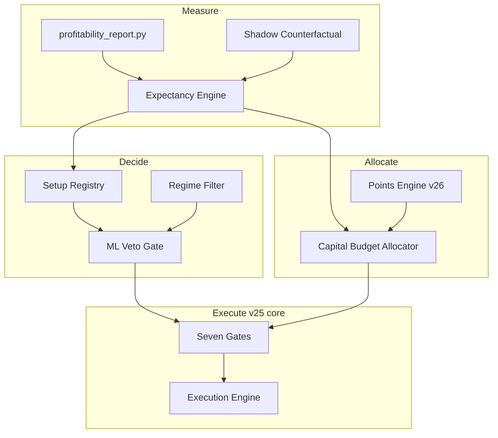
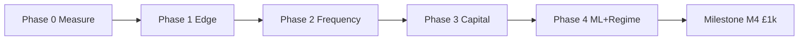

# IG Agent v26 — Profitability Specification

**DRAFT v1 | June 2026 | CONFIDENTIAL**

| Field | Value |
|-------|-------|
| Application lineage | v25.6.0+ → **v26** |
| Spec version | **v26.1** (profitability north-star) |
| Foundation | v25 operational spec v8 (unchanged lifecycle/dashboard core) |
| Capital assumption | **~£10,000** total account value |
| Trade style | **Multiple trades/day** across uncorrelated markets |
| Ultimate target | **£1,000 net/day** (stretch); staged milestones below |
| Status | **PARTIALLY IMPLEMENTED** — M0 calibration window active (see §16 + Appendix) |

---

## Purpose — Read This First

v25 shipped a **reliable multi-market agent** (gates, points, ML blend, dashboard, lifecycle).  
v26 defines **how that agent becomes profit-driven** on a **~£10k account** through measurable expectancy, controlled frequency, and capital-aware sizing.

This document is the **north-star for all v26 work**. It does not replace v8 for operational behaviour already shipped; it **extends** v8 with new modules, config, gates, and a mandatory measurement process.

**Operator principle:** No config change, market enable, or size increase is valid unless it improves **rolling £ expectancy** on the metrics in Section 4.

---

## 1. The Profit Equation (Binding)

All v26 design decisions must map to one of these terms:

```
Daily P&L ≈ N × E£ − friction

N   = qualified trades taken per day
E£  = expectancy per trade in GBP
      = (WR × avg_win£) − ((1−WR) × avg_loss£)
friction = spread + slippage + session flatten cost
```

### 1.1 Target decomposition (£10k account)

| Milestone | Daily target | % of capital | Required profile (indicative) |
|-----------|--------------|--------------|-------------------------------|
| **M1 — Prove** | £100/day | 1.0% | 8 trades × £12.5 E£ |
| **M2 — Stable** | £250/day | 2.5% | 10 trades × £25 E£ |
| **M3 — Strong** | £500/day | 5.0% | 12 trades × £42 E£ |
| **M4 — Stretch** | **£1,000/day** | 10.0% | 15 trades × £67 E£ **or** 10 trades × £100 E£ |

**£1,000/day on £10k is a stretch goal**, not day-one config. v26 reaches it only when **M1→M3 are proven for 14 consecutive trading days** each.

### 1.2 Current v25 baseline (why v26 exists)

| Metric | v25.6 typical | M4 gap |
|--------|---------------|--------|
| Live WR | ~46% | Need **52–55%** on filtered book |
| Trades/day | 5–12 | Need **12–18** qualified |
| E£/trade | £10–£30 | Need **£50–£80** |
| Daily P&L band | £50–£250 | Need **£1,000** |

v26 closes the gap by **concentrating edge**, **expanding qualified opportunity**, and **allocating capital deliberately** — not by lowering thresholds blindly.

---

## 2. Capital & Risk Envelope (£10k)

### 2.1 Hard constraints (v26 config block: `capital_envelope`)

```json
"capital_envelope": {
  "account_balance_gbp": 10000,
  "max_margin_pct": 0.20,
  "max_concurrent_risk_gbp": 1200,
  "max_daily_risk_deployed_gbp": 2500,
  "max_daily_loss_gbp": 500,
  "max_daily_profit_target_gbp": 1000,
  "min_available_gbp": 100,
  "reserve_pct": 0.10
}
```

| Rule | Value | Rationale |
|------|-------|-----------|
| Max margin | 20% (£2,000) | Slight uplift from v25 15%; still leaves buffer |
| Max concurrent risk | £1,200 | ~4 positions × ~£300 risk without stacking recklessly |
| Max daily risk deployed | £2,500 | Sum of stop-risk on all entries in a day |
| Max daily loss | £500 | **Halt** — unchanged safety rail |
| Reserve | 10% (£1,000) | Never size as if 100% is deployable |

### 2.2 Per-trade risk bands (v26 replaces flat `risk_cap_gbp` logic)

| Band | When | Risk per trade | Max concurrent |
|------|------|----------------|----------------|
| **Probe** | Setup WR < 52% or N < 30 | £50–£80 | 2 |
| **Core** | Setup WR 52–58%, N ≥ 30 | £80–£150 | 4 |
| **Conviction** | Setup WR ≥ 58%, ML agree, HEALTHY | £150–£250 | 3 |
| **No trade** | STOP / negative EV / event block | £0 | — |

Risk bands are chosen by **Expectancy Engine** (Section 5), not static config alone.

**Implemented (June 2026 — confidence bands, live):** `config_v26.json` → `risk_bands` drives **Probe / Core / Full** sizing by **entry confidence** (not yet per `setup_key`). Module: `src/system/risk_bands.py`; wired in `trading_loop._gate_risk_validation`, `execution_engine`, `points_engine`. See **Current Calibration Appendix**.

### 2.3 Structural alignment (v25 incoherence fixed in v26)

| v25 problem | v26 fix |
|-------------|---------|
| £1,000 ambition vs £500 halt only | Explicit `max_daily_risk_deployed_gbp` + milestone targets |
| Fixed `risk_cap_gbp` per epic | Dynamic band per **setup_key** |
| `one_position_per_epic: true` limits book | Keep true; add **more epics** instead of stacking |
| Sizing ignores portfolio risk | **Capital Budget Allocator** (Section 5.3) |

---

## 3. v26 Architecture — Five New Systems



### 3.1 Relationship to v25

| v25 component | v26 change |
|---------------|------------|
| Seven gates | Add **gate 5b** `expectancy_ok` and **gate 6b** `ml_veto` |
| ML blend | **Demote blend** → **veto mode** when `ml_mode: veto` |
| Points engine | Size multiplier **capped by capital allocator** |
| Correlation guard | Add **portfolio heat** (sum open risk £) |
| Config | New `capital_envelope`, `expectancy`, `ml_veto`, `regime` blocks |
| Dashboard | New **PROFIT** tab: E£, N, milestone progress |

---

## 4. Measurement Layer (Phase 0 — ship first)

**Nothing in v26 runs without daily truth.**

### 4.1 Primary metrics (rolling 14 trading days)

| Metric ID | Formula | M1 gate | M3 gate | M4 gate |
|-----------|---------|---------|---------|---------|
| `E£_portfolio` | Mean realised P&L per **qualified** trade | ≥ £12 | ≥ £40 | ≥ £65 |
| `WR_qualified` | Wins / qualified trades | ≥ 50% | ≥ 53% | ≥ 55% |
| `PF` | Gross wins / gross losses | ≥ 1.2 | ≥ 1.4 | ≥ 1.6 |
| `N_day` | Qualified trades per day (median) | ≥ 6 | ≥ 10 | ≥ 12 |
| `friction_pct` | Spread+slippage / gross wins | ≤ 25% | ≤ 20% | ≤ 15% |
| `max_dd_14d` | Peak-to-trough £ on rolling 14d | ≤ £400 | ≤ £500 | ≤ £600 |

**Qualified trade** = passed all entry gates + tagged with `setup_key` + not `legacy_pnl_suspect`.

### 4.2 Segmentation (mandatory dimensions)

Every closed trade and shadow signal must be reportable by:

- `epic` / market name  
- `session` (asia_early, london_us_overlap, etc.)  
- `setup_key`  
- `confidence_band` (high / standard / marginal)  
- `ml_probability` decile  
- `points_state` at entry  
- `risk_band` (probe / core / conviction)  
- `exit_reason` (stop / trail / partial / session_flatten / manual)

### 4.3 Scripts & stores (v26 extends v25)

| Artifact | Path | v26 enhancement |
|----------|------|-----------------|
| Profitability report | `scripts/profitability_report.py` | Add `--expectancy`, `--milestones`, JSON export |
| Shadow counterfactual | **NEW** `scripts/shadow_expectancy.py` | Label blocked signals via replay |
| Expectancy snapshot | **NEW** `src/data/state/expectancy_snapshot.json` | Daily write for dashboard |
| Weekly operator pack | **NEW** `docs/weekly/YYYY-MM-DD_v26_pack.md` | Auto-generated Sunday |

---

## 5. Decision Layer (Phase 1–2)

### 5.1 Expectancy Engine

**NEW module:** `src/trading/expectancy_engine.py`

Responsibilities:

1. Maintain rolling stats per `setup_key` (N, WR, avg win £, avg loss £, E£).  
2. Classify setup: `ACTIVE` | `PROBE` | `SUSPENDED` | `BANNED`.  
3. Expose `allowed_risk_band(setup_key) → probe|core|conviction|none`.  
4. Emit `expectancy_ok` gate pass/fail.

**Suspension rules (default):**

| Condition | Action |
|-----------|--------|
| N ≥ 20 and WR < 45% | `BANNED` — no entries |
| N ≥ 20 and E£ < 0 | `SUSPENDED` — review weekly |
| N < 30 and WR ≥ 52% | `PROBE` only |
| N ≥ 30 and WR ≥ 52% and E£ > 0 | `ACTIVE` |

### 5.2 Setup Registry

**NEW module:** `src/system/setup_registry.py`  
**Persisted:** `src/data/state/setup_registry.json`

- Mirrors expectancy classifications.  
- Operator overrides with expiry (e.g. force-enable Germany for 7 days).  
- Dashboard: list setups with E£ and status.

### 5.3 Capital Budget Allocator

**NEW module:** `src/execution/capital_budget.py`

Before each entry:

```
remaining_daily_risk = max_daily_risk_deployed - sum(open_stop_risk_gbp) - sum(closed_risk_today)
remaining_concurrent = max_concurrent_risk - sum(open_stop_risk_gbp)
proposed_risk = min(band_cap, epic_cap, allocator_slice)
```

**Allocator slices (default £10k):**

| Slots | Max open positions | Risk per slot (core) |
|-------|-------------------|----------------------|
| 4 markets × 1 position | 4 | up to £300 each, total ≤ £1,200 |

If `remaining_daily_risk < proposed_risk` → block entry (log `capital_budget_exhausted`).

### 5.4 ML Veto (replaces weak blend for v26)

**Config:**

```json
"ml_veto": {
  "enabled": true,
  "mode": "veto",
  "min_labelled_rows": 500,
  "min_probability": 0.58,
  "min_probability_high_conf": 0.55,
  "setup_specific_thresholds": true,
  "blend_fallback": false
}
```

| Mode | Behaviour |
|------|-----------|
| `blend` (v25) | Adjust confidence ± blend |
| **`veto` (v26 default)** | If prob < threshold → **hard block**; else rules score unchanged |

Per-epic thresholds loaded from `src/data/ml_model/thresholds.json` (walk-forward output).

### 5.5 Regime Filter (Phase 2)

**NEW module:** `src/signals/regime_filter.py` (full unified filter — still Phase 4 target)

Inputs (v26.2+):

| Input | Source | Effect | Live status |
|-------|--------|--------|-------------|
| ATR percentile (rolling 5m) | Signal engine candles | Extreme vol → confidence penalty on indices | **Implemented/Live** — `src/system/live_regime_gate.py`; soft −15% on DOW/NASDAQ at ≥95th ATR percentile (not hard block) |
| Economic calendar | `config/calendar.json` + Finnhub ingest | Block around high-impact events | **Implemented/Live** — `calendar_gate` ±15 min; nightly `v26_nightly.py` + `com.igagent.v25.v26nightly` launchd |
| Cross-market direction | Open positions snapshot | Reduce size when 3+ same direction | **Research/Shadow** — `v26/regime/router.py` shadow only |

---

## 6. Execution Layer Changes (Phase 2–3)

### 6.1 Gate flow (v26 = nine checks, seven dashboard groups)

| # | Gate | v26 change | Live status |
|---|------|------------|-------------|
| 1–4 | session, gap, fitness, points | Unchanged | v25 core |
| **5a** | risk_validation | Applies **risk_band** clip (probe £50–£80) | **Implemented/Live** |
| **5b** | **`expectancy_ok`** | Setup not **BANNED** when registry enabled | **Implemented/Live** (gate wired); registry **`enabled: false`** during calibration — see Appendix |
| **5c** | **`capital_budget`** | Portfolio heat OK | **Partial** — `portfolio_gate` + `capital_envelope` live; full allocator Phase 3 |
| 5d | **`calendar_ok`** | Macro veto | **Implemented/Live** |
| 6a | signal_confidence | Vol soft penalty on indices | **Implemented/Live** (Tier 2 soft gate) |
| **6b** | **`ml_veto`** | prob ≥ threshold | **Partial** — EUR/USD S4 veto live |
| 7 | execution | Correlation guard uses **£ heat** not just count | **Partial** — correlation guard + envelope live |

Dashboard LIVE tab: **risk_band** badge + **threshold_pass** chips (≥70–≥85) on confidence panel; gate coherence snapshot 4×/day.

### 6.2 Exit optimisation (v26.1)

| Parameter | v25 | v26 target |
|-----------|-----|------------|
| Partial close | 50% @ 1.5R | Keep; **attribute P&L** to `exit_reason=partial` |
| Trail | ATR multiple | **Per-epic** overrides from replay MFE/MAE |
| Session flatten | All positions | **v26 option:** flatten losers only, trail winners |

**NEW metric:** `capture_ratio = realised_R / MFE_R` — target ≥ 0.55 portfolio median.

### 6.3 Market book (v26 target state)

**Phase 1 (v26.0):** 4 enabled — Japan, Wall St, Gold, Nasdaq (unchanged).  
**Phase 2 (v26.2):** +1 epic per month max if checklist passes (Section 7).  
**Phase 3 (v26.4):** 6–8 epics, **one position each**, staggered sessions for **12–18 N/day**.

---

## 7. Market Expansion Checklist (mandatory)

An epic is enabled only when **all** are true:

| # | Criterion | Tool |
|---|-----------|------|
| 1 | Lightstreamer stream OK 48h | `pre_flight_check.py --live` |
| 2 | Replay WR ≥ 52% at epic threshold | `analyse_replay.py --epic` |
| 3 | Replay E£ > 0 at assigned risk band | shadow + replay |
| 4 | Spread cost < 15% of avg winner £ | profitability report |
| 5 | Correlation overlap acceptable | correlation matrix |
| 6 | 14-day probation in `PROBE` band | expectancy engine |

**Germany 40:** remains disabled until criterion 1 passes on target account.

---

## 8. Process — Logical Steps to Success

### 8.1 Phase map



| Phase | Version | Deliverable | Exit gate |
|-------|---------|-------------|-----------|
| **0 — Measure** | v26.0 | Expectancy engine read-only; enhanced reports; PROFIT tab skeleton | 14d of clean segmented data |
| **1 — Edge** | v26.1 | Setup registry; BANNED/SUSPENDED; ML veto optional | M1: £100/day median 14d |
| **2 — Frequency** | v26.2 | +1–2 epics; session tuning; shadow counterfactual | M2: £250/day median 14d |
| **3 — Capital** | v26.3 | Capital budget allocator; conviction bands | M3: £500/day median 14d |
| **4 — Intelligence** | v26.4 | Regime filter; per-epic ML thresholds; exit MFE tuning | M4: £1,000/day **best days**; £500 median |
| **5 — Autonomy** | v26.5 | Weekly auto-tune within bounds; operator approve via dashboard | Sustained M3+ with max DD within cap |

### 8.2 Weekly operator cadence (every Sunday)

| Step | Command / action |
|------|------------------|
| 1 | `profitability_report.py --days 14 --expectancy --milestones` |
| 2 | `shadow_expectancy.py --days 7` |
| 3 | `run_ml_retrain_pipeline.sh` (if labels grew > 5%) |
| 4 | Review `weekly_v26_pack.md` — approve/reject setup status changes |
| 5 | Apply config diff **only** for approved changes |
| 6 | `pytest tests/test_v26_*.py -q` + `test_deployed_fixes.py` |

Launchd: extend `com.igagent.v25.profitability.plist` → v26 pack generation.

### 8.3 Daily AI/operator loop (weekdays)

| Time | Action |
|------|--------|
| Pre-open | Check milestone dashboard; confirm calendar blocks |
| During | Monitor `N_day`, running E£, friction; halt if daily loss → £400 (soft warning) |
| Post-close | Snapshot daily metrics; compare to milestone path |
| On STOP state | Root-cause: setup, session, or friction — **no threshold cuts same day** |

### 8.4 What the AI controller needs (explicit)

| Need | Provided by |
|------|-------------|
| Segmented trade truth | Learning DB + v26 expectancy snapshot |
| Authority to suspend setups | Setup registry (bounds in config) |
| Risk budget visibility | Capital budget allocator |
| Counterfactual on blocks | Shadow expectancy script |
| Walk-forward ML thresholds | Retrain pipeline + `thresholds.json` |
| Human capital mandate | Operator sets `capital_envelope` once per phase |
| Go/no-go on new epics | Market expansion checklist |

---

## 9. Configuration Schema (v26 additions)

New top-level keys in `config/config_v26.json` (inherits v25, overrides listed):

```json
{
  "version": "26.0.0",
  "capital_envelope": { },
  "expectancy": {
    "min_trades_per_setup": 20,
    "ban_wr_below": 0.45,
    "probe_until_trades": 30,
    "active_wr_min": 0.52,
    "rolling_days": 14
  },
  "ml_veto": { },
  "regime": {
    "calendar_enabled": true,
    "atr_percentile_block_above": 95,
    "same_direction_soft_cap": 3
  },
  "milestones": {
    "current": "M1",
    "daily_target_gbp": 100,
    "prove_days": 14
  }
}
```

Per-instrument overrides add:

```json
"risk_band_caps_gbp": {
  "probe": 80,
  "core": 150,
  "conviction": 250
}
```

---

## 10. Dashboard (v26 PROFIT tab)

| Panel | Content |
|-------|---------|
| Milestone tracker | M1–M4 progress bars vs 14d rolling |
| Today | N, gross, net, friction, running E£ |
| Setup league table | setup_key, N, WR, E£, status, suggested band |
| Capital | concurrent risk / £1,200, daily deployed / £2,500 |
| Blockers | Top shadow blocks with £ counterfactual |
| Actions | Approve weekly setup changes (v26.5) |

Strategy Help: add link “v26 profitability model”.

---

## 11. Testing & Acceptance (v26)

**NEW test modules:**

| File | Proves |
|------|--------|
| `tests/test_v26_expectancy_engine.py` | BAN/PROBE/ACTIVE transitions |
| `tests/test_v26_capital_budget.py` | Concurrent + daily risk caps |
| `tests/test_v26_ml_veto.py` | Veto blocks; blend off |
| `tests/test_v26_milestones.py` | M1–M4 gate math |

**Acceptance before live capital scale:**

1. 14d replay + live **shadow** agree within 5% WR.  
2. `E£_portfolio` live ≥ 80% of replay on same setups.  
3. Max DD in soak ≤ `max_dd_14d` for current milestone.  
4. All `test_v26_*` + `test_deployed_fixes` green.

---

## 12. Realistic Outcomes on £10k (honest)

| Outcome | Probability if process followed | Time |
|---------|----------------------------------|------|
| M1 £100/day sustained | **Achievable** | 4–8 weeks from v26.0 |
| M2 £250/day | **Achievable** with edge + 1–2 epics | 3–4 months |
| M3 £500/day | **Stretch** — needs full book + conviction sizing | 6–9 months |
| M4 £1,000/day every day | **Unlikely daily**; possible **best days** with M3 base | 9–12+ months |
| M4 £1,000/day median | Requires exceptional edge or leverage beyond spec | Not guaranteed |

v26 **does not promise** 10% daily returns. It **engineers** the path and stops capital destruction when edge is absent.

---

## 13. Implementation Backlog (ordered)

| Priority | Item | Phase | Status |
|----------|------|-------|--------|
| P0 | `expectancy_engine.py` read-only + snapshot | 0 | **Done** — `v26/expectancy/engine.py` + `expectancy_snapshot.json` |
| P0 | `profitability_report.py --expectancy --milestones` | 0 | Partial |
| P0 | PROFIT dashboard tab (read-only) | 0 | Partial — `ProfitPanel.jsx` |
| P1 | `setup_registry.py` + gate `expectancy_ok` | 1 | **Done** (gate live; registry **off** for calibration) |
| P1 | `ml_veto` gate + config | 1 | **Partial** — EUR/USD |
| P1 | `config/config_v26.json` skeleton | 1 | **Done** |
| P1 | **Risk bands / probe sizing** (`risk_bands.py`) | 1 | **Done — Live** |
| P1 | **Live vol soft gate** (`live_regime_gate.py`) | 2 | **Done — Live** (indices) |
| P1 | Gate coherence audit (4×/day + per-market) | 1 | **Done** — `gate_coherence.py`, launchd |
| P1 | Feeder `threshold_pass` + feature store | 0 | **Done** |
| P2 | `capital_budget.py` + gate | 3 | Pending |
| P2 | `shadow_expectancy.py` | 2 | Partial — shadow v26 stack |
| P2 | Per-epic trail from MFE/MAE replay | 2 | **Done** — `trail_tuner.py` |
| P3 | `regime_filter.py` (unified) + calendar | 4 | Calendar **live**; unified filter pending |
| P3 | Weekly auto pack + approve UI | 5 | Partial — `v26_weekly_pack.py` launchd |

---

## 14. v25 → v26 Spec Relationship

| Document | Role |
|----------|------|
| `IG_Agent_v25_COMPLETE_SPEC_v8.md` | **Operational truth** for shipped v25 behaviour |
| **`IG_Agent_v26_PROFITABILITY_SPEC.md`** | **North-star** for profitability extension |
| `docs/V26_IMPLEMENTATION_PROCESS.md` | Week-by-week operator/dev checklist |

v26 ships **incrementally** (v26.0, v26.1, …). App `version` in config bumps per phase completion.

---

## 15. Summary — Logical Steps to Success

1. **Measure** — Know E£ per setup; stop flying blind.  
2. **Concentrate** — Ban negative EV; probe unproven; core only proven.  
3. **Frequency** — Add epics/sessions only when checklist passes.  
4. **Allocate** — Fit risk to £10k envelope; multiple trades, not oversized singles.  
5. **Veto** — ML blocks losers; does not invent edge.  
6. **Regime** — Calendar and vol filter reduce friction.  
7. **Milestone** — M1 → M2 → M3 → M4; **14 days each** before advance.  
8. **Autonomy** — Weekly AI proposals; human approves until trust established.

---

## 16. Implemented Layers (bidirectional sync — June 2026)

Status of v26 modules that bridge shadow/research and **live v25 execution**. Core profit equation, milestones (§1.1), and measurement gates (§4) are **unchanged**.

| Layer | Module / config | Was | Now | Notes |
|-------|-----------------|-----|-----|-------|
| **Risk bands / probe sizing** | `src/system/risk_bands.py`, `config_v26.risk_bands` | Research/Shadow | **Implemented/Live** | Confidence-based Probe/Core/Full; not yet setup_key-driven |
| **Live volatility soft gate** | `src/system/live_regime_gate.py`, `config_v26.regime.live_vol_soft_gate` | Research/Shadow (`v26/regime/router.py`) | **Implemented/Live** | −15% confidence on DOW/NASDAQ at extreme ATR; WARNING-tier, not hard block |
| **Macro calendar gate** | `src/system/calendar_gate.py`, Finnhub ingest | Partial / ±30m spec | **Implemented/Live** | ±15 min hard block; nightly `v26_nightly` @ 22:30 |
| **Setup registry / expectancy_ok** | `src/system/setup_registry.py`, gate in `trading_loop` | Spec only | **Implemented/Live** (inactive) | Gate wired; `enabled: false` until n≥20 ban baseline |
| **Portfolio envelope** | `src/system/portfolio_envelope.py` | Spec | **Implemented/Live** | Concurrent + daily deploy caps |
| **Gate coherence** | `src/system/gate_coherence.py` | — | **Implemented/Live** | 4×/day per-market alignment audit |
| **ML veto (S4)** | `ml_veto` config | Partial | **Partial/Live** | EUR/USD whitelist |
| **Capital budget allocator** | §5.3 | Spec | Research/Shadow | Phase 3 |
| **Unified regime filter** | §5.5 `regime_filter.py` | Spec | Research/Shadow | Shadow router only for strategy selection |

**Code audit — files touched in calibration sprint (representative):**

| Area | Paths |
|------|-------|
| Risk bands | `src/system/risk_bands.py`, `src/trading/trading_loop.py`, `src/execution/execution_engine.py`, `src/trading/points_engine.py` |
| Vol soft gate | `src/system/live_regime_gate.py`, `src/trading/trading_loop.py` (`_gate_signal_confidence`) |
| Config | `config/config_v25.json`, `config/config_v26.json`, `config/calendar.json` |
| Calendar / ops | `src/system/calendar_gate.py`, `scripts/v26_nightly.py`, `scripts/com.igagent.v25.v26nightly.plist`, `scripts/install_launchd.sh` |
| Measurement | `src/feeder/event_bus.py`, `v26/research/feature_store.py`, `dashboard/src/tabs/LiveTab.jsx` |
| Coherence | `src/system/gate_coherence.py`, `scripts/run_gate_coherence_check.py` |
| Tests | `tests/test_risk_bands.py`, `tests/test_live_regime_gate.py`, `tests/test_setup_registry.py` |

---

## Current Calibration Appendix

**Active from:** June 2026 restart · **Duration:** 7-day data-gathering window (M0) · **Milestone:** `current: M0` in `config_v26.json`

| Parameter | Live value | Config / code |
|-----------|------------|---------------|
| **Entry confidence floor** | **72%** | `config_v25.confidence_floor`, `config_v26.risk_bands.entry_confidence_floor` |
| **Probe band** | **72%–&lt;80%** confidence | `probe_max_confidence: 80` |
| **Probe risk bounds** | **£50–£80** linear vs confidence | `probe_risk_gbp_min` / `probe_risk_gbp_max`; `apply_risk_band_to_size()` |
| **Core band** | **80%–&lt;85%** | `core_size_multiplier: 0.65` |
| **Full size** | **≥85%** confidence | `full_size_min_confidence: 85` |
| **Live vol soft gate** | **−15%** confidence penalty | DOW + NASDAQ when ATR ≥ **95th** percentile (`atr_percentile_block_above: 95`) |
| **Macro calendar veto** | **±15 minutes** | High-impact Finnhub + `calendar.json` events; `calendar_block_minutes_before/after: 15` |
| **DOW pilot epic** | `IX.D.DOW.IFM.IP` | `config_v26.pilot.primary_epic` |
| **DOW pilot RRR target** | **2.5R** | `instruments.wall_street.reward_multiple: 2.5` |
| **DOW pilot WR target (review)** | **60%** | `config_v26.pilot.target_wr: 0.6` (measurement only) |
| **Setup registry** | **`enabled: false`** | `src/data/state/setup_registry.json` — bans require **n ≥ 20** per `setup_key`; gate passes all while off |
| **Expectancy gate behaviour** | Pass (inactive) | `expectancy_ok` detail: *setup registry inactive* |
| **Dashboard surfacing** | Live tick | `signal.risk_band`, `signal.threshold_pass` (≥70/75/80/85), `probe_risk_gbp_target` |
| **Nightly ops** | 22:30 local | `bash scripts/install_launchd.sh --ops-only` → Finnhub + feature store (`build_feature_store.py --days 7`) |

**Operator pre-flight:** Live tab → `expectancy ok` = PASS · `setup registry inactive` · probe badge visible on 72–79% signals before restart completes calibration logging.

---

*IG Agent v26 — Profitability Specification v1 — Confidential*  
*£10k capital · Multiple trades · Expectancy-driven · June 2026*
