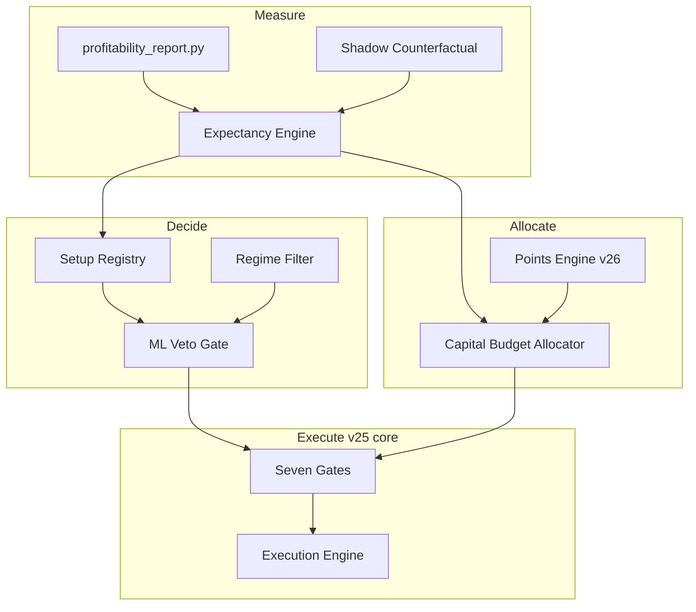
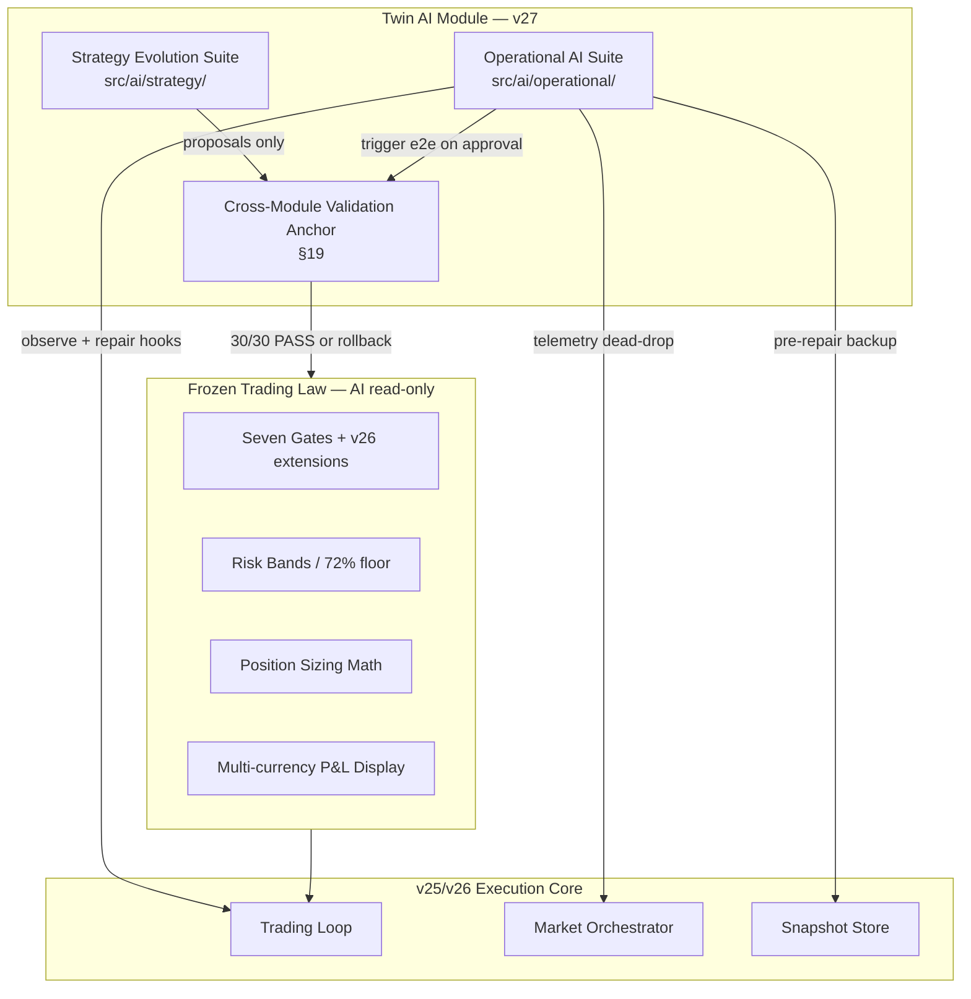
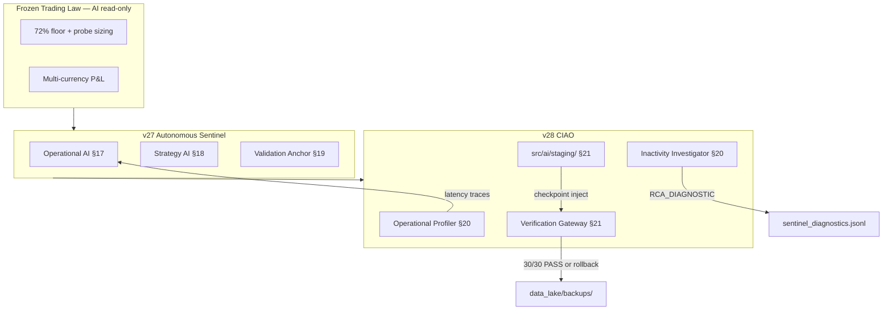
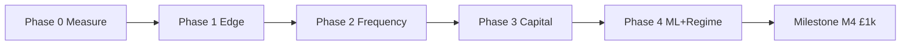
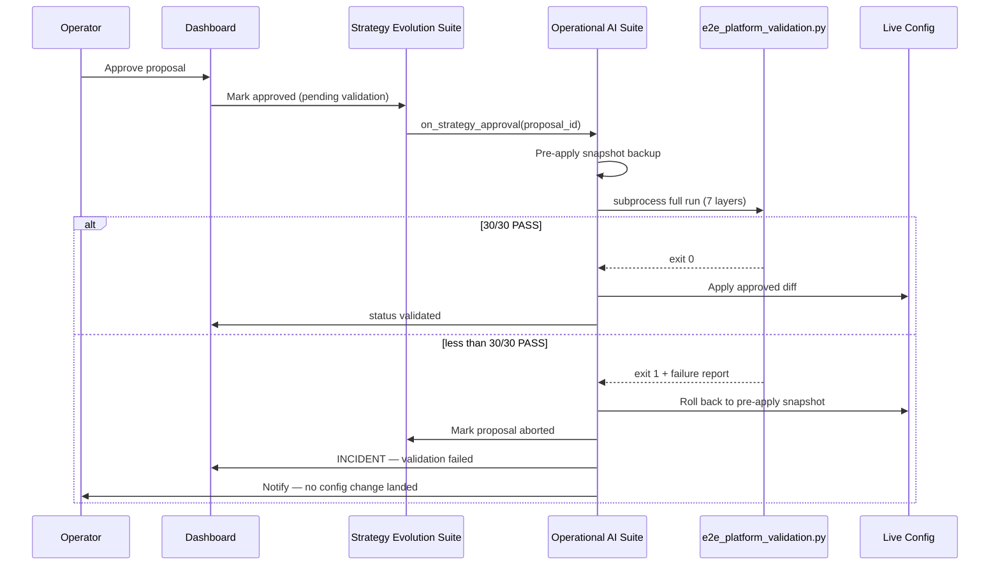
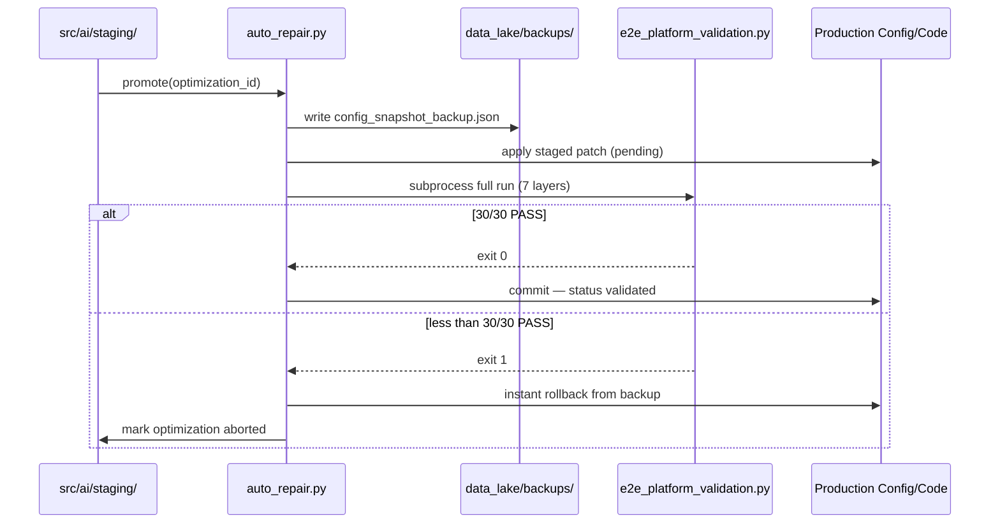

# IG Agent v28 — Profitability Specification
## The Continuous Integration & Adaptive Optimization Engine (CIAO)

**DRAFT v3 | June 2026 | CONFIDENTIAL**

| Field | Value |
|-------|-------|
| Application lineage | v25.6.0+ → v26 → v27 → **v28** |
| Spec version | **v28.0** (CIAO — self-healing code + strategy automation) |
| Foundation | v25 operational spec v8 (unchanged lifecycle/dashboard core) |
| Profitability foundation | v26 profitability north-star (§1–§16 — **frozen trading law**) |
| AI foundation | v27 Autonomous Sentinel — Twin AI Module (§17–§19) |
| Capital assumption | **~£10,000** total account value |
| Trade style | **Multiple trades/day** across uncorrelated markets |
| Ultimate target | **£1,000 net/day** (stretch); staged milestones below |
| Status | **v28-M1: Continuous Integration Sandbox Active** |

---

## Purpose — Read This First

v25 shipped a **reliable multi-market agent** (gates, points, ML blend, dashboard, lifecycle).  
v26 defines **how that agent becomes profit-driven** on a **~£10k account** through measurable expectancy, controlled frequency, and capital-aware sizing.  
**v27 (Autonomous Sentinel)** formalises a **Twin AI Module** architecture — separating **operational autonomy** (runtime health, repair, validation) from **strategy evolution** (research, proposals, backtests) — without altering core trading law.  
**v28 (CIAO)** extends v27 with **self-healing code** (operational profiling, inactivity root-cause analysis) and **strategy automation** (isolated staging, checkpointed injection) — still bound by frozen trading law and the **30/30 PASS** verification gateway.

This document is the **north-star for all v28 work**. It does not replace v8 for operational behaviour already shipped; it **extends** v8, v26, and v27 with CI/CD-style validation, profiling, and staged optimization layers.

**Frozen trading law (v28 non-negotiable):** Core rulesets (§6 gates), **72% entry confidence floor**, probe/core/full sizing math (Appendix), active position sizing formulas, and **multi-currency P&L display logic** are **immutable by AI modules**. CIAO may observe, profile, stage, propose, repair infrastructure, and validate — never silently rewrite trading parameters.

**Operator principle:** No config change, market enable, size increase, or staged optimization promotion is valid unless it improves **rolling £ expectancy** on the metrics in Section 4 **and** passes the Cross-Module Validation Anchor (§19) **or** the Auto-Refactor Verification Gateway (§21).

---

## 1. The Profit Equation (Binding)

All v26 design decisions must map to one of these terms:

```
Daily P&L ≈ N × E£ − friction

N   = qualified trades taken per day
E£  = expectancy per trade in GBP
      = (WR × avg_win£) − ((1−WR) × avg_loss£)
friction = spread + slippage + session flatten cost
```

### 1.1 Target decomposition (£10k account)

| Milestone | Daily target | % of capital | Required profile (indicative) |
|-----------|--------------|--------------|-------------------------------|
| **M1 — Prove** | £100/day | 1.0% | 8 trades × £12.5 E£ |
| **M2 — Stable** | £250/day | 2.5% | 10 trades × £25 E£ |
| **M3 — Strong** | £500/day | 5.0% | 12 trades × £42 E£ |
| **M4 — Stretch** | **£1,000/day** | 10.0% | 15 trades × £67 E£ **or** 10 trades × £100 E£ |

**£1,000/day on £10k is a stretch goal**, not day-one config. v26 reaches it only when **M1→M3 are proven for 14 consecutive trading days** each.

### 1.2 Current v25 baseline (why v26 exists)

| Metric | v25.6 typical | M4 gap |
|--------|---------------|--------|
| Live WR | ~46% | Need **52–55%** on filtered book |
| Trades/day | 5–12 | Need **12–18** qualified |
| E£/trade | £10–£30 | Need **£50–£80** |
| Daily P&L band | £50–£250 | Need **£1,000** |

v26 closes the gap by **concentrating edge**, **expanding qualified opportunity**, and **allocating capital deliberately** — not by lowering thresholds blindly.

---

## 2. Capital & Risk Envelope (£10k)

### 2.1 Hard constraints (v26 config block: `capital_envelope`)

```json
"capital_envelope": {
  "account_balance_gbp": 10000,
  "max_margin_pct": 0.20,
  "max_concurrent_risk_gbp": 1200,
  "max_daily_risk_deployed_gbp": 2500,
  "max_daily_loss_gbp": 500,
  "max_daily_profit_target_gbp": 1000,
  "min_available_gbp": 100,
  "reserve_pct": 0.10
}
```

| Rule | Value | Rationale |
|------|-------|-----------|
| Max margin | 20% (£2,000) | Slight uplift from v25 15%; still leaves buffer |
| Max concurrent risk | £1,200 | ~4 positions × ~£300 risk without stacking recklessly |
| Max daily risk deployed | £2,500 | Sum of stop-risk on all entries in a day |
| Max daily loss | £500 | **Halt** — unchanged safety rail |
| Reserve | 10% (£1,000) | Never size as if 100% is deployable |

### 2.2 Per-trade risk bands (v26 replaces flat `risk_cap_gbp` logic)

| Band | When | Risk per trade | Max concurrent |
|------|------|----------------|----------------|
| **Probe** | Setup WR < 52% or N < 30 | £50–£80 | 2 |
| **Core** | Setup WR 52–58%, N ≥ 30 | £80–£150 | 4 |
| **Conviction** | Setup WR ≥ 58%, ML agree, HEALTHY | £150–£250 | 3 |
| **No trade** | STOP / negative EV / event block | £0 | — |

Risk bands are chosen by **Expectancy Engine** (Section 5), not static config alone.

**Implemented (June 2026 — confidence bands, live):** `config_v26.json` → `risk_bands` drives **Probe / Core / Full** sizing by **entry confidence** (not yet per `setup_key`). Module: `src/system/risk_bands.py`; wired in `trading_loop._gate_risk_validation`, `execution_engine`, `points_engine`. See **Current Calibration Appendix**.

### 2.3 Structural alignment (v25 incoherence fixed in v26)

| v25 problem | v26 fix |
|-------------|---------|
| £1,000 ambition vs £500 halt only | Explicit `max_daily_risk_deployed_gbp` + milestone targets |
| Fixed `risk_cap_gbp` per epic | Dynamic band per **setup_key** |
| `one_position_per_epic: true` limits book | Keep true; add **more epics** instead of stacking |
| Sizing ignores portfolio risk | **Capital Budget Allocator** (Section 5.3) |

---

## 3. v26 Architecture — Five New Systems



### 3.1 Relationship to v25

| v25 component | v26 change |
|---------------|------------|
| Seven gates | Add **gate 5b** `expectancy_ok` and **gate 6b** `ml_veto` |
| ML blend | **Demote blend** → **veto mode** when `ml_mode: veto` |
| Points engine | Size multiplier **capped by capital allocator** |
| Correlation guard | Add **portfolio heat** (sum open risk £) |
| Config | New `capital_envelope`, `expectancy`, `ml_veto`, `regime` blocks |
| Dashboard | New **PROFIT** tab: E£, N, milestone progress |

### 3.2 v27 Architecture — Twin AI Module (Autonomous Sentinel)

v27 **layers** the Autonomous Sentinel Framework on top of the v26 profitability stack (§3.1). The Twin AI design splits autonomy into two **read-bounded** modules with a shared validation anchor:



| Module | Path | Authority | Detail |
|--------|------|-----------|--------|
| **Operational AI Suite** | `src/ai/operational/` | Runtime health, telemetry, repair orchestration | §17 |
| **Strategy Evolution Suite** | `src/ai/strategy/` | Research, backtests, human-facing proposals | §18 |
| **Cross-Module Validation Anchor** | `scripts/e2e_platform_validation.py` + Operational AI trigger | Mandatory gate on any approved strategy change | §19 |

**v27-M0 scope:** Document and initialise sandbox directory structures only. No Twin AI module may write trading config until §19 validation passes in a later milestone.

### 3.3 v28 Architecture — CIAO (Continuous Integration & Adaptive Optimization)

v28 **extends** the v27 Twin AI stack with self-healing observability and staged optimization promotion:



| Layer | Path | Authority | Detail |
|-------|------|-----------|--------|
| **Operational Profiler** | `src/ai/operational/profiler.py` | Latency + inactivity RCA | §20 |
| **Auto-Refactor Staging** | `src/ai/staging/` | Isolated optimization sandbox | §21 |
| **Verification Gateway** | `auto_repair.py` checkpoint + e2e | Mandatory 30/30 before production inject | §21 |

**v28-M1 scope:** Continuous Integration sandbox active — profiler + staging directories documented; production inject requires §21 gateway. Frozen trading law unchanged.

---

## 4. Measurement Layer (Phase 0 — ship first)

**Nothing in v26 runs without daily truth.**

### 4.1 Primary metrics (rolling 14 trading days)

| Metric ID | Formula | M1 gate | M3 gate | M4 gate |
|-----------|---------|---------|---------|---------|
| `E£_portfolio` | Mean realised P&L per **qualified** trade | ≥ £12 | ≥ £40 | ≥ £65 |
| `WR_qualified` | Wins / qualified trades | ≥ 50% | ≥ 53% | ≥ 55% |
| `PF` | Gross wins / gross losses | ≥ 1.2 | ≥ 1.4 | ≥ 1.6 |
| `N_day` | Qualified trades per day (median) | ≥ 6 | ≥ 10 | ≥ 12 |
| `friction_pct` | Spread+slippage / gross wins | ≤ 25% | ≤ 20% | ≤ 15% |
| `max_dd_14d` | Peak-to-trough £ on rolling 14d | ≤ £400 | ≤ £500 | ≤ £600 |

**Qualified trade** = passed all entry gates + tagged with `setup_key` + not `legacy_pnl_suspect`.

### 4.2 Segmentation (mandatory dimensions)

Every closed trade and shadow signal must be reportable by:

- `epic` / market name  
- `session` (asia_early, london_us_overlap, etc.)  
- `setup_key`  
- `confidence_band` (high / standard / marginal)  
- `ml_probability` decile  
- `points_state` at entry  
- `risk_band` (probe / core / conviction)  
- `exit_reason` (stop / trail / partial / session_flatten / manual)

### 4.3 Scripts & stores (v26 extends v25)

| Artifact | Path | v26 enhancement |
|----------|------|-----------------|
| Profitability report | `scripts/profitability_report.py` | Add `--expectancy`, `--milestones`, JSON export |
| Shadow counterfactual | **NEW** `scripts/shadow_expectancy.py` | Label blocked signals via replay |
| Expectancy snapshot | **NEW** `src/data/state/expectancy_snapshot.json` | Daily write for dashboard |
| Weekly operator pack | **NEW** `docs/weekly/YYYY-MM-DD_v26_pack.md` | Auto-generated Sunday |

---

## 5. Decision Layer (Phase 1–2)

### 5.1 Expectancy Engine

**NEW module:** `src/trading/expectancy_engine.py`

Responsibilities:

1. Maintain rolling stats per `setup_key` (N, WR, avg win £, avg loss £, E£).  
2. Classify setup: `ACTIVE` | `PROBE` | `SUSPENDED` | `BANNED`.  
3. Expose `allowed_risk_band(setup_key) → probe|core|conviction|none`.  
4. Emit `expectancy_ok` gate pass/fail.

**Suspension rules (default):**

| Condition | Action |
|-----------|--------|
| N ≥ 20 and WR < 45% | `BANNED` — no entries |
| N ≥ 20 and E£ < 0 | `SUSPENDED` — review weekly |
| N < 30 and WR ≥ 52% | `PROBE` only |
| N ≥ 30 and WR ≥ 52% and E£ > 0 | `ACTIVE` |

### 5.2 Setup Registry

**NEW module:** `src/system/setup_registry.py`  
**Persisted:** `src/data/state/setup_registry.json`

- Mirrors expectancy classifications.  
- Operator overrides with expiry (e.g. force-enable Germany for 7 days).  
- Dashboard: list setups with E£ and status.

### 5.3 Capital Budget Allocator

**NEW module:** `src/execution/capital_budget.py`

Before each entry:

```
remaining_daily_risk = max_daily_risk_deployed - sum(open_stop_risk_gbp) - sum(closed_risk_today)
remaining_concurrent = max_concurrent_risk - sum(open_stop_risk_gbp)
proposed_risk = min(band_cap, epic_cap, allocator_slice)
```

**Allocator slices (default £10k):**

| Slots | Max open positions | Risk per slot (core) |
|-------|-------------------|----------------------|
| 4 markets × 1 position | 4 | up to £300 each, total ≤ £1,200 |

If `remaining_daily_risk < proposed_risk` → block entry (log `capital_budget_exhausted`).

### 5.4 ML Veto (replaces weak blend for v26)

**Config:**

```json
"ml_veto": {
  "enabled": true,
  "mode": "veto",
  "min_labelled_rows": 500,
  "min_probability": 0.58,
  "min_probability_high_conf": 0.55,
  "setup_specific_thresholds": true,
  "blend_fallback": false
}
```

| Mode | Behaviour |
|------|-----------|
| `blend` (v25) | Adjust confidence ± blend |
| **`veto` (v26 default)** | If prob < threshold → **hard block**; else rules score unchanged |

Per-epic thresholds loaded from `src/data/ml_model/thresholds.json` (walk-forward output).

### 5.5 Regime Filter (Phase 2)

**NEW module:** `src/signals/regime_filter.py` (full unified filter — still Phase 4 target)

Inputs (v26.2+):

| Input | Source | Effect | Live status |
|-------|--------|--------|-------------|
| ATR percentile (rolling 5m) | Signal engine candles | Extreme vol → confidence penalty on indices | **Implemented/Live** — `src/system/live_regime_gate.py`; soft −15% on DOW/NASDAQ at ≥95th ATR percentile (not hard block) |
| Economic calendar | `config/calendar.json` + Finnhub ingest | Block around high-impact events | **Implemented/Live** — `calendar_gate` ±15 min; nightly `v26_nightly.py` + `com.igagent.v25.v26nightly` launchd |
| Cross-market direction | Open positions snapshot | Reduce size when 3+ same direction | **Research/Shadow** — `v26/regime/router.py` shadow only |

---

## 6. Execution Layer Changes (Phase 2–3)

### 6.1 Gate flow (v26 = nine checks, seven dashboard groups)

| # | Gate | v26 change | Live status |
|---|------|------------|-------------|
| 1–4 | session, gap, fitness, points | Unchanged | v25 core |
| **5a** | risk_validation | Applies **risk_band** clip (probe £50–£80) | **Implemented/Live** |
| **5b** | **`expectancy_ok`** | Setup not **BANNED** when registry enabled | **Implemented/Live** (gate wired); registry **`enabled: false`** during calibration — see Appendix |
| **5c** | **`capital_budget`** | Portfolio heat OK | **Partial** — `portfolio_gate` + `capital_envelope` live; full allocator Phase 3 |
| 5d | **`calendar_ok`** | Macro veto | **Implemented/Live** |
| 6a | signal_confidence | Vol soft penalty on indices | **Implemented/Live** (Tier 2 soft gate) |
| **6b** | **`ml_veto`** | prob ≥ threshold | **Partial** — EUR/USD S4 veto live |
| 7 | execution | Correlation guard uses **£ heat** not just count | **Partial** — correlation guard + envelope live |

Dashboard LIVE tab: **risk_band** badge + **threshold_pass** chips (≥70–≥85) on confidence panel; gate coherence snapshot 4×/day.

### 6.2 Exit optimisation (v26.1)

| Parameter | v25 | v26 target |
|-----------|-----|------------|
| Partial close | 50% @ 1.5R | Keep; **attribute P&L** to `exit_reason=partial` |
| Trail | ATR multiple | **Per-epic** overrides from replay MFE/MAE |
| Session flatten | All positions | **v26 option:** flatten losers only, trail winners |

**NEW metric:** `capture_ratio = realised_R / MFE_R` — target ≥ 0.55 portfolio median.

### 6.3 Market book (v26 target state)

**Phase 1 (v26.0):** 4 enabled — Japan, Wall St, Gold, Nasdaq (unchanged).  
**Phase 2 (v26.2):** +1 epic per month max if checklist passes (Section 7).  
**Phase 3 (v26.4):** 6–8 epics, **one position each**, staggered sessions for **12–18 N/day**.

---

## 7. Market Expansion Checklist (mandatory)

An epic is enabled only when **all** are true:

| # | Criterion | Tool |
|---|-----------|------|
| 1 | Lightstreamer stream OK 48h | `pre_flight_check.py --live` |
| 2 | Replay WR ≥ 52% at epic threshold | `analyse_replay.py --epic` |
| 3 | Replay E£ > 0 at assigned risk band | shadow + replay |
| 4 | Spread cost < 15% of avg winner £ | profitability report |
| 5 | Correlation overlap acceptable | correlation matrix |
| 6 | 14-day probation in `PROBE` band | expectancy engine |

**Germany 40:** remains disabled until criterion 1 passes on target account.

---

## 8. Process — Logical Steps to Success

### 8.1 Phase map



| Phase | Version | Deliverable | Exit gate |
|-------|---------|-------------|-----------|
| **0 — Measure** | v26.0 | Expectancy engine read-only; enhanced reports; PROFIT tab skeleton | 14d of clean segmented data |
| **1 — Edge** | v26.1 | Setup registry; BANNED/SUSPENDED; ML veto optional | M1: £100/day median 14d |
| **2 — Frequency** | v26.2 | +1–2 epics; session tuning; shadow counterfactual | M2: £250/day median 14d |
| **3 — Capital** | v26.3 | Capital budget allocator; conviction bands | M3: £500/day median 14d |
| **4 — Intelligence** | v26.4 | Regime filter; per-epic ML thresholds; exit MFE tuning | M4: £1,000/day **best days**; £500 median |
| **5 — Autonomy** | v26.5 | Weekly auto-tune within bounds; operator approve via dashboard | Sustained M3+ with max DD within cap |

### 8.2 Weekly operator cadence (every Sunday)

| Step | Command / action |
|------|------------------|
| 1 | `profitability_report.py --days 14 --expectancy --milestones` |
| 2 | `shadow_expectancy.py --days 7` |
| 3 | `run_ml_retrain_pipeline.sh` (if labels grew > 5%) |
| 4 | Review `weekly_v26_pack.md` — approve/reject setup status changes |
| 5 | Apply config diff **only** for approved changes |
| 6 | `pytest tests/test_v26_*.py -q` + `test_deployed_fixes.py` |

Launchd: extend `com.igagent.v25.profitability.plist` → v26 pack generation.

### 8.3 Daily AI/operator loop (weekdays)

| Time | Action |
|------|--------|
| Pre-open | Check milestone dashboard; confirm calendar blocks |
| During | Monitor `N_day`, running E£, friction; halt if daily loss → £400 (soft warning) |
| Post-close | Snapshot daily metrics; compare to milestone path |
| On STOP state | Root-cause: setup, session, or friction — **no threshold cuts same day** |

### 8.4 What the AI controller needs (explicit)

| Need | Provided by |
|------|-------------|
| Segmented trade truth | Learning DB + v26 expectancy snapshot |
| Authority to suspend setups | Setup registry (bounds in config) |
| Risk budget visibility | Capital budget allocator |
| Counterfactual on blocks | Shadow expectancy script |
| Walk-forward ML thresholds | Retrain pipeline + `thresholds.json` |
| Human capital mandate | Operator sets `capital_envelope` once per phase |
| Go/no-go on new epics | Market expansion checklist |

---

## 9. Configuration Schema (v26 additions)

New top-level keys in `config/config_v26.json` (inherits v25, overrides listed):

```json
{
  "version": "26.0.0",
  "capital_envelope": { },
  "expectancy": {
    "min_trades_per_setup": 20,
    "ban_wr_below": 0.45,
    "probe_until_trades": 30,
    "active_wr_min": 0.52,
    "rolling_days": 14
  },
  "ml_veto": { },
  "regime": {
    "calendar_enabled": true,
    "atr_percentile_block_above": 95,
    "same_direction_soft_cap": 3
  },
  "milestones": {
    "current": "M1",
    "daily_target_gbp": 100,
    "prove_days": 14
  }
}
```

Per-instrument overrides add:

```json
"risk_band_caps_gbp": {
  "probe": 80,
  "core": 150,
  "conviction": 250
}
```

---

## 10. Dashboard (v26 PROFIT tab)

| Panel | Content |
|-------|---------|
| Milestone tracker | M1–M4 progress bars vs 14d rolling |
| Today | N, gross, net, friction, running E£ |
| Setup league table | setup_key, N, WR, E£, status, suggested band |
| Capital | concurrent risk / £1,200, daily deployed / £2,500 |
| Blockers | Top shadow blocks with £ counterfactual |
| Actions | Approve weekly setup changes (v26.5) |

Strategy Help: add link “v26 profitability model”.

---

## 11. Testing & Acceptance (v26)

**NEW test modules:**

| File | Proves |
|------|--------|
| `tests/test_v26_expectancy_engine.py` | BAN/PROBE/ACTIVE transitions |
| `tests/test_v26_capital_budget.py` | Concurrent + daily risk caps |
| `tests/test_v26_ml_veto.py` | Veto blocks; blend off |
| `tests/test_v26_milestones.py` | M1–M4 gate math |

**Acceptance before live capital scale:**

1. 14d replay + live **shadow** agree within 5% WR.  
2. `E£_portfolio` live ≥ 80% of replay on same setups.  
3. Max DD in soak ≤ `max_dd_14d` for current milestone.  
4. All `test_v26_*` + `test_deployed_fixes` green.

---

## 12. Realistic Outcomes on £10k (honest)

| Outcome | Probability if process followed | Time |
|---------|----------------------------------|------|
| M1 £100/day sustained | **Achievable** | 4–8 weeks from v26.0 |
| M2 £250/day | **Achievable** with edge + 1–2 epics | 3–4 months |
| M3 £500/day | **Stretch** — needs full book + conviction sizing | 6–9 months |
| M4 £1,000/day every day | **Unlikely daily**; possible **best days** with M3 base | 9–12+ months |
| M4 £1,000/day median | Requires exceptional edge or leverage beyond spec | Not guaranteed |

v26 **does not promise** 10% daily returns. It **engineers** the path and stops capital destruction when edge is absent.

---

## 13. Implementation Backlog (ordered)

| Priority | Item | Phase | Status |
|----------|------|-------|--------|
| P0 | `expectancy_engine.py` read-only + snapshot | 0 | **Done** — `v26/expectancy/engine.py` + `expectancy_snapshot.json` |
| P0 | `profitability_report.py --expectancy --milestones` | 0 | Partial |
| P0 | PROFIT dashboard tab (read-only) | 0 | Partial — `ProfitPanel.jsx` |
| P1 | `setup_registry.py` + gate `expectancy_ok` | 1 | **Done** (gate live; registry **off** for calibration) |
| P1 | `ml_veto` gate + config | 1 | **Partial** — EUR/USD |
| P1 | `config/config_v26.json` skeleton | 1 | **Done** |
| P1 | **Risk bands / probe sizing** (`risk_bands.py`) | 1 | **Done — Live** |
| P1 | **Live vol soft gate** (`live_regime_gate.py`) | 2 | **Done — Live** (indices) |
| P1 | Gate coherence audit (4×/day + per-market) | 1 | **Done** — `gate_coherence.py`, launchd |
| P1 | Feeder `threshold_pass` + feature store | 0 | **Done** |
| P2 | `capital_budget.py` + gate | 3 | Pending |
| P2 | `shadow_expectancy.py` | 2 | Partial — shadow v26 stack |
| P2 | Per-epic trail from MFE/MAE replay | 2 | **Done** — `trail_tuner.py` |
| P3 | `regime_filter.py` (unified) + calendar | 4 | Calendar **live**; unified filter pending |
| P3 | Weekly auto pack + approve UI | 5 | Partial — `v26_weekly_pack.py` launchd |

---

## 14. Spec Relationship (v25 → v26 → v27 → v28)

| Document | Role |
|----------|------|
| `IG_Agent_v25_COMPLETE_SPEC_v8.md` | **Operational truth** for shipped v25 behaviour |
| **`IG_Agent_v26_PROFITABILITY_SPEC.md`** | **Profitability north-star** (§1–§16; frozen trading law) |
| **§17–§19 (this document)** | **v27 Autonomous Sentinel** — Twin AI Module architecture |
| **§20–§21 (this document)** | **v28 CIAO** — profiler, inactivity RCA, staging + verification gateway |
| `docs/V26_IMPLEMENTATION_PROCESS.md` | Week-by-week operator/dev checklist |

v26 ships **incrementally** (v26.0, v26.1, …). v27 ships **incrementally** (v27-M0 sandbox → M1 operational hooks → M2 strategy proposals). v28 ships **incrementally** (v28-M1 CI sandbox → M2 profiler live → M3 staged optimization). App `version` in config bumps per phase completion.

---

## 15. Summary — Logical Steps to Success

1. **Measure** — Know E£ per setup; stop flying blind.  
2. **Concentrate** — Ban negative EV; probe unproven; core only proven.  
3. **Frequency** — Add epics/sessions only when checklist passes.  
4. **Allocate** — Fit risk to £10k envelope; multiple trades, not oversized singles.  
5. **Veto** — ML blocks losers; does not invent edge.  
6. **Regime** — Calendar and vol filter reduce friction.  
7. **Milestone** — M1 → M2 → M3 → M4; **14 days each** before advance.  
8. **Autonomy** — Weekly AI proposals; human approves until trust established.  
9. **Twin AI (v27)** — Operational AI maintains runtime health; Strategy AI proposes; Validation Anchor enforces **30/30 PASS** before any approved change lands.  
10. **CIAO (v28)** — Profiler + Inactivity Investigator diagnose zero-trade sessions; staged optimizations inject only through §21 verification gateway with instant rollback on failure.

---

## 16. Implemented Layers (bidirectional sync — June 2026)

Status of v26 modules that bridge shadow/research and **live v25 execution**. Core profit equation, milestones (§1.1), and measurement gates (§4) are **unchanged**.

| Layer | Module / config | Was | Now | Notes |
|-------|-----------------|-----|-----|-------|
| **Risk bands / probe sizing** | `src/system/risk_bands.py`, `config_v26.risk_bands` | Research/Shadow | **Implemented/Live** | Confidence-based Probe/Core/Full; not yet setup_key-driven |
| **Live volatility soft gate** | `src/system/live_regime_gate.py`, `config_v26.regime.live_vol_soft_gate` | Research/Shadow (`v26/regime/router.py`) | **Implemented/Live** | −15% confidence on DOW/NASDAQ at extreme ATR; WARNING-tier, not hard block |
| **Macro calendar gate** | `src/system/calendar_gate.py`, Finnhub ingest | Partial / ±30m spec | **Implemented/Live** | ±15 min hard block; nightly `v26_nightly` @ 22:30 |
| **Setup registry / expectancy_ok** | `src/system/setup_registry.py`, gate in `trading_loop` | Spec only | **Implemented/Live** (inactive) | Gate wired; `enabled: false` until n≥20 ban baseline |
| **Portfolio envelope** | `src/system/portfolio_envelope.py` | Spec | **Implemented/Live** | Concurrent + daily deploy caps |
| **Gate coherence** | `src/system/gate_coherence.py` | — | **Implemented/Live** | 4×/day per-market alignment audit |
| **ML veto (S4)** | `ml_veto` config | Partial | **Partial/Live** | EUR/USD whitelist |
| **Capital budget allocator** | §5.3 | Spec | Research/Shadow | Phase 3 |
| **Unified regime filter** | §5.5 `regime_filter.py` | Spec | Research/Shadow | Shadow router only for strategy selection |

**Code audit — files touched in calibration sprint (representative):**

| Area | Paths |
|------|-------|
| Risk bands | `src/system/risk_bands.py`, `src/trading/trading_loop.py`, `src/execution/execution_engine.py`, `src/trading/points_engine.py` |
| Vol soft gate | `src/system/live_regime_gate.py`, `src/trading/trading_loop.py` (`_gate_signal_confidence`) |
| Config | `config/config_v25.json`, `config/config_v26.json`, `config/calendar.json` |
| Calendar / ops | `src/system/calendar_gate.py`, `scripts/v26_nightly.py`, `scripts/com.igagent.v25.v26nightly.plist`, `scripts/install_launchd.sh` |
| Measurement | `src/feeder/event_bus.py`, `v26/research/feature_store.py`, `dashboard/src/tabs/LiveTab.jsx` |
| Coherence | `src/system/gate_coherence.py`, `scripts/run_gate_coherence_check.py` |
| Tests | `tests/test_risk_bands.py`, `tests/test_live_regime_gate.py`, `tests/test_setup_registry.py` |

---

## 17. Operational AI Suite

**Status:** v27-M0 — specification only; sandbox under `src/ai/operational/`.

### 17.1 Purpose

The Operational AI Suite is the **runtime sentinel** for the live agent. It observes execution health, ingests telemetry, orchestrates bounded repairs, and triggers platform validation — it does **not** invent or apply strategy changes.

| Responsibility | In scope | Out of scope |
|----------------|----------|--------------|
| Loop health monitoring | Per-epic trading-loop failure streaks, stall detection | Threshold tuning, setup bans |
| Telemetry aggregation | Gate pass rates, quote freshness, REST budget, snapshot drift | Strategy parameter writes |
| Bounded repair | Restart hooks, cache refresh, stream resubscribe | Direct order placement |
| Dead-drop safety | Flatten open books after catastrophic loop failure | Discretionary trade entries |
| Validation trigger | Invoke §19 on human-approved strategy deltas | Approve its own config writes |
| Snapshot stewardship | Pre-repair backup + post-repair integrity check | Learning DB schema changes |

### 17.2 Directory layout (`src/ai/operational/`)

| Path (planned) | Role |
|----------------|------|
| `src/ai/operational/__init__.py` | Package entry; exports hook registry |
| `src/ai/operational/hooks.py` | Registration points for trading loop, orchestrator, bootstrap |
| `src/ai/operational/telemetry.py` | Normalised event stream (loop tick, gate outcome, quote age) |
| `src/ai/operational/repair.py` | Repair orchestrator (bounded actions only) |
| `src/ai/operational/dead_drop.py` | Telemetry Dead-Drop Protocol implementation |
| `src/ai/operational/snapshot_guard.py` | Pre-repair snapshot backup + restore |
| `src/ai/operational/validation_bridge.py` | Operational trigger for §19 e2e run |

### 17.3 Structural read-only boundary (trading parameters)

Operational AI operates under a **hard read-only boundary** on trading parameters. The following are **observable but not writable** by any Operational AI code path:

| Category | Examples (config / code) | Enforcement |
|----------|--------------------------|-------------|
| Entry confidence | `confidence_floor` (**72%**), `threshold_pass` tiers | Read-only adapter; writes rejected at hook layer |
| Risk bands | `risk_bands`, `probe_risk_gbp_min/max`, `apply_risk_band_to_size()` | No direct config mutation |
| Position sizing | `execution_engine` size clip, points multipliers | Repair may restart process; never patch sizing math |
| Gate thresholds | Seven gates, `expectancy_ok`, `ml_veto`, calendar blocks | Telemetry only |
| Capital envelope | `capital_envelope`, portfolio heat caps | Read for alerts; write via operator + §19 only |
| P&L display | Multi-currency conversion, dashboard P&L formatting | Read-only; no display-logic mutation |

**Hook contract:** All Operational AI hooks receive `(context, read_only_config_view)`. Any attempt to mutate frozen keys must raise `OperationalBoundaryError` and emit an audit event to `src/data/logs/operational_ai_audit.jsonl`.

**Integration hooks (planned):**

| Hook | Emitter | Operational AI action |
|------|---------|------------------------|
| `on_loop_tick` | `trading_loop.py` | Track tick health; increment error/disconnect streak |
| `on_loop_error` | `trading_loop.py` | Log internal loop error; attempt bounded repair |
| `on_stream_disconnect` | Lightstreamer hub / stream layer | Log socket disconnect; attempt resubscribe |
| `on_tick_failure_streak` | `telemetry.py` | Evaluate dead-drop after 3 consecutive unhealthy ticks (§17.4) |
| `on_orchestrator_stall` | `market_orchestrator.py` | Alert + optional bounded resubscribe |
| `on_bootstrap_complete` | `agent_bootstrap.py` | Register telemetry sinks |
| `on_pre_repair` | `repair.py` | Write `config_snapshot_backup.json` (§17.5) before any auto-repair |
| `on_strategy_approval` | Dashboard / operator UI | Trigger §19 via `validation_bridge.py` |

### 17.4 Telemetry Dead-Drop Protocol

When an **internal loop error** or **streaming socket disconnect** cannot be cleared, Operational AI must **fail safe**: flatten exposed books, enter a **safety freeze**, and halt autonomous recovery until operator review.

**Trigger condition (per epic, evaluated each loop tick):**

```
unhealthy_tick(epic) =
  internal_loop_error(epic)
  OR streaming_socket_disconnected(epic)
  OR quote_stale_beyond_freshness_threshold(epic)

IF consecutive_unhealthy_ticks(epic) >= 3
  AND bounded_repair_attempt(epic) did not restore health on tick 3
THEN execute Dead-Drop
```

A **tick** is one completed trading-loop iteration for the epic. Three consecutive unhealthy ticks without recovery on the third constitutes a Dead-Drop trigger — regardless of whether the root cause is loop logic or stream transport.

**Mandatory sequence:**

1. **Safety freeze** — set global `operational_safety_freeze=true`; block all new entries across the book.  
2. **Flatten** all open positions on affected epic(s) — session flatten path (`exit_reason=operational_dead_drop`).  
3. **Dead-drop telemetry** — write flattened book summary to `src/data/state/telemetry_dead_drop_{epic}_{ts}.json`.  
4. **Notify** operator (Telegram + dashboard INCIDENT banner).  
5. **Remain frozen** until operator acknowledges and §19 quick validation (layers 1–3) passes.

**Cross-epic rule:** Stream hub failures affecting multiple epics may trigger book-wide flatten under safety freeze. Single-epic loop errors flatten **only** the affected epic unless orchestrator detects shared infrastructure failure.

### 17.5 Pre-repair snapshot backup requirements

Before **any** Operational AI auto-repair routine executes (stream resubscribe, orchestrator restart, cache invalidation, process recycle):

| Step | Requirement |
|------|-------------|
| 1 | Serialize active runtime config + state pointers to `src/data/state/config_snapshot_backup.json` |
| 2 | Include: merged config hash, `dashboard_snapshot.json` path ref, open-position export ref, repair reason, epic scope, timestamp |
| 3 | Verify backup file written and checksum-valid **before** repair begins |
| 4 | Execute auto-repair |
| 5 | Post-repair: if integrity check fails → restore from `config_snapshot_backup.json` and abort repair |

**Mandatory rule:** No auto-repair routine may run if `config_snapshot_backup.json` cannot be written. Retain last **7** backup files as `config_snapshot_backup_{ts}.json`; promote latest symlink/copy to `config_snapshot_backup.json`.

---

## 18. Strategy Evolution Suite

**Status:** v27-M0 — specification only; sandbox under `src/ai/strategy/`.

### 18.1 Purpose

The Strategy Evolution Suite is the **research and proposal engine**. It analyses historical and shadow data, constructs strategy deltas, and presents human-readable proposals — it never applies changes directly to live config.

| Responsibility | In scope | Out of scope |
|----------------|----------|--------------|
| Hypothesis generation | New session filters, epic candidates, exit tweaks | Live config writes |
| Backtesting | Out-of-sample replay runs | Bypassing §19 validation |
| Friction analysis | Spread-to-ATR matrix per epic/session | Real-time order execution |
| Proposal packaging | Diff + evidence bundle for operator review | Auto-approve promotions |
| Shadow comparison | v25 vs v26 vs proposed counterfactual | Modifying `confidence_floor` or risk bands |

### 18.2 Directory layout (`src/ai/strategy/`)

| Path (planned) | Role |
|----------------|------|
| `src/ai/strategy/__init__.py` | Package entry |
| `src/ai/strategy/proposal.py` | Proposal schema + status lifecycle |
| `src/ai/strategy/backtest_runner.py` | Out-of-sample historical backtest orchestration |
| `src/ai/strategy/friction_matrix.py` | Spread-to-ATR Friction Matrix builder |
| `src/ai/strategy/evidence_pack.py` | Bundles metrics, charts paths, replay hashes |
| `src/ai/strategy/shadow_compare.py` | Counterfactual vs live/shadow books |

### 18.3 Structural read-only boundary

Strategy Evolution Suite code may **read** all config, learning DB exports, shadow logs, and replay artifacts. It may **write only** to:

- `src/data/state/strategy_proposals/{proposal_id}/`  
- `data_lake/research/strategy/` (derived analytics)  
- Proposal audit log: `src/data/logs/strategy_evolution_audit.jsonl`

It may **never write** to `config/config_v25.json`, `config/config_v26.json`, instrument overrides, or any runtime state file consumed by the trading loop without an operator approval record **and** successful §19 validation executed by Operational AI.

### 18.4 Spread-to-ATR Friction Matrix (mandatory)

Every strategy proposal that affects entry timing, epic enablement, session windows, or **trade allocation** **must** include an up-to-date **Spread-to-ATR Friction Matrix**.

**Definition (per epic, evaluated at proposal generation time):**

```
spread_friction_pct = (transaction_spread_pts / active_14_bar_atr_pts) × 100

active_14_bar_atr_pts = ATR(14) on the asset's active 5m bar series (most recent 14 bars)
transaction_spread_pts = median quoted spread at proposal timestamp (or session median if live quote unavailable)
```

| Condition | Rule |
|-----------|------|
| `spread_friction_pct ≤ 15%` | Eligible for strategy update review and trade allocation |
| `spread_friction_pct > 15%` | **Prohibited** — block strategy update **and** block trade allocation for that asset |

**Enforcement:** Proposals or allocation changes failing the 15% gate are **auto-rejected** and must not enter the operator approval queue. Strategy Evolution Suite writes the matrix to `strategy_proposals/{id}/friction_matrix.json`; missing or stale matrix → proposal invalid.

### 18.5 Out-of-sample backtesting (mandatory before proposals)

No proposal may be **generated or presented** to an operator until **strict out-of-sample (OOS) historical backtesting** completes successfully.

**Required protocol:**

| Step | Rule |
|------|------|
| 1 | Split timeline: **in-sample (IS)** = oldest 70% of available replay window; **OOS** = most recent 30% |
| 2 | Fit / tune proposal logic **only** on IS data — no peeking at OOS |
| 3 | Evaluate WR, E£, PF, `friction_pct`, and `max_dd` on **OOS only** |
| 4 | OOS gates (minimum): `WR ≥ 50%`, `E£ > 0`, `PF ≥ 1.2`, `spread_friction_pct ≤ 15%` per §18.4 |
| 5 | Store replay hash, bar range, IS/OOS date boundaries, and CLI invocation in `evidence_pack.json` |
| 6 | Mark proposal `status: ready_for_review` **only** when steps 1–5 and §18.4 friction gate pass |

**Presentation rule:** Dashboard and weekly pack surfaces **OOS metrics only** as headline figures; IS metrics are appendix-only to prevent overfit approval. Proposals without a completed OOS run must not be generated.

---

## 19. The Cross-Module Validation Anchor

**Status:** v27-M0 — specification only; automation wired in v27-M1.

### 19.1 Purpose

The Cross-Module Validation Anchor is the **non-bypassable law** connecting human strategy approval to platform integrity. It ensures no approved strategy delta reaches live config unless the full platform validation suite passes.

**Binding rule:** Any human approval of a §18 strategy proposal **must automatically** trigger — via the Operational AI loop (`validation_bridge.py`), not manual ad-hoc runs alone:

```bash
PYTHONPATH=src python3 scripts/e2e_platform_validation.py
```

If validation returns **anything less than a perfect 30/30 PASS**, the system **must instantly abort the config injection and roll back** to the pre-approval snapshot.

### 19.2 Mandatory automation loop



| Stage | Owner | Action |
|-------|-------|--------|
| T0 | Operator | Approve proposal in dashboard |
| T+0s | Operational AI | Receive approval event; create pre-apply backup |
| T+0s | Operational AI | Spawn `e2e_platform_validation.py` (full run, not `--quick`) |
| T+finish | Operational AI | Parse `TOTAL` line — require **30/30 PASS** |
| Pass | Operational AI | Commit config diff; log `validation_anchor_pass` |
| Fail | Operational AI | **Instantly abort** config injection; **roll back** configuration from pre-apply backup; log `validation_anchor_abort` |

### 19.3 Pass criteria (exact)

| Check | Requirement |
|-------|-------------|
| Command | `PYTHONPATH=src python3 scripts/e2e_platform_validation.py` |
| Mode | Full run (layers 1–7); `--quick` is **not** sufficient for approval |
| Exit code | `0` |
| Score | **`30/30 PASS`** on `TOTAL` summary line |
| Partial pass | **29/30 or below** → automatic abort + rollback — no operator override in v27 |

**Layer coverage (reference):**

| Layer | Checks |
|-------|--------|
| 1 — Data Integrity | 6 |
| 2 — Gate Validation | 6 |
| 3 — Execution Simulation | 4 |
| 4 — Learning Pipeline | 3 |
| 5 — Dashboard Integrity | 3 |
| 6 — Resilience | 3 |
| 7 — Operational Integrity | 5 |
| **Total** | **30** |

### 19.4 Rollback requirements

On any validation failure:

1. Restore config files from pre-apply backup manifest.  
2. Restore `src/data/state/` snapshots listed in manifest.  
3. Set proposal status → `aborted_validation_failed`.  
4. Emit audit record with e2e failure checklist IDs.  
5. Require fresh operator approval (new approval id) after root-cause fix — **no retry without re-approval**.

### 19.5 Cross-module invariants

| Invariant | Enforcement |
|-----------|-------------|
| Strategy AI cannot invoke e2e directly for self-approval | Only Operational AI holds subprocess trigger |
| Operational AI cannot approve proposals | Observer + validator role only |
| Frozen trading law unchanged by failed validation | Rollback restores exact pre-approval bytes |
| Dead-drop state survives failed validation | Positions flattened under §17.4 are not re-opened by rollback |

---

## 20. The Operational Profiler & Inactivity Investigator

**Status:** v28-M1 — specification only; sandbox under `src/ai/operational/profiler.py`.

### 20.1 Purpose

The Operational Profiler extends the v27 Operational AI Suite with **code-path latency telemetry** and an **Inactivity Investigator** that automatically explains zero-trade sessions when market conditions appear tradable. It observes and diagnoses — it does **not** mutate trading parameters or place orders.

| Responsibility | In scope | Out of scope |
|----------------|----------|--------------|
| Latency profiling | Per-tick timing in `trading_loop.py`, order path in `execution_engine.py` | Threshold tuning, gate rewrites |
| Inactivity RCA | Zero-trade session analysis when ATR/vol filters clear | Forced entries, confidence floor changes |
| Diagnostic output | `RCA_DIAGNOSTIC` payloads to `data_lake/state/` | Live config writes |
| Sentinel correlation | Parse `sentinel_diagnostics.jsonl` for gate/safety context | Bypass §19 / §21 validation |

### 20.2 Module layout (`src/ai/operational/profiler.py`)

| Path (planned) | Role |
|----------------|------|
| `src/ai/operational/profiler.py` | Profiler entry + Inactivity Investigator orchestration |
| `src/ai/operational/profiler_hooks.py` | Instrumentation hooks for trading loop and execution engine |
| `data_lake/state/rca_diagnostics/` | Written `RCA_DIAGNOSTIC` JSON payloads |
| `data_lake/state/profiler_latency.jsonl` | Rolling latency samples (append-only) |

### 20.3 Code execution profiler

The profiler tracks **wall-clock latency** on critical hot paths without altering trading logic:

| Probe point | Source module | Metric |
|-------------|---------------|--------|
| `probe_trading_loop_tick` | `src/trading/trading_loop.py` | Total `_run_tick()` duration (ms) |
| `probe_gate_evaluation` | `src/trading/trading_loop.py` | `_evaluate_gates()` duration (ms) |
| `probe_execution_process_tick` | `src/execution/execution_engine.py` | Order submission path duration (ms) |
| `probe_snapshot_publish` | `src/trading/trading_loop.py` | `_publish_snapshot()` duration (ms) |

**Sampling rule:** Record every tick in live mode; aggregate p50 / p95 / p99 over rolling 1-hour windows. Emit WARN when `probe_trading_loop_tick` p95 exceeds **2×** tick interval (default 5s → warn above 10s).

**Hook contract:** Profiler hooks are **read-only wrappers** — they must not change gate outcomes, sizing, or order payloads.

### 20.4 Inactivity Investigator — binding laws

The Inactivity Investigator activates when **all** of the following are true for an **active session window**:

| Condition | Definition |
|-----------|------------|
| **Zero trades** | `qualified_trades_taken == 0` for the epic/session window |
| **Session active** | Market `session_open` gate passing for ≥ **60 minutes** continuous |
| **Volatility cleared** | Environment fitness ATR factor **> 0** and ATR ≥ instrument `min_atr_points` |
| **Not safety-frozen** | `operational_safety_freeze` is **false** in sentinel state |

**Mandatory automated sequence:**

1. **Scan** `data_lake/state/sentinel_diagnostics.jsonl` — last **500** lines for the epic.  
2. **Correlate** with learning DB / gate activity for the same window.  
3. **Isolate** the **dominant gate failure** — gate name with highest fail count or longest consecutive block streak.  
4. **Write** `RCA_DIAGNOSTIC` payload to `data_lake/state/rca_diagnostics/rca_{epic}_{ts}.json`.  
5. **Notify** operator dashboard INCIDENT panel (read-only banner — no auto-remediation of frozen keys).

**RCA_DIAGNOSTIC schema (minimum fields):**

```json
{
  "type": "RCA_DIAGNOSTIC",
  "ts": "ISO-8601",
  "epic": "CS.D.CFPGOLD.CFP.IP",
  "session_window": { "start": "...", "end": "..." },
  "trades_taken": 0,
  "atr_filter_cleared": true,
  "dominant_gate_block": "signal_confidence",
  "gate_fail_counts": { "signal_confidence": 142, "risk_validation": 3 },
  "sentinel_excerpt": [],
  "recommended_operator_action": "review gate detail — no auto threshold change"
}
```

**Investigator boundary:** RCA output is **diagnostic only**. It must **not** auto-lower the **72% confidence floor**, probe sizing, or any frozen trading-law parameter.

---

## 21. Auto-Refactor Staging & Verification Gateway

**Status:** v28-M1 — specification only; sandbox under `src/ai/staging/`.

### 21.1 Purpose

CIAO staged optimization allows AI-generated code and config **candidates** to be developed in **runtime isolation** and promoted to production **only** through an automated verification checkpoint. This extends §19 (strategy proposal validation) to cover **operational optimizations** and refactors staged under `src/ai/staging/`.

### 21.2 Staging directory — strict runtime isolation (`src/ai/staging/`)

| Rule | Enforcement |
|------|-------------|
| **Write sandbox** | All staged artifacts live under `src/ai/staging/{optimization_id}/` only |
| **No direct production writes** | Staging code must not import-write to `config/config_v25.json`, `config/config_v26.json`, or frozen keys |
| **Promotion path** | Production inject **only** via `auto_repair.py` checkpoint function (§21.3) |
| **Frozen law** | Staged diffs touching `confidence_floor`, `risk_bands`, probe sizing, or P&L display logic are **rejected at staging ingest** |
| **Audit trail** | Every staging action logged to `src/data/logs/staging_audit.jsonl` |

**Planned layout:**

| Path | Role |
|------|------|
| `src/ai/staging/__init__.py` | Package marker |
| `src/ai/staging/{optimization_id}/manifest.json` | Staged file list + checksums |
| `src/ai/staging/{optimization_id}/patch/` | Candidate diffs (config/code) |
| `src/ai/staging/{optimization_id}/evidence.json` | Profiler / RCA context that motivated the change |

### 21.3 Verification Gateway — checkpoint in `auto_repair.py`

Before **any** staged AI optimization is injected into production, `AutoRepairEngine` must execute the **Verification Gateway** sequence:



| Step | Requirement |
|------|-------------|
| 1 | Write full backup to `data_lake/backups/config_snapshot_backup.json` (+ timestamped copy) |
| 2 | Apply staged patch to production paths (atomic pending state) |
| 3 | Spawn `PYTHONPATH=src python3 scripts/e2e_platform_validation.py` (full run — **not** `--quick`) |
| 4 | Parse `TOTAL` line — require **30/30 PASS**, exit code **0** |
| 5a | **Pass** → log `verification_gateway_pass`; leave production patch committed |
| 5b | **Fail** → **instant configuration rollback** from backup; log `verification_gateway_abort`; staged optimization status → `aborted_verification_failed` |

**Pass criteria (exact — same bar as §19):**

| Check | Requirement |
|-------|-------------|
| Score | **`30/30 PASS`** on full e2e suite |
| Partial pass | **29/30 or below** → mandatory instant rollback — no operator override in v28-M1 |
| Retry | Requires new staging promotion id after root-cause fix |

### 21.4 Relationship to §19 Cross-Module Validation Anchor

| Flow | Gateway |
|------|---------|
| Human-approved **strategy proposal** (§18) | §19 — `check_approved_proposals()` |
| Staged **AI optimization** (§21) | §21 — `promote_staged_optimization()` in `auto_repair.py` |

Both gateways share the same **30/30 PASS** bar and `data_lake/backups/` rollback discipline. §21 does **not** replace §19 — it extends validation to operational refactor staging.

### 21.5 Cross-module invariants

| Invariant | Enforcement |
|-----------|-------------|
| Staging cannot self-promote without e2e | Only `auto_repair.py` holds promotion trigger |
| Profiler / RCA cannot promote staging | Diagnostic modules are read-only |
| Failed verification restores exact bytes | Rollback from pre-inject backup manifest |
| Frozen trading law survives failed promotion | No partial application left on disk after abort |

---

## Current Calibration Appendix

**Active from:** June 2026 restart · **Duration:** 7-day data-gathering window (M0) · **Milestone:** `current: M0` in `config_v26.json`

| Parameter | Live value | Config / code |
|-----------|------------|---------------|
| **Entry confidence floor** | **72%** | `config_v25.confidence_floor`, `config_v26.risk_bands.entry_confidence_floor` |
| **Probe band** | **72%–&lt;80%** confidence | `probe_max_confidence: 80` |
| **Probe risk bounds** | **£50–£80** linear vs confidence | `probe_risk_gbp_min` / `probe_risk_gbp_max`; `apply_risk_band_to_size()` |
| **Core band** | **80%–&lt;85%** | `core_size_multiplier: 0.65` |
| **Full size** | **≥85%** confidence | `full_size_min_confidence: 85` |
| **Live vol soft gate** | **−15%** confidence penalty | DOW + NASDAQ when ATR ≥ **95th** percentile (`atr_percentile_block_above: 95`) |
| **Macro calendar veto** | **±15 minutes** | High-impact Finnhub + `calendar.json` events; `calendar_block_minutes_before/after: 15` |
| **DOW pilot epic** | `IX.D.DOW.IFM.IP` | `config_v26.pilot.primary_epic` |
| **DOW pilot RRR target** | **2.5R** | `instruments.wall_street.reward_multiple: 2.5` |
| **DOW pilot WR target (review)** | **60%** | `config_v26.pilot.target_wr: 0.6` (measurement only) |
| **Setup registry** | **`enabled: false`** | `src/data/state/setup_registry.json` — bans require **n ≥ 20** per `setup_key`; gate passes all while off |
| **Expectancy gate behaviour** | Pass (inactive) | `expectancy_ok` detail: *setup registry inactive* |
| **Dashboard surfacing** | Live tick | `signal.risk_band`, `signal.threshold_pass` (≥70/75/80/85), `probe_risk_gbp_target` |
| **Nightly ops** | 22:30 local | `bash scripts/install_launchd.sh --ops-only` → Finnhub + feature store (`build_feature_store.py --days 7`) |

**Operator pre-flight:** Live tab → `expectancy ok` = PASS · `setup registry inactive` · probe badge visible on 72–79% signals before restart completes calibration logging.

**v28 note:** Parameters in this appendix are **frozen trading law**. Twin AI (§17–§18) and CIAO (§20–§21) modules may read these values for telemetry, profiling, and staging context but **must not write** to `confidence_floor`, `risk_bands`, probe/core/full sizing keys, gate thresholds, or multi-currency P&L display logic without human approval **and** §19 or §21 validation.

---

*IG Agent v28 — Profitability Specification v3 (CIAO) — Confidential*  
*£10k capital · Multiple trades · Expectancy-driven · Twin AI · Continuous Integration · June 2026*
