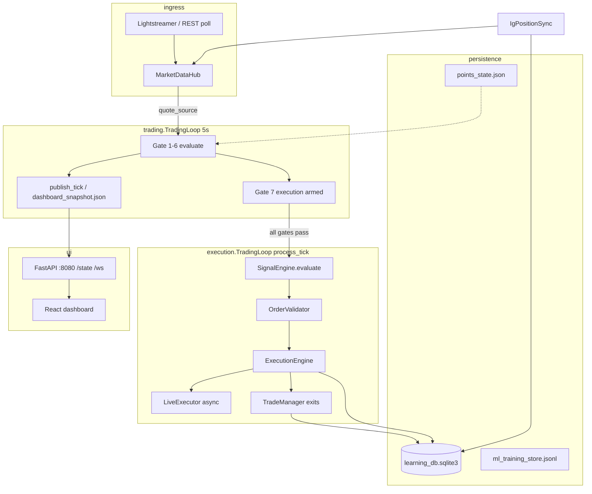

# IG Agent v25 — Profitable Trading Enhancement Assessment

**Workspace:** `/Users/chrisgordon/Desktop/IG_Agent_v25`  
**Snapshot:** 2026-05-27 ~21:05 UTC (live agent on `:8080`)  
**Spec reference:** `IG_Agent_v25_COMPLETE_SPEC_v6.pdf` (extracted via pypdf; `pdftotext` not installed)

---

## 1. Executive summary

### Maturity today

| Area | Status | Notes |
|------|--------|--------|
| **Runtime / ops** | **Strong** | `main.py` + FastAPI `:8080`, Lightstreamer → `MarketDataHub`, IG position sync, instance lock, emergency stop script, async live executor path |
| **7-gate orchestration** | **Implemented** | Session, cold start, fitness ≥40%, points, risk, signal, execution arming — visible on dashboard |
| **Signal engine (rules)** | **Implemented** | EMA/RSI/momentum scoring, learning adjustment, vol regime, RSI hard blocks |
| **Exits** | **Partial** | `TradeManager`: breakeven, ATR trail, partial close, hard cap — exercised heavily in **tests** (engine.log test lines) |
| **Learning (SQLite)** | **Scaffold** | `LearningStore` + setup stats; **0 closed trades** in `learning_db.sqlite3` at assessment time |
| **ML / replay / intelligence** | **Mostly unbuilt** | `MLTrainingStore` exists but **not wired** into execution; no `replay_engine`, `ml_scorer`, autopsy, benchmarks |
| **Demo P&L loop** | **Blocked** | Agent runs and streams; **no confirmed demo round-trips** feeding points/learning |

### What works

- Live Japan 225 stream (`stream_status: LIVE`, spread ~7 pts).
- Gates 1–5 pass under normal conditions (session open, cold start done, fitness 40%, CAUTION points, risk OK).
- `auto_trade_enabled: true`, `dry_run: false` — configured for real DEMO orders when gates 6–7 pass.
- Web dashboard (Live / Trades / Points / System) + snapshot IPC + WebSocket.
- IG-confirmed trade discipline (pending state, excluded sim/replay sources) is coded.

### What blocks profitable trading **today**

1. **Conjunctive gates** — all 7 must pass; gate 7 only arms when 1–6 pass.
2. **Signal warmup** — needs **≥4 five-minute bars** (~20+ min live quotes) before scoring; until then: `collecting candle history` (404 log lines today).
3. **RSI ceiling (`rsi_buy_max: 68`)** — dominant post-warmup blocker: e.g. **BUY score 99.0%** still WAIT because RSI 90.1 > 68; many blocks at 82–89% scores with RSI ~86–95.
4. **`signal_threshold: 85`** — scores must reach 85 **and** pass RSI; several near-misses logged.
5. **No historical bar bootstrap on session open** — `rest_client.fetch_historical_prices()` exists but is **not** used to seed `SignalEngine` at startup (only `warmup_cache` for closed-market synthetic path).
6. **Learning flywheel empty** — no closed trades → setup learning neutral; points cumulative +3.0 is not from a validated demo track record.
7. **ML gate absent** — spec’s “Conf + ML + fitness + points — all agree” is **rules + fitness + points only**.

**Bottom line:** Infrastructure is demo-ready; **trade frequency is near zero** because filters are strict, warmup is slow, and the best-looking BUY setups are rejected by RSI cap while trending markets keep RSI elevated.

---

## 2. Live performance (investigated)

### 2.1 `GET http://127.0.0.1:8080/state` (agent up)

| Field | Value |
|-------|--------|
| Market | OPEN, bid/offer ~65177 / 65184, spread 7.0 |
| Stream | LIVE, tick_age 0s |
| Health | **BLOCKED 71%** — “29% remaining before trade” |
| Gates passing | **5 / 7** |
| Failing | `signal_confidence` (collecting), `execution` (not armed) |
| Signal | WAIT, confidence 0%, setup `WAIT\|collecting` |
| Fitness | 40% (at gate minimum) |
| Points | CAUTION, cumulative/session 3.0, **size_multiplier 0.0** (no actionable confidence) |
| Eligibility | `signal_warmup` ~5:00 remaining |
| Positions | 0, daily P&L £0 |

### 2.2 `engine.log` patterns (`src/data/logs/engine.log`, ~24k lines)

**Aggregated `signal_confidence` WAIT reasons:**

| Count | Reason |
|------:|--------|
| 404 | `collecting candle history` |
| 204 | `no tradable direction (0.0%)` |
| 40 | `awaiting next closed 5m bar` |
| 28 | `RSI overbought … (BUY score 99.0%)` |
| 30 | `RSI overbought … (BUY score 89.1%)` |
| 24–31 | Many RSI blocks at 77–83% scores |
| 0 | `scores buy=… need >=85` (logged via gate detail, not top-level WAIT line) |

**Recent live pattern (21:28–21:33):** repeated  
`RSI overbought filter: 85.8–86.2 > max 68 (BUY score 82.8–83.4%)`.

**Not observed in log:** `live gate OPEN`, `execute_trade` success, or production `signal generated` lines for today's session — gates 6–7 never fully cleared long enough for orders.

Test noise (12:04–12:40): `HARD CAP EXIT`, `PARTIAL CLOSE`, `ml_training_store` test deals — not demo trading.

### 2.3 `config/config_v25.json` — profit-relevant keys

| Key | Value | Effect |
|-----|-------|--------|
| `signal_threshold` | **85** | Min adjusted confidence (also floor via points: `max(points_tier, 85)`) |
| `rsi_buy_min` / `rsi_buy_max` | **58 / 68** | BUY RSI must be in band; **>68 hard-blocks** even if score ≥85 |
| `rsi_sell_min` / `rsi_sell_max` | **32 / 45** | SELL mirror |
| `auto_trade_enabled` | **true** | Orders allowed when gates + validation pass |
| `dry_run` | **false** | Real DEMO routing |
| `min_atr_points` | **20** | Weakens scores if ATR low (×0.65) |
| `vol_regime_filter_enabled` | **true** | Blocks/chops low-vol regime |
| `max_spread_points` | **35** | Spread penalty in scoring |
| `learning_enabled` | **true** | Setup bonus/penalty (needs trade history) |
| `account_type` | **DEMO** | |
| Instruments | **japan_225 only** enabled | EUR/USD, Wall St, Gold disabled |

Config notes in file: production target **92**; “at 92 signals rare on Japan 225”.

### 2.4 Why trades are rare — gate stack

```
ALL must pass:
  session_open → cold_start_gap → environment_fitness (≥40%)
  → points_state (not STOP/paused/day stop)
  → risk_validation (spread, flat, £ risk cap)
  → signal_confidence (BUY|SELL + conf ≥ threshold + no RSI block)
  → execution (armed = gates 1–6 all true → process_tick)
```

**Additional filters inside `process_tick` (not separate dashboard gates):**  
`OrderValidator` (session hours whitelist, circuit breaker, adaptive setup block, spread, ATR, confidence), margin preflight, pending order inflight, `auto_trade`, points **size multiplier** (CAUTION + low conf → 0 size).

**LiveTradeGate** (2 arming ticks per config) exists in `execution/trading_loop.py` but is **not wired** in `agent_bootstrap.build_trading_loop()` — so spec arming is currently **inactive** in the v25 entry path (reduces one blocker; also removes deliberate post-open settle).

---

## 3. Architecture (from code)

### 3.1 Component map

| Component | Role |
|-----------|------|
| **`src/main.py`** | Preflight (lock, config, credentials), `AgentRuntime`: background orchestrator + uvicorn FastAPI :8080 |
| **`src/runtime/agent_bootstrap.py`** | Wires `LearningStore`, `SignalEngine`, `PointsEngine`, `EnvironmentScorer`, `SessionManager`, `ExecutionEngine`, `execution.TradingLoop`, `trading.TradingLoop`, `MarketDataHub`, Lightstreamer, `IgPositionSync` |
| **`src/trading/trading_loop.py`** | **7 gates**, 5s tick, `publish_tick` → snapshot IPC |
| **`src/execution/trading_loop.py`** | Per-tick: quotes → signal → validate → execute (async live path) |
| **`src/signals/signal_engine.py`** | 5m/15m candles from live quotes; scoring; RSI block; learning delta |
| **`src/trading/environment_scorer.py`** | 4-factor fitness (ATR, 15m trend, session timing, spread) — gate min **40** |
| **`src/trading/points_engine.py`** | Cumulative/session points, threshold bumps, size multipliers, session pause after 3 losses |
| **`src/trading/session_manager.py`** | IG calendar open/close, cold start 6 bars, gap, flatten window |
| **`src/system/market_data_hub.py`** | Central quote cache; REST fallback if stale |
| **`src/ig_api/lightstreamer_streaming.py`** | LS + REST poll fallback |
| **`src/runtime/ig_position_sync.py`** | Background open position sync |
| **`src/api/server.py` + `snapshot_store.py`** | FastAPI, `/state`, WebSocket; atomic `dashboard_snapshot.json` |
| **`src/data/learning_store.py`** | SQLite trades + setup_stats |
| **`src/data/journal.py`** | CSV decision journal (path optional; not set in current config) |
| **`src/data/ml_training_store.py`** | JSONL training log schema — **write path not hooked to live closes** |
| **`src/trading/trade_manager.py`** | Position exits (BE, trail, partial, hard cap) |

### 3.2 Data flow (mermaid)



### 3.3 Learning store / journal

- **`LearningStore`**: trades table, `setup_stats`, IG deal IDs, confirmed-close queries for points.
- **`PointsEngine`**: persists `src/data/state/points_state.json` (current: cumulative **3.0**, **CAUTION**).
- **`DecisionJournal`**: CSV with signal/action fields — **not enabled** (`decision_log_file` absent in config).
- **`MLTrainingStore`**: rich feature schema defined; population depends on integration at entry/exit (currently test-only log noise).

---

## 4. Spec v6 gap analysis

Legend: **DONE** | **PARTIAL** | **NOT BUILT**

| Spec capability | Status | Evidence |
|-----------------|--------|----------|
| Web dashboard (FastAPI + React) | **DONE** | `dashboard/`, 4 tabs; spec asked 5 (+ Intelligence) |
| 7 (spec says 13) trading gates | **PARTIAL** | 7 gates in `api/snapshot.GATE_NAMES`; no ML gate, no correlation gate |
| Lightstreamer + hub | **DONE** | `lightstreamer_streaming.py`, `market_data_hub.py` |
| Points reinforcement | **DONE** | `points_engine.py` |
| Environment fitness | **PARTIAL** | 4 factors implemented; spec lists 5 (missing “recent signal quality” as separate factor) |
| Session manager (refresh, gap, cold start, flatten) | **DONE** | `session_manager.py` |
| ATR trail / BE / partial close | **DONE** | `trade_manager.py` |
| Async orders | **DONE** | `live_executor.py` background worker |
| IG position sync independent | **DONE** | `ig_position_sync.py` |
| LiveTradeGate 2 ticks | **PARTIAL** | Code exists; **not attached** in `agent_bootstrap` |
| Learning store + setup stats | **DONE** | Schema + adaptive hooks |
| **Nightly replay engine (100x)** | **NOT BUILT** | No `replay_engine.py` / `replay_scheduler.py`; only `test_replay_*` config keys |
| **ML scorer (XGBoost subprocess)** | **NOT BUILT** | No `ml_scorer.py`; no gate integration |
| **Shadow mode (1x, log ML vs rules)** | **NOT BUILT** | |
| **Trade autopsy** | **NOT BUILT** | No `trade_autopsy.py` |
| **Insight store / pattern library** | **NOT BUILT** | |
| **Intelligence tab / weekly report** | **NOT BUILT** | Dashboard has no Intelligence tab |
| **Benchmarking (5 benchmarks)** | **NOT BUILT** | |
| **Correlation guard** | **NOT BUILT** | |
| **Multi-instrument parallel** | **PARTIAL** | `instrument_registry.py` + config; **only Japan 225 enabled**; single orchestrator loop |
| **Historical OHLC bootstrap at open** | **PARTIAL** | `rest_client` fetch API + `warmup_cache`; **no auto-seed into SignalEngine on open** |
| **ML training store on every close** | **PARTIAL** | Module + tests; **not wired** to live lifecycle |
| **Sound alerts (browser)** | **NOT BUILT** | macOS `afplay` only in `connection_health.py` for errors |
| **State files (trail, replay)** | **PARTIAL** | points + session persisted; no `replay_state.json` |
| Emergency stop script | **DONE** | `scripts/emergency_stop.sh` |
| Reconcile pending trades | **DONE** | `scripts/reconcile_pending_trades.py` |
| Config validation / safe defaults | **DONE** | `config_validator.py` |
| 8-week delivery plan | **IN PROGRESS** | Core engine ~Week 1–2; ML/replay/intelligence largely Weeks 2–4 |

**Spec vs config tension:** spec table lists Japan 225 **92%** threshold; `config_v25.json` uses **85%** with notes to review after 20 sessions — currently **more permissive on score, but RSI cap is the practical choke**.

---

## 5. Outstanding implementation (prioritized for profit)

### P0 — Unblock first demo trades (days, not weeks)

| # | Item | Rationale |
|---|------|-----------|
| P0.1 | **IG historical OHLC seed at session open** | Cut 20–30 min “collecting”; immediate 5m/15m indicators. Use `rest_client` `GET /prices/{epic}/MINUTE_5/{n}` → inject quotes into `SignalEngine` before first tick. |
| P0.2 | **Reconcile RSI filter with trend-following Japan 225** | Log shows **99% BUY blocked** by RSI>68. Options: (a) raise `rsi_buy_max` to 75–80 for index trend mode, (b) disable RSI hard-block when raw score ≥90, (c) use RSI only as score component not veto. |
| P0.3 | **Prove one full DEMO round-trip** | Force a controlled session: gates green → order → IG confirm → close → SQLite + points + closed-trades UI. Without this, learning/ML/points stay theoretical. |
| P0.4 | **Wire `MLTrainingStore` on IG-confirmed close** | Even before ML model, capture feature rows for Claude/offline analysis. |
| P0.5 | **Enable `decision_log_file`** | Per-tick CSV of signal, gates, block_reason — cheap dataset for tuning. |

### P1 — Improve quality without starving frequency (weeks 2–3)

| # | Item | Rationale |
|---|------|-----------|
| P1.1 | **Replay engine + scheduler** | Spec’s 100x nightly labels; calibrate thresholds against history before live tweaks. |
| P1.2 | **Shadow mode** | Log rules vs future ML on every tick; measure “would have traded” without capital risk. |
| P1.3 | **Trade autopsy + weekly export** | Turn closes into labeled features (session, spread, regime, exit reason). |
| P1.4 | **Wire `LiveTradeGate` in bootstrap** | Match spec (2 ticks) or document intentional removal. |
| P1.5 | **Benchmark harness** | Fixed stop vs ATR trail; threshold 85 vs 88 vs 92 on replay set. |
| P1.6 | **Points size multiplier audit** | CAUTION at +3 cumulative should allow 0.25–0.5 size when signal fires; verify not blocking at validator/risk stage. |

### P2 — Scale edge (weeks 4–8)

| # | Item | Rationale |
|---|------|-----------|
| P2.1 | **ML scorer gate** | Only after ≥500–1000 labeled replay + 50+ demo closes. |
| P2.2 | **Correlation guard** | Prevent stacked directional losses when multi-instrument enabled. |
| P2.3 | **Multi-instrument** | EUR/USD / Wall St / Gold — after Japan 225 demo win rate stable. |
| P2.4 | **Intelligence dashboard tab** | Weekly narrative + parameter recommendations. |
| P2.5 | **External context (VIX, USDJPY)** | Spec implies macro awareness; add as fitness factors or ML features once base loop proven. |

---

## 6. Additional data that would help profitability

### 6.1 IG historical OHLC backfill (parked → **promote to P0**)

- **What:** 2–5 days of `MINUTE_5` + `MINUTE_15` for `IX.D.NIKKEI.IFM.IP` at each session open (and after long disconnect).
- **Why:** Removes cold-start scoring blindness; reduces false “0% direction” and speeds gate 6.
- **Store:** `src/data/warmup_cache/` or dedicated `ohlc_bootstrap/` parquet/CSV with provenance timestamp.

### 6.2 Closed trade labels / autopsy features

Per confirmed close, persist:

- Entry/exit time (UTC + session name), side, size, spread at entry/exit  
- `setup_key`, raw/adjusted confidence, learning_delta  
- Fitness at entry, points state, size multiplier  
- ATR at entry, vol regime, RSI, 15m trend alignment  
- Exit reason: `stop`, `trail`, `partial`, `hard_cap`, `session_flatten`, `manual`  
- P&L: points, GBP (IG-confirmed), MAE/MFE if tracked  
- Gate snapshot at entry (which of 7 passed, block_reason history 5 min prior)

### 6.3 Spread / session / regime context

- Spread vs rolling median (fitness already partial)  
- Minutes since session open, gap flag, cold-start flag  
- Regime label: TRENDING / CHOPPY / LOW_VOL (extend `vol_regime`)  
- “Nikkei cash vs futures” session overlap flags if available from market watch

### 6.4 ML training features from replay

- Same feature vector as `ml_training_store.REQUIRED_FIELDS`  
- Label: WIN/LOSS/BREAKEVEN + forward return at 1/3/6 bars  
- Weight: live=3x, replay=1x, shadow=0.5x (per spec §3.2)  
- Counterfactual: “rules fired but RSI blocked” rows (today’s dominant case)

### 6.5 Benchmark A/B

| Experiment | Metrics |
|------------|---------|
| Trail vs fixed target | Expectancy, avg win, tail wins, max DD |
| Threshold 85 vs 88 vs 92 | Trades/day, win rate, profit factor |
| RSI cap 68 vs 75 vs off | Block rate, win rate on taken trades |
| Vol low filter on/off | Chop losses vs missed trends |

Run on replay first; promote winner to demo for 10 sessions.

### 6.6 What to log/export for Claude analysis

**Weekly CSV bundle:**

1. `gate_ticks.csv` — timestamp, gate pass bitmap, block_reason, bid, spread, fitness, buy/sell scores, RSI, signal  
2. `signals_blocked.csv` — rows where raw=BUY/SELL but output=WAIT (RSI, vol, threshold)  
3. `trades_closed.csv` — full autopsy columns above  
4. `points_ledger.csv` — per-trade point delta + state transitions  
5. `session_summary.csv` — trades, win rate, P&L, top block reason, REST calls, stream uptime  

**Weekly metrics (single row):**

`sessions`, `ticks`, `pct_time_gate6_fail`, `top_block_reason`, `signals_buy_sell`, `orders_sent`, `fills`, `win_rate`, `profit_factor`, `avg_spread`, `avg_confidence_taken`, `rsi_block_count`, `collecting_minutes`

### 6.7 External data (spec-aligned)

- **VIX** (or VSTOXX): risk-off filter — widen thresholds or pause longs when vol spikes  
- **USD/JPY**: correlation with Nikkei direction — decay confidence on conflict  
- Not in codebase today; add only after base demo track record exists

---

## 7. Config / levers — trade frequency vs quality

| Lever | More trades ↑ | Better quality ↑ | Honest tradeoff |
|-------|---------------|------------------|-----------------|
| `signal_threshold` 85→80 | More entries | More false positives | Japan 225 noisy at 80 |
| `signal_threshold` 85→92 | Fewer | Higher conviction | Spec notes rarity on index |
| `rsi_buy_max` 68→78 | **Large ↑** today | Buys closer to overbought | Trend markets stay blocked at 68 |
| `rsi_buy_max` off (score only) | Max frequency | Chase risk | Log shows 99% scores blocked — huge impact |
| `min_atr_points` 20→10 | Trades in quiet periods | More chop losses | |
| `vol_regime_filter_enabled` false | More signals in low ATR | Worse in chop | |
| `environment` gate min 40→30 | More trading time | Trade in hostile conditions | |
| Points CAUTION thresholds | Lower effective size | Protects capital | At +3 pts, still CAUTION — OK |
| `learning_enabled` false | Neutral scoring | Ignores setup edge | Keep on once trades exist |
| `auto_trade_enabled` false | Zero orders | Manual only | Debug only |
| `dry_run` true | Safe rehearsal | No P&L truth | |
| Historical bootstrap | Faster time-to-first signal | Slight stale-bar risk if not refreshed | **High value** |
| ML gate (future) | Fewer if conservative | Better filter when trained | Needs labels first |

**Current effective choke (observed):** `rsi_buy_max` + post-warmup `signal_threshold` + conjunctive gates — not `auto_trade` or broker connectivity.

---

## 8. Recommended next 30 days (phased)

### Phase A — Days 1–7: “First blood” demo trade

- Implement OHLC bootstrap into `SignalEngine` on startup / market open.  
- Tune RSI policy (document A/B: cap 68 vs 75 vs conditional).  
- Enable decision CSV + confirm one IG round-trip end-to-end.  
- Daily: export `signals_blocked.csv` + gate summary; review with Claude.  
- **Success metric:** ≥3 confirmed demo closes, gates 6–7 green >10% of session ticks.

### Phase B — Days 8–14: Learning loop

- Wire `MLTrainingStore` + autopsy-lite (exit reason, MAE/MFE from ticks).  
- Run `reconcile_pending_trades.py` post-session; zero phantom rows.  
- Replay MVP: single script, 30 days history, label outcomes (no XGBoost yet).  
- Points: verify scoring tracks confirmed trades only.  
- **Success metric:** ≥20 closed demo trades in SQLite; win rate and block-reason dashboard.

### Phase C — Days 15–21: Calibration

- Nightly replay job (cron 06:15 BST, 22:30 cutoff).  
- Shadow log: ML stub (rules probability) vs actual.  
- Benchmark: RSI cap and threshold on replay; pick one config for 5 demo sessions.  
- **Success metric:** replay vs demo outcome within 15% on direction; ≤1 day in STOP points state.

### Phase D — Days 22–30: Decide ML + scale

- If demo win rate ≥55% over last 30 trades: prototype `ml_scorer` subprocess.  
- If not: freeze entries, focus exit optimization (trail distances).  
- Plan second instrument (EUR/USD) only if Japan 225 stable 2 weeks.  
- **Success metric:** documented config freeze + 60% win-rate trajectory OR explicit “extend demo 2 weeks” per spec §13.

---

## Appendix — Quick reference for Claude feedback

**Ask Claude to prioritize:**

1. RSI veto vs threshold interaction on trending indices  
2. Minimum dataset to justify ML gate vs rules-only  
3. Optimal `gate_ticks` schema for threshold tuning  
4. Whether Japan 225 should use asymmetric RSI (higher cap for BUY in `asia_early`)  
5. Replay-first vs live-first learning given 0 closed trades today  

**Files to attach in follow-up:** `config/config_v25.json`, last 7 days `engine.log`, `points_state.json`, any `ml_training_store.jsonl`, weekly CSVs once P0.5 enabled.

---

*Assessment based on live `/state`, `engine.log` aggregation, `config_v25.json`, codebase scan, and `IG_Agent_v25_COMPLETE_SPEC_v6.pdf` text extraction.*