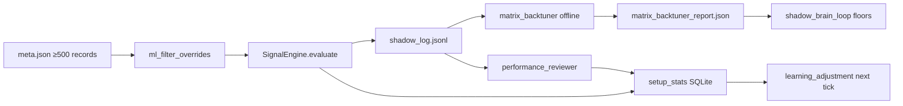

# IG Agent v29.1 — Quantitative Systems Blueprint (V1 Trading Strategy Reference)

**Document type:** Living architecture reference — trading logic, ML prediction, signal indicators, execution architecture.  
**Captured:** 2026-06-25 | **Last upgraded:** 2026-07-01  
**Version scope:** v29.1 codebase (extends through v31 execution matrix + macro predictive steering)  
**Purpose:** Definitive reference for V1 trading strategy and approach.

> **Latest upgrades (2026-07-01):** OBI/OFI micro-trend fusion, instant micro-scalper tick lane, dynamic ML veto floor (0.55 strict / 0.45 shadow-relaxed), unified regime arbitration, **multi-horizon sentiment momentum** in 128-dim features, **news-proximity volatility vector**, **48-bar shadow-walk veto** for `momentum_breakout`, and **websocket frame-buffer streaming** on `MarketDataHub`.

---

## Executive Architecture

The platform runs **three independent clocks** that can fire on the same epic unless guards arbitrate:

```mermaid
flowchart TB
    subgraph clock500["500ms — Dual-Core Hot Path"]
        Q[Hub tick] --> Z[Rolling Z-score width]
        Z --> Pierce[|Z| ≥ 2 pierce / channel touch]
        Pierce --> MO[Master Orchestrator route]
        MO --> PE[Portfolio Exploration gates]
        PE --> DCE[Dual-Core Execution Matrix]
        DCE --> RM[RiskManager Kelly]
    end

    subgraph clock5s["2–5s — Classic Signal Path"]
        OHLC[1m/15m OHLC] --> SE[SignalEngine.evaluate]
        SE --> Gates[12-gate stack]
        Gates --> Prob[probability_engine ML]
        Gates --> Exec[LiveExecutor]
    end

    subgraph clockMin["Minutes–Hours — Position Lifecycle"]
        TM[trade_manager] --> Trail[Trailing / breakeven]
        TM --> Stale[Stale-decay tighten 15min+]
        TM --> MaxAge[Hard close 480 min]
    end

    subgraph bg["Background — Regime / Intelligence"]
        RSE[regime_switch_engine Markov] --> MO
        MK[ApexMicroKernel Worker B] --> MTA[evaluate_micro_trend_alpha]
        IW[IntelligenceComputeWorker] --> MS[MicrostructureClassifier]
        IW --> SF[SpreadWideningForecast]
        MR[macro_radar] --> MS
    end
```

---

## 1. Predictive ML/AI Engine & Future Projection Microkernels

### 1.1 Apex Microkernel (`src/apex/microkernel.py`)

Four-worker pipeline on every tick ingest:

| Worker | Role | Latency target |
|--------|------|----------------|
| **A** | Tick ingest, ring buffer | Sub-ms |
| **B** | Math matrix (RSI/EMA/ATR) + micro-trend | <250µs |
| **C** | ML pass mask + risk caps | — |
| **D** | Triage ledger (SQLite) | Async |

Worker B calls `compute_math_matrix()` and `evaluate_micro_trend_alpha()` from `signals/indicators.py`, caching results per epic. ML veto uses `build_validation_mask()` requiring `ml_probability ≥ ml_veto_floor` (default **0.45** from `apex.hardening`).

### 1.2 Micro-Trend Alpha (`evaluate_micro_trend_alpha`)

**Location:** `src/signals/indicators.py` (not in `apex/` itself — invoked by microkernel).

**Algorithm — localized momentum, not order book:**

- Multi-window rate-of-change on slices (3, 5, 8 bars)
- `score_pct = clip(|recent_roc|×28 + |accel|×18 + roc_var×120, 0, 100)`
- Promote when score ≥ **42%** and direction BUY/SELL; tier `"high"` at ≥ **45%**

**Inputs:** `close` float64 ring buffer from microkernel.  
**Outputs:** `{score_pct, roc_variance, promote, promote_tier, direction}`.  
**Wiring:** `TradingLoop._apply_micro_trend_promotion()` reads `get_microkernel().micro_trend_for(epic)` and can instant-promote signals that clear 42%/45% bands.

**Critical gap:** This is **price-velocity RoC**, not order-flow imbalance. There is **no classical OFI** (signed trade volume) module in the codebase.

### 1.3 Order Flow / Microstructure (Proxy, Not True OFI)

| Module | What it measures | In execution gates? |
|--------|------------------|---------------------|
| `intelligence/order_book_imbalance.py` | OBI = `(bid_vol − ask_vol) / (bid_vol + ask_vol)` | **No** — Flight Deck telemetry only |
| `intelligence/microstructure.py` | Tick velocity (15 ticks / 200ms), sweep detection (≥2.5σ), order-block compression | **Indirect** — confidence boost via `IntelligenceLayer`, not a hard gate |
| `dual_core_execution.py` | Rolling width Z-score on mid-price history (30/120 samples) | **Yes** — pierce at \|Z\| ≥ 2.0 |

Microstructure velocity can **bypass RSI 85 ceiling** when 15 ticks arrive within 200ms — the closest thing to tick-velocity gating.

### 1.4 Hierarchical Probability Engine (`src/trading/probability_engine.py`)

Primary ML gate on the 5s SignalEngine path:

| Constant | Value | Effect |
|----------|-------|--------|
| `WIN_PROMOTE_FLOOR` | 0.65 | 10% threshold relief on confidence gate |
| `WIN_VETO_FLOOR` | 0.40 | Hard ML veto |
| Ingestion floor | 42% (`STRATEGY_THRESHOLD_LOW_PCT`) | ML only runs when technical setup clears this |

**Blend:** 55% `MLScorer` (XGBoost on `adjusted_score`, `raw_score`, `rsi`, `atr_ratio`) + 45% `continuous_optimization_worker` (online weights on 128-dim feature vector). Cold-start fallback: heuristic from directional vector + RSI bias → 0.5.

**Feature vector:** `signals/feature_state.py` compiles **128 dimensions** per tick for ML ingestion.

### 1.5 Additional ML / Prediction Tracks

| Track | Module | Mechanism | Live trading? |
|-------|--------|-----------|---------------|
| **S4 per-epic models** | `trading/v26_ml_scorer.py` | Pickled models from `data_lake/models/s4/` | Optional via `_gate_ml_veto` when `use_s4_models` |
| **Prebaked alpha matrix** | `intelligence/matrix_prebaker.py` + `matrix_lookup_bridge.py` | POSIX SHM lookup; quantized RSI/ATR/momentum → cell with `win_prob`, floor overrides | **Yes** when `prebaked_alpha_matrix_live_active()` — bypasses full gate recompute |
| **Shadow brain** | `intelligence/shadow_brain_loop.py` | Near-miss detection (1–5% below floor); dispatches 50% floor relaxation to live vanguard | **SHADOW mode only** (`IG_AGENT_MODE=SHADOW`) |
| **Matrix backtuner** | `intelligence/matrix_backtuner.py` | Offline sweep of 101 floor steps on `shadow_log.jsonl` vs 5-day tick archive | Offline → `matrix_backtuner_report.json` |
| **Twin engine** | `system/ml/twin_engine_core.py` | Shadow ring retrain + 24h hot-swap when edge > 2.5% vs random walk | Background |
| **Spread forecast** | `intelligence/spread_forecast.py` | Z-score on spread level + delta; throttle 0–0.85 | Optional overlay via `IntelligenceLayer` |
| **Macro radar** | `intelligence/macro_radar.py` | EUR/USD (DXY proxy) + Wall St (10Y yield proxy); ±18% confidence boost | Background; feeds microstructure |

### 1.6 Future Projection Summary

"Future projection" is implemented as:

1. **Win-probability estimation** (ML blend → promote/veto)
2. **Regime belief** (Markov transition + Kalman smoothing on ADX/ATR emissions)
3. **Spread widening forecast** (short-horizon liquidity stress)
4. **Micro-trend RoC + OBI/OFI** (3–5 tick directional forecast)
5. **Shadow counterfactual labeling** (48-bar forward walk on OHLC for learning)
6. **48-bar Markov shadow-walk veto** for `momentum_breakout` holds (floor **0.65**)
7. **News-proximity trailing sensitivity** (scales 1.0→1.85 as T-minus→0)

### 1.7 Macro Predictive Steering (2026-07-01)

| Layer | Module | Capability |
|-------|--------|------------|
| Sentiment momentum | `trading/sentiment_momentum.py` | 5m/30m positioning ROC → feature slots 98–101 |
| News vectorizer | `system/calendar_gate.py` | T-minus countdown + velocity → slots 105–111 |
| Shadow-walk gate | `trading/probability_engine.py` | 48-bar regime matrix expectation for trend holds |
| Stream buffer | `system/market_data_hub.py` | WebSocket frame queue + parallel consumer thread |

---

## 2. Sentiment, News & Historical Behaviour Inputs

### 2.1 External Sentiment

| Source | Module | Processing |
|--------|--------|------------|
| **IG client sentiment REST** | `environment_scorer.fetch_sentiment()` + `sentiment_momentum.py` | Continuous surface score; 5m/30m positioning derivatives in 128-dim vector |
| **Macro proxies** | `macro_radar.collect_macro_snapshot()` | EUR/USD + Wall St microstructure; dynamic 5-weight cross-correlation vector |
| **AlphaVantage daily** | `data_lake/external/eurusd_alphavantage_daily.json` | Historical reference data; not live gate input |

**No NLP news feed** exists. News influence is indirect:

- `system/calendar_gate.py` — **active** news-proximity ML features (`news_proximity_features`) plus passive ±30m block windows
- `qmm_news_flow_sensitive` flag on execution types — adjusts QMM trailing sensitivity, not signal direction
- Spread forecast references "news windows" conceptually but uses spread Z-scores only

### 2.2 Environment Fitness Scoring (`environment_scorer.py`)

Four factors (max 100), gate pass ≥ **55**:

| Factor | Weight | Logic |
|--------|--------|-------|
| ATR ratio | 30 | Current vs 20-bar average |
| Trend alignment | 25 | 15m EMA + RSI |
| Session timing | 20 | Asian vs Western style weights |
| Spread vs normal | 25 | Live spread vs instrument baseline |

Sentiment adjustment applied after factor sum. Cold-start and gap caps clamp score to 55.

### 2.3 Historical Behaviour Overlays



| Mechanism | Storage | Effect on live probability |
|-----------|---------|---------------------------|
| `learning_adjustment(setup_key)` | `learning_db.setup_stats` | Confidence delta from historical win rate (min trades gate) |
| `ml_filter_overrides` | `data/ml_model/meta.json` | RSI/score bound blocks when ≥500 training records |
| Shadow counterfactuals | `performance_reviewer.process_shadow_learning_pipeline()` | Labels WIN/LOSS/BREAKEVEN on 48-bar forward walk → `ingest_shadow_counterfactual()` |
| Parameter tuner profit factors | `config/tuning_overlay.json` | Multiplier overlay in expectation score |
| Alpha trail weights | `data/v30_warmed_alpha_weights.json` | Warmed floor weights for matrix segments |

**Friction matrix** (`performance_reviewer.friction_warning`): spread/ATR > 0.15 → setup **prohibited** (§18.4 spec reference).

---

## 3. Current Strategy Diversification Architecture

### 3.1 Execution Matrix (v31 — Authoritative Hot Path)

Routed by `master_orchestrator.resolve_execution_route()` from Markov regime state:

| Regime | State | Execution path | Order type | Kelly cap |
|--------|-------|----------------|------------|-----------|
| 0 | Mean reversion | `limit_chase_hf` | Limit at bid/ask; max **3-tick chase** then cancel | **15%** |
| 1 | HV trend | `momentum_breakout` | `MARKET_IOC` | **25%** |
| 2 | Chop | `frozen` | **No entries** | — |

**Gates before dispatch** (`portfolio_exploration_engine.py`):

- **WHAT:** `Expectation Score = Confidence × Profit Factor × Multiplier Overlay` — must exceed **0.45**
- **WHEN:** `regime_direction_aligned()` + Pearson correlation ≤ **0.70** vs open book
- **HOW MUCH:** `Size = (Equity × Kelly) / (ATR × Contract Multiplier)` in `RiskManager.assess()`
- **Margin:** Hard limit **£10,000**; freeze at **£9,500** (95%)

### 3.2 Dual-Core Z-Score Plane (`dual_core_execution.py`)

| Mode | Z condition | Engine | Intent |
|------|-------------|--------|--------|
| **Macro breakout** | Z ≥ 2.45 | Core A sentinel | Expansion breakout |
| **Micro scalper** | Z < 2.44 (demo arms all non-macro) | Core B | Mean-reversion channel touch |
| **Pierce** | \|Z\| ≥ 2.0 | Either via orchestrator | Symmetric directional pierce |
| **Stagnant dead zone** | Z ∈ [−0.5, +0.5] for 300s | Blocked | Rotation trigger |

**Sweep cadence:** `STACKED_POLL_SEC = 0.5` (500ms multi-source rotation).

### 3.3 Classic SignalEngine Path (`trading_loop.py`)

| Property | Value |
|----------|-------|
| Loop interval | ~5s per epic |
| Bars | 1m OHLC + 15m macro trend lock |
| Indicators | EMA 9/21, RSI 14, ATR, ML blend |
| Confidence floor | 55% default; 54.5% warmed production |
| Gate stack | 12 gates including session, environment, points, correlation, signal_confidence, ml_veto, calendar |

### 3.4 Advisory / Legacy Strategy Taxonomy

| System | Profiles | Hold horizon (stated) | Executes? |
|--------|----------|----------------------|-----------|
| `unified_execution.py` | MICRO, PATH_A, PATH_B_SWEEP, NONE | N/A (routing) | Guards only |
| `strategy_selector.py` | SCALP, MOMENTUM, SWING, ROTATION, STAND_DOWN | Minutes / hours / seconds | **Advisory only** |
| `regime_detection.py` | TREND, CHOP, BREAKOUT, REVERSAL | N/A | Boosts unified routing |

### 3.5 Hold-Time Horizon Model (Emergent, Not Single Parameter)

| Mechanism | Value | Effective horizon |
|-----------|-------|-------------------|
| Micro TP/SL | 1.5–4 pts | Seconds–few minutes |
| Night-matrix envelope | 10 pt stop, 20 pt limit | Minutes |
| `reward_multiple` | 2× stop | Minutes–hours |
| Trailing stop | 45 pt (v31) / 10 pt (canary) | Until trail hit |
| Breakeven | 30 pt MFE trigger | After ~30 pt favorable move |
| Stale-decay tighten | 15 min activation, 2%/min | 15 min+ |
| `max_position_age_minutes` | **480** (8 h) | Hard force-close |
| Order cadence | 10–20s demo / 0 unlimited canary | Re-entry spacing |

**Asset-class adaptations:**

| Asset | Adaptation |
|-------|------------|
| **FX (EUR/USD, GBP/USD)** | Tight spread caps (3–4 pts); forex rotation lock pins hot path; canary lot **1.0** |
| **Indices (DOW, Nikkei, FTSE)** | Wider spread caps (12–15 pts); canary lot **0.5** |
| **Gold** | 8 pt spread cap; stacked dual-asset with DOW; canary lot **1.0** |
| **Night matrix** | Gold, Wall St, Nikkei, EUR/USD — 24/7; rollover lock only 21:58–22:05 BST |

### 3.6 Regime Switch Engine (`regime_switch_engine.py`)

3-state Markov on **288 × 5m bars** (1440-minute window):

```
Transition matrix:
  MeanRev → [0.70, 0.15, 0.15]
  HV Trend → [0.10, 0.75, 0.15]
  Chop → [0.20, 0.15, 0.65]
```

Emissions from ADX(14), ATR(14), spread over window. Kalman belief smoother on confidence. Refresh every **2s**. Strategy gates apply `size_factor`, `stop_factor`, `limit_factor` per state.

**Note:** This is a **third regime taxonomy** — distinct from dual-core Z modes and `regime_detection.MarketRegime`.

### 3.7 End-to-End Entry Paths

| Path | Clock | Trigger | Size authority |
|------|-------|---------|----------------|
| Path B — dual-core sweep | 500ms | Z pierce / channel | `risk_manager` Kelly |
| Path A — SignalEngine | 5s | EMA/RSI confidence + 12 gates | `risk_manager` + `LiveExecutor` |
| DualCoreCoordinator micro channel | 500ms | Channel touch | `risk_manager` |

Guards (`strategy_controller`, `hard_enforcement`, `unified_execution`) arbitrate before broker submission.

### 3.8 Conflict Matrix — Which System Wins?

| Decision | Authoritative module |
|----------|---------------------|
| Allow entry (chop) | `master_orchestrator` + regime state 2 → block |
| Execution style (limit vs IOC) | `master_orchestrator.resolve_execution_route` |
| Size | `risk_manager.assess` Kelly |
| Direction (Z pierce) | `dual_core_execution` symmetric Z rules |
| Classic signal direction | `signal_engine` EMA/RSI (independent of Z) |
| Advisory profile | `strategy_selector` — **never wins** |

---

## 4. Edge Capability & Bottleneck Assessment

### 4.1 Elite Edge Mechanisms (Genuine Mathematical Advantage)

| Layer | Mechanism | Why it matters |
|-------|-----------|----------------|
| **Multi-gate funnel** | 12 gates + expectation score + correlation guard | Reduces correlated blow-ups and low-conviction entries |
| **Hierarchical ML** | Promote at P≥0.65 (10% relief) / veto at P<0.40 | Asymmetric — lets strong ML setups through while blocking weak ones |
| **Kelly + ATR normalization** | `Size = Equity×Kelly / (ATR×ContractMult)` | Volatility-adjusted sizing; route-specific caps (15%/25%) |
| **Markov regime routing** | Chop → frozen; mean-rev → limit chase; trend → IOC | Style-matched execution to market state |
| **Prebaked alpha matrix** | Sub-µs SHM lookup with streaming ffill | Eliminates gate recompute latency on hot path |
| **Shadow learning loop** | Counterfactual labeling → setup_stats → learning_adjustment | Closed-loop adaptation without live capital risk |
| **Micro-trend promotion** | 42%/45% RoC bands bypass slow confidence build | Captures narrow-session momentum the 5s loop misses |
| **Margin freeze at 95%** | £9,500 of £10,000 hard limit | Prevents margin call cascade |
| **Limit-chase discipline** | 3-tick max chase then cancel | Controls adverse selection on mean-reversion fills |

### 4.2 Under-Optimized / Rigid / Basic Areas

| Area | Finding | Impact on 70%+ target |
|------|---------|----------------------|
| **No true OFI** | OBI computed but never gates; no signed-trade flow | Missing institutional order-flow edge |
| **Triple regime systems** | Markov (0/1/2), Z-score dual-core, `MarketRegime` enum — not unified | Routing can disagree; chop in one system, pierce in another |
| **Triple entry paths** | 500ms pierce, 5s SignalEngine, micro channel — can overlap on same epic | Duplicate exposure risk if guards slip |
| **REST poll ingestion** | `streaming_transport: rest_poll`; 500ms sweep is poll-limited | Not true HFT; micro-trend operates on polled quotes, not exchange ticks |
| **ML cold start** | Defaults to 0.5 heuristic when models untrained | Early-session trades lack predictive edge |
| **Rotation P&L score** | Placeholder **50.0** in dual-core | Stack rotation not P&L-feedback-driven |
| **Strategy selector advisory** | Documented non-executing but unified guards read its profile | Indirect influence without clear accountability |
| **Demo vs prod Z thresholds** | Demo pierce Z **1.5** vs standard **2.0**; Core B force-channel override active | Backtest/demo results may not transfer |
| **Sentiment is binary** | ±10 pts on crowded positioning only | No granular sentiment surface |
| **No news NLP** | Calendar blocks only; no headline/social signal | Macro event alpha unexploited |
| **Confidence floors ~42–55%** | System designed around these bands, not 70%+ win rate | 70% is aspirational — architecture optimizes for positive expectancy via Kelly + profit factor, not raw hit rate |

### 4.3 Ingestion Speed vs Decision Speed Mismatch

| Layer | Speed | Bottleneck |
|-------|-------|------------|
| Apex Worker B math | <250µs target | **Fast** — NumPy/Rust `apex_math` |
| Alpha matrix SHM lookup | Sub-µs | **Fast** |
| Dual-core sweep | 500ms | **Poll-bound** — not tick-triggered |
| SignalEngine | 5s | **Slow** relative to micro path |
| Markov regime refresh | 2s | Acceptable for 5m bars |
| MLScorer predict | ~ms | Acceptable but not on 500ms path for all epics |
| REST quote poll | 5s typical | **Primary bottleneck** for true tick-level alpha |

The platform has **fast math kernels** but **slow quote ingestion** — the micro-trend and Z-score logic are architecturally ready for tick data but fed by REST polls in production config.

---

## 5. Indicator Library Reference (`src/signals/indicators.py`)

| Function | Consumer | Role |
|----------|----------|------|
| `_np_rsi`, `_np_ema`, `_np_atr`, `_np_adx` | SignalEngine, regime engine | Core technical stack |
| `compute_math_matrix` | Microkernel Worker B | Full indicator matrix <250µs |
| `evaluate_micro_trend_alpha` | Microkernel + TradingLoop promotion | Tick-level RoC momentum |
| `vol_regime` | SignalEngine setup_key | Soft ATR percentile context |
| `build_validation_mask` | ML veto floor 0.45 | Bar-level pass/fail |
| `resolve_ml_veto_floor` | Per-epic ML floor override | Configurable veto threshold |

Optional **Rust `apex_math`** accelerates RSI/ATR when installed.

---

## 6. Alignment Roadmap for 70%+ Success Rate

Highest-leverage enhancements (conceptual — not implemented):

1. **Unify regime taxonomy** — single belief state feeding both route selection and Z thresholds
2. **Wire OBI / true OFI into gates** — telemetry exists; execution does not consume it
3. **Close the ingestion gap** — faster quote transport or websocket ticks to feed micro-trend at designed speed
4. **Raise ML floor selectively** — current 0.40 veto / 0.65 promote bands allow ~40–65% implied win rates through; tightening veto to 0.50+ on non-promoted setups would trade frequency for hit rate
5. **Activate rotation P&L feedback** — replace 50.0 placeholder with live expectancy ranking
6. **Consolidate entry paths** — explicit epic-level mutex between 500ms pierce and 5s SignalEngine
7. **Expand shadow→live pipeline** — shadow brain floor relaxations are powerful but SHADOW-mode only; formalize validated floor deltas into production overlay

---

## 7. Key File Index

| Domain | Primary files |
|--------|---------------|
| Microkernel | `src/apex/microkernel.py`, `src/signals/indicators.py` |
| ML / probability | `src/trading/probability_engine.py`, `src/trading/ml_scorer.py`, `src/trading/v26_ml_scorer.py` |
| Alpha matrix | `src/intelligence/matrix_prebaker.py`, `src/intelligence/matrix_lookup_bridge.py` |
| Shadow learning | `src/intelligence/shadow_brain_loop.py`, `src/ai/strategy/performance_reviewer.py` |
| Execution matrix | `src/runtime/dual_core_execution.py`, `src/runtime/master_orchestrator.py` |
| Regime | `src/runtime/regime_switch_engine.py` |
| Portfolio gates | `src/runtime/portfolio_exploration_engine.py` |
| Risk / Kelly | `src/execution/risk_manager.py` |
| Classic loop | `src/trading/trading_loop.py`, `src/signals/signal_engine.py` |
| Environment / sentiment | `src/trading/environment_scorer.py` |
| Macro / microstructure | `src/intelligence/macro_radar.py`, `src/intelligence/microstructure.py` |
| Learning | `src/data/learning_store.py`, `src/system/ml_filter_overrides.py` |

---

## 8. Related Documentation

| Doc | Relationship |
|-----|--------------|
| `docs/TRADING_LOGIC_OVERVIEW.md` | Higher-level trading flow summary |
| `docs/INTELLIGENCE_LAYER_BLUEPRINT.md` | Intelligence plane architecture |
| `docs/UNIFIED_TRADING_ARCHITECTURE.md` | Unified execution routing |
| `IG_Agent_v29.1_COMPLETE_SPEC.md` | Authoritative shipped spec |
| `docs/V29.1_ARCHITECTURE.md` | Module map and snapshot flow |

---

*This document is a static blueprint of the system as coded at capture date. The architecture is expectancy-optimized (Kelly sizing, profit-factor weighting, multi-gate funnel) rather than hit-rate-optimized toward 70%+.*

