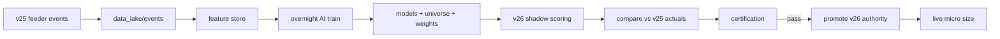

# v25 → v26 Strategy & Operating Model

**June 2026 | CONFIDENTIAL**

This document answers:

1. Is a **separate v26 agent** fed by v25 a good approach?  
2. What are you **missing** for success?  
3. How does v25 **feed** v26 without **restricting** it?  
4. How does **AI drive v26** and learn continuously?  
5. What does the **built system look like** on your MacBook?

**Related:** `IG_Agent_v26_FRAMEWORK.md`, `IG_Agent_v26_PROFITABILITY_SPEC.md`, `docs/V26_IMPLEMENTATION_PROCESS.md`

---

## 1. Verdict: good approach, with one hard rule

| Your idea | Verdict |
|-----------|---------|
| v25 stays running today | **Good** — proven execution + data |
| v26 is the next step | **Good** — profit brain, not another ops rewrite |
| v26 as **separate agent** | **Good** — if it does not fight v25 for orders |
| v25 as **feeder** into v26 | **Good** — clean separation of concerns |
| v25 must not cap v26 markets/strategies | **Good** — requires a **data contract**, not shared config |

### The one hard rule

**Only one agent may place IG orders per account at a time.**

| Mode | v25 | v26 |
|------|-----|-----|
| **Phase 1–2 (now → week 8)** | Trades demo; full feeder | **Shadow only** — learns, certifies, logs intents |
| **Phase 3 (certified)** | Feeder only *or* retired | **Decision + order authority** |
| **Never** | Both sending orders | — |

Separate **processes**, shared **data lake** — not two traders on one account.

---

## 2. What you might be missing (success checklist)

Beyond code, these gaps kill v26 if ignored:

| # | Gap | Why it matters | v26 answer |
|---|-----|----------------|------------|
| 1 | **Data contract** | v25 telemetry must be rich enough for any market/strategy | `shared/contracts/` schemas (below) |
| 2 | **Shadow parity** | v26 must prove it beats v25 before orders | Shadow intents vs v25 fills |
| 3 | **Friction model** | Demo P&L lies without slippage/spread tax | Research haircut + live slippage log |
| 4 | **Walk-forward discipline** | AI overfits without OOS gates | Monthly OOS; auto-ban strategies |
| 5 | **Model versioning** | Bad deploy = blown day | `models/` versioned; one-click rollback |
| 6 | **AI autonomy bounds** | AI must not resize to infinity | `ai_policy.json` hard limits |
| 7 | **Human promotion gate** | Real cash needs explicit sign-off | Live Promotion Checklist |
| 8 | **Kill switch** | Both agents need coordinated halt | Shared `HALT` flag in data lake |
| 9 | **Attribution** | Must know *what* made £ | Per strategy/setup/session P&L |
| 10 | **Universe independence** | v25's 4 markets must not cap v26 | v26 universe in separate config + research |

If you build v26 code without items 1–6, you get a smarter backtest — not a safer live system.

---

## 3. Architecture: two agents, one repo, shared lake

**Not a new git repo.** One repository, two runnable agents, shared data.

```
IG_Agent_v25/                          # umbrella repo (name can stay)
├── src/                               # v25 AGENT — execution chassis (today)
│   ├── main.py                        # v25 entry: trades demo
│   ├── trading/
│   └── ...
├── v26/                               # v26 AGENT — brain (new package)
│   ├── main.py                        # v26 entry: shadow | certify | trade
│   ├── portfolio/                     # allocator, heat, correlation
│   ├── strategies/                    # S1..Sn plugins — unlimited
│   ├── research/                      # feature store, walk-forward, AI train
│   ├── regime/
│   └── certification/
├── shared/                            # v25 → v26 bus (feeder contract)
│   ├── contracts/                     # JSON schemas / event types
│   ├── bus/                           # append-only event log (jsonl)
│   └── README.md
├── data_lake/                         # unlimited research (gitignored bulk)
│   ├── events/                        # v25 telemetry stream
│   ├── features/                      # parquet partitions
│   ├── models/                        # versioned ML artifacts
│   └── certifications/                # L0–L5 reports
├── config/
│   ├── config_v25.json                # frozen baseline (feeder)
│   └── config_v26_50k.json            # v26 universe + portfolio
└── dashboard/                         # tabs: v25 LIVE + v26 SHADOW + CERT
```

### 3.1 Roles

| Agent | Job | Restrictions |
|-------|-----|--------------|
| **v25** | IG connectivity, orders, sync, ticks, shadow log, learning DB | Strategy config **frozen** (feeder); no profit thrashing |
| **v26** | Any markets, any strategies, AI train, allocate, certify | No orders until promoted; reads lake + features |

**v25 does not restrict v26** because v26 never reads v25's `signal_threshold` logic for its decisions — only **events** (quotes, bars, fills, shadow evaluations).

---

## 4. Feeder data contract (v25 → v26)

v25 appends to `data_lake/events/` (jsonl, one file per day):

| Event type | When | v26 uses for |
|------------|------|--------------|
| `bar_close` | Every 5m bar per epic | Features, any timeframe strategy |
| `quote_tick` | Sampled/stream snapshot | Spread, friction |
| `signal_eval` | Every evaluate (incl. WAIT) | Shadow learning, gate attribution |
| `gate_result` | Each gate pass/fail | Blocker £ analysis |
| `order_intent` | Pre-submit | Shadow compare |
| `fill_close` | IG-confirmed close | Labels, E£, certification |
| `account_snapshot` | Periodic | Margin, heat |
| `regime_snapshot` | Optional v25 env fitness | Baseline compare |

**Schema version** in every event: `contract_version: "1.0"`.

v26 ingests into feature store — **markets not in v25 config still work** if v26 research pulls OHLC via offline seeder (unlimited data path).

---

## 5. How v25 feeds v26 without restricting capability

| Dimension | v25 (feeder) | v26 (unrestricted) |
|-----------|--------------|-------------------|
| Markets traded live | 4 demo epics | 12–20 in research; subset live when certified |
| Strategies | 1 rules + blend | Registry: rules, momentum, FX, ML meta, **future AI-generated** |
| Bars / features | 5m/15m in loop | 1m–1h offline; cross-asset; calendar |
| Config | `config_v25.json` frozen | `config_v26_50k.json` + generated `universe.json` |
| Orders | Yes (today) | Shadow → promote |

**Key:** v25 is a **telemetry + execution utility**. v26 is the **portfolio OS**.

---

## 6. AI drives v26 — how it learns (bounded autonomy)

### 6.1 Three AI roles

| Role | What AI does | Human |
|------|--------------|-------|
| **Researcher** (offline) | Feature gen, walk-forward, strategy ideas, threshold tuning | Reviews weekly pack |
| **Operator** (daily) | Ban setups, adjust weights inside bounds, regime labels | Sets `ai_policy.json` limits |
| **Certifier** (weekly) | L1–L5 pass/fail narrative + recommended promote/hold | Signs live promotion |

v25 has **no AI autonomy** during feeder phase (frozen).

### 6.2 Learning loop (continuous)



**Nightly (MacBook, 22:30+):**

1. Ingest new events → features  
2. Retrain / walk-forward (only promote if OOS improves)  
3. Update `data_lake/models/v{date}/`  
4. Write `certification/YYYY-MM-DD.json`  
5. v26 loads new artifacts at next start — **rollback** = point to previous model folder  

### 6.3 AI policy bounds (`config/ai_policy.json`)

```json
{
  "max_risk_per_trade_gbp": 700,
  "max_daily_loss_gbp": 2000,
  "max_new_epics_per_week": 2,
  "max_threshold_delta_per_week": 2.0,
  "min_human_approve_for_live": true,
  "auto_ban_negative_setup": true,
  "auto_promote_strategy": false
}
```

AI **proposes**; policy **enforces**. Human **approves live**.

---

## 7. Phased approach — what you do when

### Phase 0 — Today (v25 only, start feeder)

**You:** Run v25 demo as now.  
**Build:**

- [x] `shared/contracts/event_schema.json`  
- [x] `src/feeder/event_bus.py` + hooks (trading_loop, learning_store, trade_manager)  
- [x] `data_lake/events/` daily JSONL  
- [x] `v26/main.py --mode shadow` lake reader  

**Success:** 7 days of events without gaps.

```bash
# v25 demo (feeder on by default; IG_AGENT_FEEDER=0 to disable)
PYTHONPATH=src python3 src/main.py

# v26 shadow summary (separate terminal)
PYTHONPATH=src:v26 python3 v26/main.py --mode shadow --watch
```

---

### Phase 1 — Weeks 2–4 (v26 born, shadow only)

**You:** v25 still sole trader.  
**Run:** `PYTHONPATH=src:v26 python3 v26/main.py --mode shadow --watch --tail`

- [x] v26 package scaffold  
- [x] `scripts/build_feature_store.py`  
- [x] S1 plugin (`v26/strategies/s1_rules_v25.py`)  
- [x] Shadow intents → `data_lake/shadow_v26/`  
- [x] `scripts/shadow_compare.py` + expectancy snapshot  

```bash
# Live shadow tail (second terminal while v25 runs)
PYTHONPATH=src:v26 python3 v26/main.py --mode shadow --watch --tail

# End of day
PYTHONPATH=src:v26 python3 scripts/shadow_compare.py --process --expectancy
PYTHONPATH=src:v26 python3 scripts/build_feature_store.py --day $(date -u +%Y-%m-%d)
```

**Success:** S1 shadow parity ~100% vs v25 `would_fire`; 14d rolling E£ tracked in expectancy snapshot.

---

### Phase 2 — Weeks 5–8 (expand brain, still shadow)

- [ ] S2 momentum, S3 FX strategies  
- [ ] Regime engine  
- [ ] Portfolio allocator  
- [ ] 90d replay L1 + walk-forward L2  
- [ ] Universe manager (12+ epics in research)  

**Success:** L1 pass (replay shows £1k days exist at £50k envelope).

---

### Phase 3 — Weeks 9–12 (demo certification)

- [ ] Flip v26 to `--mode trade` on **demo**  
- [ ] v25 `--mode feeder-only` (no orders) **OR** stop v25 process  
- [ ] 14d soak → **L5 certificate**  

**Success:** 10/14 demo days ≥ £1k, audited P&L.

---

### Phase 4 — Live real cash (micro)

- [ ] Live Promotion Checklist signed  
- [ ] v26 live at **25%** risk bands, core 4 epics  
- [ ] 14d live PF ≥ 1.2 → 50% → 100%  

**Success:** Live E£ ≥ 70% of demo E£ (friction haircut).

---

## 8. What the running system looks like (MacBook)

### Today (Phase 0)

```bash
# Terminal 1 — v25 demo trader (feeder)
PYTHONPATH=src python3 src/main.py
```

### Phase 1+ (typical day)

```bash
# Terminal 1 — v25 feeder (orders until Phase 3)
PYTHONPATH=src python3 src/main.py

# Terminal 2 — v26 shadow brain (no orders)
PYTHONPATH=src:v26 python3 v26/main.py --mode shadow

# Night — research (cron / manual)
PYTHONPATH=src:v26 python3 v26/research/nightly_pipeline.py
```

### Phase 3+ (v26 certified trader)

```bash
# v25 STOPPED or feeder-only (no orders)
PYTHONPATH=src:v26 python3 v26/main.py --mode trade --config config/config_v26_50k.json
```

Dashboard:

| Tab | Shows |
|-----|--------|
| LIVE | v25 or v26 positions (one active trader) |
| v26 SHADOW | Intent vs actual when in shadow |
| CERT | L0–L5 ladder, milestone £ |
| INTELLIGENCE | Strategy attribution, AI weekly pack |

---

## 9. Good vs bad — honest assessment

### Good about your approach

- Preserves v25 investment (ops, IG, dashboard)  
- Separates **execution risk** from **model risk**  
- Feeder pattern scales to unlimited markets/strategies in v26  
- AI learns from **everything v25 sees** plus offline data  
- Clear path demo → cert → micro live  
- MacBook-viable  

### Risks to manage

| Risk | Mitigation |
|------|------------|
| Two agents, double orders | Single order authority flag |
| v26 never ships (endless research) | L1 deadline — replay pass by week 8 or cut scope |
| v25 and v26 diverge silently | Daily shadow compare report |
| AI overfits | Walk-forward + auto-ban; no auto-promote to live |
| Repo sprawl | One repo; `v26/` package; shared contracts |
| You keep tuning v25 | **Freeze v25 strategy** — write it down |

### Bad alternative (avoid)

- New repo from scratch  
- v26 places orders alongside v25 on demo  
- Skip shadow compare  
- Live on "felt good" demo week  
- Unlimited AI resize without policy bounds  

---

## 10. Framework summary — what's required

| Layer | Required deliverable |
|-------|---------------------|
| **Shared bus** | Event contract + `data_lake/events/` |
| **v25 feeder** | Emitters in trading loop; frozen config |
| **v26 agent** | `v26/main.py`, shadow + trade modes |
| **Research** | Feature store, nightly pipeline, model versions |
| **Strategies** | Plugin registry (unlimited) |
| **Portfolio** | Allocator + £ heat + correlation |
| **Regime** | Global classifier + calendar |
| **Certification** | L0–L5 scripts + dashboard CERT tab |
| **AI policy** | Bounded autonomy JSON |
| **Promotion** | Live checklist + size ramp |
| **Dashboard** | v25 LIVE + v26 SHADOW + CERT |

---

## 11. How I would do it (ordered)

1. **This week:** Event contract + v25 emitter (smallest feeder hook).  
2. **Week 2:** `v26/main.py --mode shadow` reading lake only.  
3. **Week 3–4:** Feature store + S1 parity (v26 shadow ≈ v25 trades).  
4. **Week 5+:** New strategies only in v26 — v25 untouched.  
5. **Week 9+:** v26 demo trade authority after L1/L2 pass.  
6. **After L5:** Live micro — real cash, real fear, small size.

**v25 today. v26 shadow in parallel within 2 weeks. v25 orders until v26 cert. One account, one trader.**

---

## 12. Decision log (record your choices)

| Decision | Recommendation | Your call |
|----------|----------------|-----------|
| Separate repo? | **No** — one repo, `v26/` package | |
| v25 after v26 live? | Feeder-only or stop | |
| First live size | 25% certified bands | |
| £50k demo vs live start | Certify on demo; live may be smaller account | |
| AI auto-promote strategies | **No** — weekly human review | |

---

*Strategy doc v1 — v25 feeder → v26 brain → certified live*
