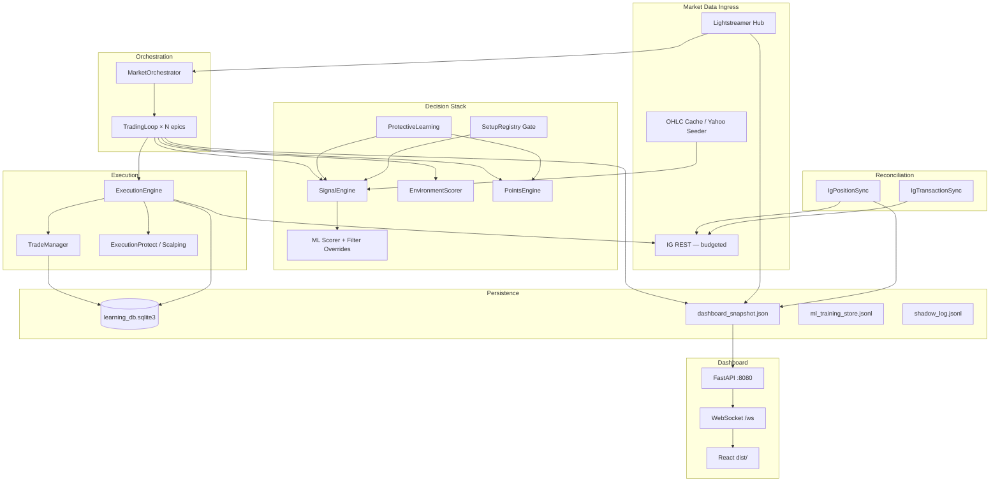
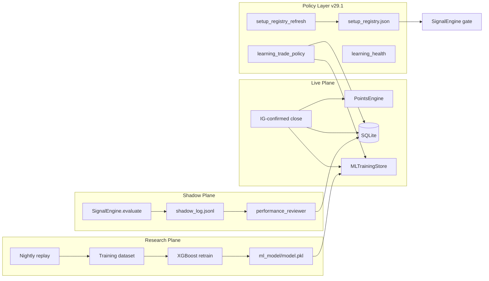

# IG Agent v29.1 — System Architecture

**June 2026 | CONFIDENTIAL**

| Field | Value |
|-------|-------|
| Version | **29.1.0** |
| Spec companion | `IG_Agent_v29.1_COMPLETE_SPEC.md` |
| Entry point | `src/main.py` |
| Config | `config/config_v29.json` → `config_v25.json` |

---

## 1. Architectural Overview

IG Agent v29.1 is a **single-process trading agent** with a **background trading orchestrator** and a **foreground FastAPI server**. One IG demo account, multiple market threads, one shared SQLite learning database, one dashboard snapshot bus.



---

## 2. Process Model

| Process | Role |
|---------|------|
| `main.py` | Acquire lock, load config, bootstrap credentials, start orchestrator thread, run Uvicorn |
| `MarketOrchestrator` | Spawns one `TradingLoop` thread per enabled epic |
| `TradingLoop` | ~5s tick: quote → gates → signal → optional submit → publish tick |
| FastAPI | Serves API + static dashboard; WebSocket broadcasts enriched ticks |
| Background sync | Position sync thread, transaction sync, hub quote → snapshot refresh |

**Instance lock:** `src/data/.ig_agent_v29.lock` (legacy `.ig_agent_v25.lock` cleared on acquire).

---

## 3. Configuration Layers

```
┌─────────────────────────────────────┐
│  config_v29.json  (v29.1 overlay)   │  protective_learning, demo_soak,
│                                     │  execution_protect, sentiment_guard,
│                                     │  learning_demo_mode, instrument toggles
└─────────────────┬───────────────────┘
                  │ $extends
┌─────────────────▼───────────────────┐
│  config_v25.json  (instrument base) │  epics, sizes, thresholds, sessions
└─────────────────┬───────────────────┘
                  │
┌─────────────────▼───────────────────┐
│  config_v26.json  (profitability)   │  capital_envelope, expectancy
└─────────────────────────────────────┘
```

**Loader:** `src/system/config_loader.py` — merged into runtime `Config` object.

**Identity:** `src/system/app_identity.py` — version labels decoupled from launcher bundle name (`IG Agent v29.0.app` may lag display string).

---

## 4. Trading Loop — Single Tick

```
Quote (hub) ──► EnvironmentScorer.score()
             ──► PointsEngine state / sizing
             ──► SignalEngine.evaluate()
                   ├─ protective threshold floor
                   ├─ ML filter overrides (meta.json)
                   └─ shadow_log append (all paths)
             ──► Seven gates (trading_loop)
             ──► ExecutionEngine (if READY)
             ──► _positions_payload() + enrich_positions_with_quote()
             ──► publish_tick() → snapshot_store
```

**Gate relaxation:** `gate_relaxation.py` merges demo soak + protective floors + velocity strictness.

---

## 5. Snapshot & Dashboard Data Flow

Cross-process snapshot (`src/api/snapshot_store.py`):

1. `TradingLoop` builds tick payload with `realized_daily_pnl_gbp`, positions, gates
2. `write_tick_snapshot()` → `apply_display_daily_pnl()` → atomic JSON write
3. Hub quote callback → `force_position_view_refresh()` when positions open
4. `_tick_for_readers()` enriches thresholds, aggregates multi-market positions, re-applies daily P&L idempotently
5. WebSocket subscribers receive JSON-safe copy

**P&L modules:**

| Module | Responsibility |
|--------|----------------|
| `daily_loss_policy.py` | Effective daily P&L after v29.1 baseline |
| `open_position_view.py` | Quote enrichment, FX pip scaling, quote trust |
| `pnl_math.py` | Pip size, IG point conversion, classify result |

---

## 6. Learning Architecture (v29.1)



**Exclusions:** IG-import setup keys and non-agent sources filtered at write and rebuild time.

**Inclusions:** Shadow counterfactuals (`source='shadow'`) feed setup stats despite `dry_run=1`.

---

## 7. Module Map (Core)

| Path | Responsibility |
|------|----------------|
| `src/main.py` | Process entry, startup pipeline, v29.1 upgrade hook |
| `src/runtime/market_orchestrator.py` | Multi-market thread manager |
| `src/trading/trading_loop.py` | Gates, tick publish, ML blend |
| `src/signals/signal_engine.py` | Rules + shadow log + ML filter |
| `src/trading/environment_scorer.py` | Fitness + sentiment guard |
| `src/trading/points_engine.py` | Reinforcement sizing |
| `src/trading/trade_manager.py` | Trail, BE, exits |
| `src/trading/open_position_view.py` | Dashboard position P&L |
| `src/execution/trade_risk.py` | Stop/risk resolution (FX-aware) |
| `src/execution/live_executor.py` | IG order submit |
| `src/runtime/ig_position_sync.py` | REST position mirror |
| `src/runtime/ig_transaction_sync.py` | Close P&L truth |
| `src/data/learning_store.py` | SQLite ORM + stats rebuild |
| `src/data/ml_training_store.py` | JSONL ML log |
| `src/system/protective_learning.py` | Phase-2 entry floors |
| `src/system/setup_registry_refresh.py` | Agent-only registry rebuild |
| `src/system/learning_health.py` | Health report builder |
| `src/system/v291_upgrade.py` | Daily loss baseline reset |
| `src/api/snapshot_store.py` | Tick persistence + hub merge |
| `src/api/routes.py` | REST API surface |
| `src/system/market_data_hub.py` | Lightstreamer quote hub |

---

## 8. Execution Boundary (v29)

```
Signal READY
    └── RiskManager / correlation_guard / margin_preflight
            └── LiveExecutor
                    └── atomic_protect (spread MA, SL/TP verify)
                            └── IG REST deal/open
```

Scalping framework config mirrors execution protect with additional equity drawdown circuit.

---

## 9. External Integrations

| System | Usage |
|--------|-------|
| IG REST | Orders, positions, transactions, sentiment — **3 calls/min cap** |
| IG Lightstreamer | Live bid/offer — primary quote source |
| Yahoo Finance | OHLC cache seed (`ohlc_yahoo_seeder.py`) |
| Telegram | Optional alerts (`telegram_notifier.py`) |
| launchd | Watchdog + caffeinate + nightly replay/digest plists (`scripts/com.igagent.v29*.plist`) |

---

## 10. Testing Architecture

| Layer | Location |
|-------|----------|
| Unit / integration | `tests/` (~794 tests) |
| Execution E2E | `tests/test_execution_pipeline_e2e.py` |
| v29 chaos | `tests/test_v29_chaos_e2e.py` |
| Platform validation | `scripts/e2e_platform_validation.py` |

Test isolation: `conftest.py` sets `IG_AGENT_PYTEST=1`, resets singletons.

---

## 11. Deployment (macOS)

| Artefact | Path |
|----------|------|
| Launcher bundle | `launcher/IG Agent v29.0.app` |
| Launch script | `launcher/templates/launch.sh` |
| Desktop shortcut | `scripts/create_desktop_shortcut.py` |
| Watchdog install | `scripts/install_launchd.sh` |

**Operator flow:** Desktop launcher → preflight → `main.py` → browser `:8080`.

---

## 12. Future Architecture (v26 — Not Yet Separate Process)

`IG_Agent_v26_FRAMEWORK.md` describes a future **strategy registry + portfolio allocator** brain. v29.1 **embeds** v26 profitability config and certification hooks but still runs the **v25 single-strategy loop** per epic. A separate `v26/` agent package is planned, not shipped.

---

## 13. Change Control

| Version | Architecture delta |
|---------|-------------------|
| v29.0 | Scalping + execution protect + correlation guard |
| v29.1 | Protective learning, clean labels, live P&L pipeline, learning health, daily loss baseline |

Update this document when `APP_VERSION` bumps or config overlay structure changes.

---

*End of v29.1 Architecture Document*
