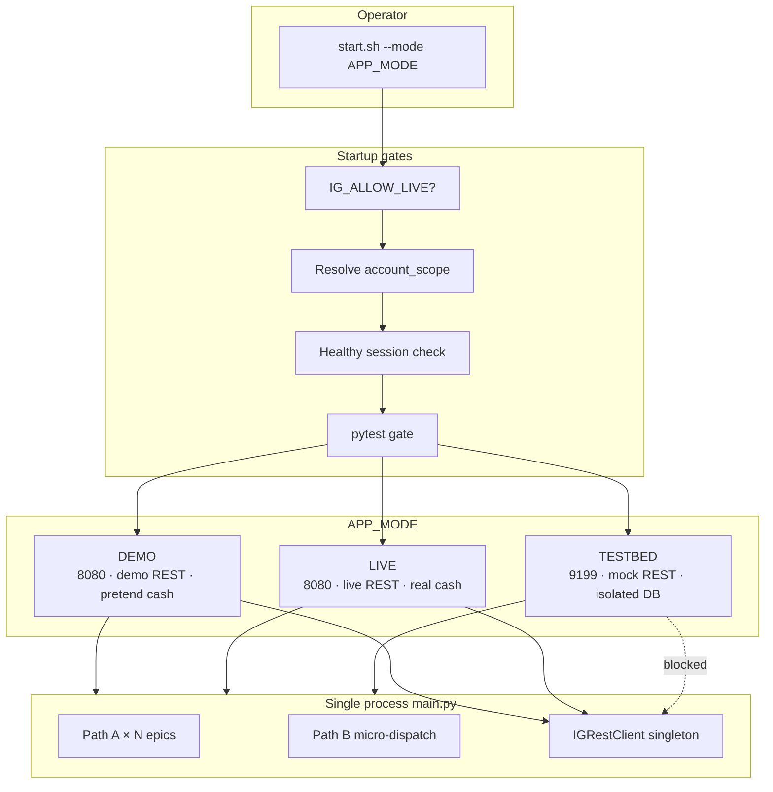

# v31 APP_MODE — Simplified Mode Hierarchy & Startup Contract

**Status:** Proposed architecture (no implementation)  
**Goal:** One session per IG account; three explicit modes; one startup path; retire parallel mode stacks.

---

## 1. Design principles

1. **Single authority:** `APP_MODE` is the only operator-facing runtime mode. All other mode enums become derived, internal, or removed.
2. **DEMO ≡ LIVE structurally:** Same binary, config merge chain, Path A/B, guards, and post-ready arming. Only broker endpoint, credentials, and cash semantics differ.
3. **TESTBED is isolated:** Same codebase, sandbox I/O plane. No shared lock, PID registry, or SQLite paths with DEMO/LIVE.
4. **One instance per IG account:** Startup refuses if a healthy agent already holds the account scope lock (regardless of port).
5. **Fail-closed LIVE:** `APP_MODE=LIVE` is rejected unless an explicit env arm flag is set.
6. **Config overlays are not modes:** Canary, soak, and v26 overlays select JSON files; they do not create new runtime planes.

---

## 2. Proposed mode hierarchy

### 2.1 Top level — `APP_MODE` (required)

```text
APP_MODE ∈ { DEMO, LIVE, TESTBED }
```

| Mode | Purpose | IG REST | Cash | Default port |
|------|---------|---------|------|--------------|
| **DEMO** | Production-shaped agent on IG demo funds | `demo-api.ig.com` | Pretend (demo account balance) | **8080** |
| **LIVE** | Same agent on IG live funds | `api.ig.com` (live) | Real | **8080** |
| **TESTBED** | Deterministic sandbox / CI / harness | Blocked or loopback mock | Synthetic | **9199** |

**Mutual exclusion (DEMO vs LIVE):** Only one of `{DEMO, LIVE}` may run per **IG account scope** at a time. Same host, same or different port — if account scope matches and session is healthy → **refuse start**.

**Mutual exclusion (TESTBED):** Independent scope (`account_scope=testbed`). May run concurrently with DEMO/LIVE on the same machine **only** because it never touches real IG or production registry paths (operator policy may still forbid this).

### 2.2 Derived planes (internal, not operator-facing)

These collapse under `APP_MODE` and are **not** set independently at startup:

```text
APP_MODE
└── RuntimePlane (derived)
    ├── DEMO  → HostPlane=RUNTIME, BrokerPlane=DEMO,  DataRoot=production
    ├── LIVE  → HostPlane=RUNTIME, BrokerPlane=LIVE,  DataRoot=production
    └── TESTBED → HostPlane=SANDBOX, BrokerPlane=MOCK, DataRoot=testbed
```

| Derived concept | DEMO / LIVE | TESTBED |
|-----------------|-------------|---------|
| **HostPlane** | `RUNTIME` (single production namespace) | `SANDBOX` |
| **BrokerPlane** | `DEMO` or `LIVE` (matches APP_MODE) | `MOCK` |
| **ExecutionEngine** | `LiveExecutor` → real IGRestClient | `MockExecutor` / loopback transport |
| **Path A + Path B** | Both armed at post-ready | Same code paths; optional `TESTBED_SKIP_POST_READY=1` for unit speed |
| **Node data paths** | `src/data/v31-production/` (or unified production root) | `testbed/` isolated root |

### 2.3 Config overlay (orthogonal to APP_MODE)

```text
IG_AGENT_CONFIG → merged JSON chain (optional; has defaults per APP_MODE)
```

| Default overlay | APP_MODE | Notes |
|-----------------|----------|-------|
| `config/config_v31.json` | DEMO, LIVE | Same base chain: v31→v30→v29→v25 |
| `config/config_v31_testbed.json` | TESTBED | Extends v31; sets dry-run / mock flags |
| `config/config_v31_live_canary.json` | DEMO or LIVE | **Not a mode** — tight £5 / forex-lock overlay for smoke |

**Rule:** DEMO and LIVE load the **same default chain** unless operator overrides `IG_AGENT_CONFIG`. LIVE is not a separate config fork.

### 2.4 Session identity (new contract)

| Field | DEMO / LIVE | TESTBED |
|-------|-------------|---------|
| **account_scope** | `ig:{account_id}` from credentials | `testbed:local` (fixed) |
| **instance_lock** | `{data_root}/.ig_agent_{account_scope_hash}.lock` | `{testbed_root}/.ig_agent_testbed.lock` |
| **pid_registry** | `{data_root}/agent.pid` + supervisor pid | `{testbed_root}/agent.pid` only |
| **rest_session** | One `IGRestClient` per process | None (mock transport) |
| **port** | `8080` (override: `IG_API_PORT`) | `9199` (override allowed) |

**Account scope lock** replaces port-only locking as the primary anti-zombie mechanism for DEMO/LIVE.

---

## 3. Startup contract

### 3.1 Operator interface

```bash
# Required (one of):
export APP_MODE=DEMO          # or LIVE, TESTBED
./scripts/start.sh

# Or explicit CLI (preferred):
./scripts/start.sh --mode DEMO [--config config/config_v31_live_canary.json] [--port 8080]

# LIVE requires explicit arm:
IG_ALLOW_LIVE=1 ./scripts/start.sh --mode LIVE
```

### 3.2 `start.sh` phases (normative)

```text
Phase 0 — Parse
  APP_MODE ← --mode or $APP_MODE (required; fail if missing/invalid)
  IG_AGENT_CONFIG ← --config or mode default
  IG_API_PORT ← --port or default (8080 DEMO/LIVE, 9199 TESTBED)

Phase 1 — LIVE gate
  IF APP_MODE=LIVE AND IG_ALLOW_LIVE ∉ {1,true,yes} → EXIT 2 "LIVE disabled"

Phase 2 — Account scope resolve
  IF TESTBED → account_scope=testbed:local
  ELSE → load credentials (memory only) → account_scope=ig:{accountId}

Phase 3 — Existing session check (fail-closed)
  IF healthy agent on /api/health AND same account_scope → EXIT 3 "session already active"
  IF stale lock (dead PID) → clear lock
  IF same port bound by foreign process → EXIT 4 "port conflict"

Phase 4 — Test gate (mode-dependent)
  IF APP_MODE ∈ {DEMO, LIVE} → run pytest gate (current 6+ modules)
  IF APP_MODE=TESTBED → run pytest gate OR lighter TESTBED_GATE=quick (policy)

Phase 5 — Single process launch
  Export canonical env bundle (§3.3)
  IF APP_MODE=TESTBED → exec python src/main.py (no supervisor) OR testbed supervisor
  ELSE → exec daemon_supervisor.sh (one worker only)

Phase 6 — Ready poll
  Poll GET /api/health until system_state.phase=G5 OR timeout
  Print: APP_MODE, account_scope (masked), port, PID
  EXIT 0 on G5; EXIT 5 on timeout
```

### 3.3 Canonical env bundle (set by `start.sh` only)

Operators should **not** need to set legacy `IG_*` mode flags. `start.sh` publishes:

| Variable | DEMO | LIVE | TESTBED |
|----------|------|------|---------|
| `APP_MODE` | DEMO | LIVE | TESTBED |
| `IG_AGENT_CONFIG` | overlay path | same | testbed overlay |
| `IG_API_PORT` | 8080 | 8080 | 9199 |
| `IG_ALLOW_LIVE` | unset | 1 (validated) | unset |
| `IG_ACCOUNT_SCOPE` | ig:… | ig:… | testbed:local |
| `IG_BROKER_PLANE` | DEMO | LIVE | MOCK |
| `IG_DATA_ROOT` | production path | production path | testbed path |

**Deprecated env vars must not be set by start.sh:** `IG_APEX_RUNTIME_MODE`, `IG_AGENT_MODE`, `IG_PARALLEL_DUAL`, `IG_PARALLEL_TRACK`, `PROD_MODE`, `IG_TEST_HARNESS` (except TESTBED internal alias).

### 3.4 `main.py` boot obligation (under new contract)

1. Read `APP_MODE` — **fail** if unset (no silent defaults).
2. Derive broker client endpoint and `allow_live_trading` from `APP_MODE` + config.
3. Acquire **account-scoped** instance lock (Gate 1).
4. Skip rollover pause / canary resets per config overlay (unchanged behaviour).
5. Arm post-ready Path A + Path B for DEMO and LIVE; TESTBED per policy.
6. Expose `APP_MODE`, `account_scope`, `broker_plane` on `/api/health`.

### 3.5 Stop contract (`stop.sh`)

```text
stop.sh [--mode DEMO|LIVE|TESTBED|all]
  Default: stop production scope (DEMO+LIVE share supervisor)
  TESTBED: stop only testbed pid/registry
  Never kill by blind pkill without reading account_scope lock holder
```

---

## 4. Mapping: legacy selectors → APP_MODE

### 4.1 Primary mappings

| Legacy selector | Disposition | Maps to |
|-----------------|-------------|---------|
| **`IG_APEX_RUNTIME_MODE=PRODUCTION`** | **Retired** | `APP_MODE ∈ {DEMO,LIVE}` |
| **`IG_APEX_RUNTIME_MODE=SHADOW_LIVE`** | **Retired** | Use `APP_MODE=TESTBED` |
| **`IG_APEX_RUNTIME_MODE=HARDENED_TESTBED`** | **Aliased → TESTBED** | `APP_MODE=TESTBED` |
| **`IG_AGENT_MODE=SHADOW`** | **Retired** | `APP_MODE=TESTBED` (mock fills) |
| **`IG_AGENT_MODE=DEMO`** | **Retired** | `APP_MODE=DEMO` |
| **`IG_AGENT_MODE=LIVE`** | **Retired** | `APP_MODE=LIVE` + `IG_ALLOW_LIVE=1` |
| **`ExecutionMode.TEST`** | **Internal** | TESTBED only inside engine bootstrap |
| **`ExecutionMode.DEMO/LIVE`** | **Derived** | Match `APP_MODE` |
| **`operating_mode` (config JSON)** | **Derived read-only** | Synced from `APP_MODE` at load; config value ignored if mismatch |
| **`NodeProfile production`** | **Derived** | DEMO + LIVE |
| **`NodeProfile shadow`** | **Retired** | Was duplicate of SHADOW_LIVE |
| **`NodeProfile testbed`** | **Derived** | TESTBED |
| **`BootProfile for_live / for_shadow`** | **Retired** | Single boot path per APP_MODE |
| **`IG_TEST_HARNESS=1`** | **Aliased** | `APP_MODE=TESTBED` + `--harness-ticks N` |
| **`IG_AGENT_PYTEST=1`** | **Kept** | Test-only; not a runtime mode |
| **`PROD_MODE=PRODUCTION`** | **Retired** | Implied by DEMO/LIVE |
| **`IG_SHARE_ENGINE=1`** | **Kept internal** | Script pacing; not a mode |
| **`IG_PARALLEL_DUAL=1`** | **Retired** | Violates single-session contract |
| **`IG_UNIFIED_ENGINE=1`** | **Retired** | Implementation detail or fold into main |
| **`--daemon-cycle` dual spawn** | **Retired** | Single process only |
| **`--isolated-track=live\|shadow`** | **Retired** | Use APP_MODE |
| **`IG_APEX_DESKTOP=1`** | **Aliased** | `APP_MODE=TESTBED` or local DEMO with port override |
| **`live_canary.enabled` (config)** | **Kept** | Config overlay behaviour, not APP_MODE |
| **`config operating_mode: LIVE`** | **Derived** | Must agree with `APP_MODE=LIVE` |

### 4.2 Compatibility shim (transition period)

During migration, `main.py` may accept:

```text
IF APP_MODE unset:
  IF IG_APEX_RUNTIME_MODE ∈ {TESTBED,HARDENED_TESTBED} → APP_MODE=TESTBED
  ELIF IG_AGENT_MODE=SHADOW OR IG_TEST_HARNESS=1 → APP_MODE=TESTBED
  ELIF IG_AGENT_MODE=LIVE AND IG_ALLOW_LIVE → APP_MODE=LIVE
  ELSE → APP_MODE=DEMO
  LOG deprecation warning once
```

Shim removed after one release.

---

## 5. Retire / alias / keep

### 5.1 Retire (remove from operator docs and start paths)

| Item | Reason |
|------|--------|
| `IG_APEX_RUNTIME_MODE=SHADOW_LIVE` | Duplicate of TESTBED / shadow node |
| `IG_AGENT_MODE=SHADOW` | Replaced by TESTBED mock plane |
| `BootProfile.for_shadow()` | Dual-track removed |
| `launch_dual_tracks_detached()` | Violates single session |
| `IG_PARALLEL_DUAL`, `IG_PARALLEL_TRACK=shadow` | Dual :8080/:9199 production |
| `process_orchestrator` parallel supervisor | Same |
| `--isolated-track`, `--daemon-cycle` multi-spawn | Same |
| Legacy `launchd` + `watchdog.sh` + `start_agent_launchd.py` | Superseded by `daemon_supervisor.sh` |
| `PROD_MODE` | Redundant with APP_MODE |
| `NodeProfile shadow` / shadow learning DB split | Collapse to TESTBED isolation |
| `ExecutionMode` as operator concept | Internal only |
| `config operating_mode` as authority | Derived from APP_MODE |

### 5.2 Alias (accept temporarily, map to APP_MODE)

| Item | Maps to |
|------|---------|
| `IG_APEX_RUNTIME_MODE=HARDENED_TESTBED` | TESTBED |
| `IG_TEST_HARNESS=1` | TESTBED |
| `--test-harness-ticks=N` | TESTBED + harness tick limit |
| `IG_APEX_DESKTOP=1` | TESTBED (or DEMO dev with explicit port) |
| `live_canary` config profile | DEMO + `IG_AGENT_CONFIG=…_live_canary.json` |

### 5.3 Keep (unchanged role; not modes)

| Item | Role |
|------|------|
| `IG_AGENT_CONFIG` | Config overlay path |
| `IG_AGENT_PYTEST` | Unit test isolation |
| `IG_API_PORT` | Bind override (defaults per APP_MODE) |
| `IG_ALLOW_LIVE` | LIVE arm gate |
| `daemon_supervisor.sh` | DEMO/LIVE supervision (single child) |
| `config_v31_live_canary.json` | Risk-tight overlay for smoke |
| Path A / Path B code | Same for DEMO and LIVE |
| `live_canary.*` config keys | Guards/bypasses within DEMO/LIVE |
| Instance lock mechanism | Upgraded to account-scoped |
| Gate G1–G5 boot | Unchanged sequence |
| pytest gate in start.sh | Pre-flight for DEMO/LIVE |

---

## 6. Mode interaction under new contract

### 6.1 Valid combinations

| APP_MODE | Config overlay | Port | Result |
|----------|----------------|------|--------|
| DEMO | default v31 | 8080 | Standard demo trading |
| DEMO | live_canary | 8080 | Demo smoke (forex lock, £5) |
| LIVE | default v31 | 8080 | Live trading (requires IG_ALLOW_LIVE) |
| LIVE | live_canary | 8080 | Live smoke (operator rare) |
| TESTBED | testbed | 9199 | Sandbox replay / CI |

### 6.2 Invalid / refused combinations

| Combination | Refusal reason |
|-------------|----------------|
| LIVE without `IG_ALLOW_LIVE` | Fail-closed |
| Second DEMO/LIVE same account_scope | Session already active |
| TESTBED writing production SQLite | Firewall (existing testbed_firewall) |
| `APP_MODE=LIVE` + demo credentials | Credential/plane mismatch (Gate 2 fail) |
| Two processes on 8080 | Port conflict |
| Legacy dual-track startup | Script removed / exits with message |

### 6.3 Path A / Path B by APP_MODE

| APP_MODE | Path A (12-gate loops) | Path B (micro-dispatch) |
|----------|------------------------|-------------------------|
| DEMO | ✓ Full | ✓ Full |
| LIVE | ✓ Full | ✓ Full |
| TESTBED | ✓ Loops (mock quotes) | Optional (mock REST); default ✓ with loopback |

---

## 7. Architecture diagram (target state)



---

## 8. Health API contract (observability)

`/api/health` must expose:

```json
{
  "app_mode": "DEMO",
  "broker_plane": "DEMO",
  "account_scope": "ig:***",
  "config_overlay": "config/config_v31_live_canary.json",
  "api_port": 8080,
  "session_id": "<pid>-<started_at_epoch>",
  "paths_armed": { "path_a": true, "path_b": true }
}
```

No exposed `IG_APEX_RUNTIME_MODE`, `IG_AGENT_MODE`, or `NodeProfile kind`.

---

## 9. Migration checklist (implementation phase — out of scope here)

1. Add `APP_MODE` enum + validation in `main.py` (fail if unset after shim sunset).
2. Replace `start.sh` / `daemon_supervisor.sh` env exports with §3.3 bundle.
3. Implement account-scoped lock in Gate 1.
4. Add healthy-session check before supervisor launch.
5. Collapse `apply_runtime_mode_to_environ` / `BootProfile` into APP_MODE derivation.
6. Remove dual-track CLI branches from `main.py`.
7. Archive legacy launchd docs; point ops to single start/stop contract.
8. Update dashboard to show `app_mode` only.

---

## 10. Summary

| Question | Answer |
|----------|--------|
| How many operator modes? | **3** — DEMO, LIVE, TESTBED |
| DEMO vs LIVE difference? | Broker endpoint + credentials + cash only; same engine, config chain, paths, guards |
| How is LIVE disabled? | `IG_ALLOW_LIVE` required |
| One session per account? | **account_scope lock** + healthy session refusal |
| What happens to SHADOW / dual-track / SHADOW_LIVE? | **Retired** → TESTBED or DEMO |
| What happens to canary? | **Config overlay**, not a mode |
| Default ports? | DEMO/LIVE **8080**, TESTBED **9199** |
| Distinct runtime shapes after simplification? | **3** (+ pytest/harness as TESTBED subvariants) |

---

*Proposed contract — v31 APP_MODE simplification. No code changes in this document.*
