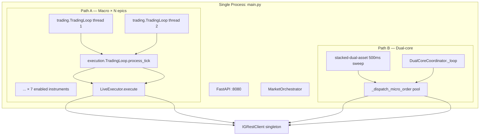

# v31 Trading Agent — Forensic Architecture Inspection

**Scope:** Codebase as of inspection date. Factual extraction only — no remediation proposals.  
**Primary production entry today:** `scripts/start.sh` → `scripts/daemon_supervisor.sh` → `src/main.py` with `IG_AGENT_CONFIG=config/config_v31_live_canary.json`.

---

## 1. Executive summary

The v31 agent is a **single OS process** (`src/main.py`) hosting **one FastAPI server**, **one shared IG REST session**, and **multiple concurrent background threads**. It is **not** a multi-process trading cluster, but it **does** run **several independent execution planes in parallel** inside that process.

| Question | Answer (code-based) |
|----------|---------------------|
| How many “versions” exist? | **12+ distinct runtime modes/planes** (see §2) — selected by env vars, config overlays, and boot entrypoint — not separate binaries. |
| How many trading loops? | **7 macro loop threads** (Path A, one per enabled instrument) + **3 Path B threads** (coordinator, stacked sweep, heartbeat) + **1 virtual-stop watchdog** + **2 micro-dispatch worker threads** (pool). |
| Can multiple sessions run concurrently? | **One agent instance per API port** (instance lock). **One IG REST login per process.** Multiple OS processes possible if locks/ports differ → **multi-session conflict risk**. |
| Path A vs Path B | **Both run simultaneously** after Gate 5 post-ready; **not mutually exclusive**; share account, position sync, REST budget. |

---

## 2. Distinct runtime modes and versions

These are **orthogonal selectors** that combine at boot. There is one codebase; “version” here means **operational plane**, not git tag.

### 2.1 Host / data plane

| Mode | Selector | Module | Effect |
|------|----------|--------|--------|
| **PRODUCTION** | default / `IG_APEX_RUNTIME_MODE=PRODUCTION` | `system/apex_runtime_mode.py` | Production data paths, live `:8080` host |
| **SHADOW_LIVE** | `IG_APEX_RUNTIME_MODE=SHADOW_LIVE`, desktop shell, `IG_NODE_PROFILE=shadow` | same | Isolated shadow namespace (`:9090` in harness) |
| **HARDENED_TESTBED** | `IG_APEX_RUNTIME_MODE=HARDENED_TESTBED` | same + `system/testbed_firewall.py` | Blocks production I/O; loopback transport only |

### 2.2 Broker / fill plane

| Mode | Selector | Module | Effect |
|------|----------|--------|--------|
| **SHADOW ledger** | `IG_AGENT_MODE=SHADOW` | `system/agent_execution_mode.py` | `ShadowExecutor` — no IG orders |
| **DEMO broker** | `IG_AGENT_MODE=DEMO` (default on Apex desktop / when mock disabled) | same | `LiveExecutor` → IG demo REST |
| **LIVE broker** | `IG_AGENT_MODE=LIVE` | same | Live REST (blocked when `demo_only_deployment`) |
| **Production execution** | `IG_PRODUCTION_EXECUTION=1` / `PROD_MODE=PRODUCTION` | same + `main.py` | Forces real `IGRestClient`; supervisor sets `PROD_MODE=PRODUCTION` |

### 2.3 Engine execution enum (per orchestrator build)

| Mode | Enum | Module | Effect |
|------|------|--------|--------|
| **TEST** | `ExecutionMode.TEST` | `execution/types.py` | Internal simulator when no REST at Gate 4 |
| **DEMO** | `ExecutionMode.DEMO` | same | Broker path when REST client present |
| **LIVE** | `ExecutionMode.LIVE` | same | Live routing inside engine |

### 2.4 Config overlay planes

| Overlay | File / flag | Module | Effect |
|---------|-------------|--------|--------|
| **v31 live canary** | `IG_AGENT_CONFIG=config/config_v31_live_canary.json` | `system/config_loader.py`, `runtime/live_canary_*.py` | `live_canary.enabled`, forex lock, bypass flags, £5 envelope |
| **operating_mode: LIVE** | canary config | config JSON | Config semantic; works with `allow_live_trading: true` |
| **Session validation** | `IG_SESSION_VALIDATION=1` | `agent_execution_mode.py` | Lower floors; clears circuit breaker on boot |
| **Soak live fire** | `IG_SOAK_MODE=1` | `system/soak_live_fire.py` | File-triggered Gold dispatch via frontier tick |
| **Demo sandbox** | auto when `IG_AGENT_MODE=DEMO` | `ensure_demo_sandbox_execution_armed()` | Clears kill-switch / streak state on boot |

### 2.5 Boot entry profiles (same binary, different lifecycle)

| Entry | Trigger | Module | Effect |
|-------|---------|--------|--------|
| **Supervised production** | `scripts/start.sh` → `daemon_supervisor.sh` | `scripts/*`, `main.py` | Pytest gate → supervisor → `main.py` canary config |
| **Direct main** | `python src/main.py` | `main.py` | Full gate boot; config from loader default unless env override |
| **Test harness** | `--test-harness-ticks=N` / `IG_TEST_HARNESS=1` | `system/test_harness/runner.py` | Port `9199`, mock feed, skips post-ready daemons |
| **Daemon cycle** | `--daemon-cycle=N` / `IG_DAEMON_CYCLE_SEC` | `system/daemon_cycle_kernel.py` | Shadow boot profile; 15-min cycle kernel |
| **Pytest in-process** | `IG_AGENT_PYTEST=1` | widespread | Skips locks, shutdown, many background services |
| **Gate 5 background pytest** | spawned in `gate5_runner.py` | `system/boot/gate5_runner.py` | Subprocess validation with `IG_AGENT_PYTEST=1` |

### 2.6 In-process execution path variants (Path A sub-modes)

| Path | Selection | Module | Competes with |
|------|-----------|--------|---------------|
| **Standard 12-gate tick** | default `_run_tick_core` | `trading/trading_loop.py` | Path B |
| **Alpha matrix redirect** | `prebaked_alpha_matrix_live_active()` unless canary bypass | `trading/trading_loop.py` | Standard tick |
| **Frontier / bare-metal tensor** | `soak_armed_for_epic`, `bare_metal_hot_path_active()` | `trading/trading_loop.py`, `system/bare_metal_exec.py` | Standard tick |
| **Harness fast tick** | `IG_TEST_HARNESS=1` | `trading/trading_loop.py` | Full gate stack |

**Live canary today:** `bypass_alpha_matrix: true` → alpha matrix redirect **disabled** for Path A.

---

## 3. Startup and session lifecycle

### 3.1 What `scripts/start.sh` starts

```
start.sh
  ├─ export PATH (.venv), PYTHONPATH=src
  ├─ pytest (6 test modules, -p no:anyio) — gate; no agent yet
  └─ nohup daemon_supervisor.sh (DAEMON_SUPERVISOR_REDIRECT=1)
       └─ writes supervisor.pid, polls /api/health for G5
```

`start.sh` does **not** start `main.py` directly. It starts **only** the bash supervisor (after tests pass).

### 3.2 What `daemon_supervisor.sh` starts

From `scripts/daemon_supervisor.sh` (`start_agent_inner`):

| Step | Action |
|------|--------|
| Env | `PROD_MODE=PRODUCTION`, `IG_AGENT_CONFIG=config/config_v31_live_canary.json`, `IG_SHARE_ENGINE=1`, `PYTHONPATH=src` |
| Process | `nohup .venv/bin/python3 -u src/main.py` → `agent.pid` |
| Supervision | Poll `http://127.0.0.1:8080/api/health` every 10s; SIGTERM recovery; 3-strike circuit breaker → `circuit_breaker.lock` + port hold |

**Separate from** legacy `scripts/install_launchd.sh` / `scripts/watchdog.sh` / `start_agent_launchd.py` — those form an **alternate supervision stack** still present in repo; v31 `start.sh` uses **daemon_supervisor** only.

### 3.3 `main.py` boot sequence (inside the agent process)

```
main.py
  ├─ Preflight: emergency lock, config, demo guard, instance lock (Gate 1 path)
  ├─ FastAPI lifespan → BootCoordinator
  │    G1 Preflight → G2 Broker handshake → G3 Stream → G4 Orchestrator (paused) → G5 READY
  └─ start_post_ready_services(context)  [skipped if IG_TEST_HARNESS=1]
```

**Gate 4** builds `MarketOrchestrator` with one skeleton/`TradingLoop` per **enabled instrument** (`InstrumentRegistry.get_enabled_with_ids()`). Observed runtime: **7 loops** (matches `V5_HYDRATION_EPICS` / health `loops.built: 7`).

**Gate 5** calls `orchestrator.unpause_from_boot()` → each loop’s `TradingLoop.start()` spawns its thread.

### 3.4 What constitutes a “session”

| Session concept | Module | Single or multi? |
|-----------------|--------|------------------|
| **Agent process session** | `main.py` lifespan | **One per OS process** |
| **IG REST session** | `system/ig_rest_session.py` | **Singleton** `_client` per process |
| **IG OAuth refresh** | `post_ready_services._start_session_refresh_watchdog` | Watchdog thread; same session |
| **Trading session (caps)** | `entry_protection.py`, `session_trade_unlimited.py` | In-memory + store keys; **one process scope** |
| **Live canary session baseline** | `runtime/live_canary_session.py` | Boot reset of P&L/shield; not a separate process |
| **Manual stop / watchdog hold** | `system/shutdown_cleanup.py` → `manual_stop.json` | Blocks **launchd** auto-restart; not a trading session |
| **Cockpit session** | `system/cockpit_session_monitor.py` | UI/monitor concept |

### 3.5 Concurrent sessions allowed?

| Layer | Policy | Evidence |
|-------|--------|----------|
| Same port / lock | **No** — fail-closed | `system/identity/instance_lock.py` → `acquire_instance_lock()` in Gate 1 |
| Same host, different port | **Possible** — two `main.py` PIDs | No global mutex beyond port-scoped lock file `.ig_agent_v30_port_{port}.lock` |
| Supervisor + orphan agent | **Observed failure mode** | Supervisor `agent_process_alive()` also true if **any** listener on `:8080` — can “adopt” wrong PID |
| Test harness | **Isolated port 9199** | `system/test_harness/runner.py` |

**Conclusion:** The design is **single active agent per API port**. Multiple agents on one host require different ports and configs → **shared IG account conflict** if both trade.

### 3.6 Supervisor ↔ worker orchestration

The supervisor manages **one worker**: `src/main.py`. It does **not** spawn per-epic workers. All trading threads are **in-process** inside that worker.

Internal “workers” (all daemon threads inside `main.py`):

| Thread name (typical) | Owner module |
|----------------------|--------------|
| `ig-agent-trading-loop-{epic}` × N | `trading/trading_loop.py` |
| `ig-loop-watchdog-{epic}` × N | same |
| `dual-core-micro-scalper` | `runtime/trade_manager.py` |
| `stacked-dual-asset` | `runtime/dual_core_execution.py` |
| `socket-heartbeat-validator` | same |
| `virtual-stop-watchdog` | `runtime/virtual_stop_loss.py` |
| `micro-scalper` × 2 (pool) | `ThreadPoolExecutor` in `DualCoreCoordinator` |
| `trading-health-monitor` | `system/trading_health_monitor.py` |
| `post-ready-*`, schedulers | `post_ready_services.py` and imports |

---

## 4. Execution paths — full map

### 4.1 Architecture outline



### 4.2 Path A — 12-gate macro pipeline

| Stage | File | Thread |
|-------|------|--------|
| Tick driver | `trading/trading_loop.py` → `_loop_thread` → `_run_tick_core` | **Dedicated per epic** |
| Gate evaluation | `_evaluate_gates` / `_evaluate_gates_core` | Same thread |
| Signal | `signals/signal_engine.py` (via execution loop) | Same thread |
| Execution wrapper | `execution/trading_loop.py` → `process_tick` | **Synchronous call** on macro thread |
| Engine | `execution/execution_engine.py` | Same |
| Broker | `execution/live_executor.py` → `place_market_order` / `confirm_deal` | Same |

**Where Path A starts:** Gate 5 `orchestrator.unpause_from_boot()` → each `TradingLoop.start()` (`trading/trading_loop.py:629`).

**Path A sub-routes inside `_run_tick_core` (mutually exclusive per tick):**

1. Soak → `_run_frontier_tensor_tick` if `soak_armed_for_epic`
2. Canary scope gate → WAIT if epic not on hot path (`live_canary_guards.canary_path_a_epic_allowed`)
3. Alpha matrix → `_run_tick_alpha_matrix` (disabled when `live_canary.bypass_alpha_matrix`)
4. Default → full gate stack → `_execution_loop.process_tick`

### 4.3 Path B — dual-core micro-scalper

| Stage | File | Thread |
|-------|------|--------|
| Coordinator poll | `runtime/trade_manager.py` → `DualCoreCoordinator._loop` | `dual-core-micro-scalper` |
| Channel scan | `_scan_micro_entries` → `evaluate_micro_scalp_signal` | Coordinator thread |
| Stacked sweep | `runtime/dual_core_execution.py` → `execute_parallel_strategy_sweep` | `stacked-dual-asset` (async loop in thread) |
| Pierce dispatch | `dispatch_piercing_zone_order` → `_dispatch_micro_order` | **ThreadPoolExecutor** (`micro-scalper` × 2) |
| Broker | `_rest.place_market_order` + `confirm_deal` | Pool thread |

**Where Path B starts:** `post_ready_services.py` → `start_dual_core_coordinator` + `start_stacked_dual_asset_tracks` (skipped in harness mode).

**Selection logic:** Path B is **not selected instead of Path A**. Both are armed. Path B fires on Z-pierce / channel touch **without** Path A gates. Path A fires on 12-gate pass on its own epic threads.

**Lazy start:** If coordinator missing, `dispatch_piercing_zone_order` → `_ensure_coordinator_for_dispatch()` can attach coordinator at first pierce (`trade_manager.py:771`).

### 4.4 Live canary mode (config plane, not separate binary)

| Concern | Entry / guard | Module |
|---------|---------------|--------|
| Enabled check | `live_canary.enabled` | `runtime/live_canary_session.py` |
| Boot P&L reset | `reset_live_canary_session_gates` | post-ready |
| Path A epic filter | `canary_path_a_epic_allowed` | `runtime/live_canary_guards.py`, `trading/trading_loop.py` |
| Path B risk parity | `canary_micro_dispatch_risk_ok` | `live_canary_guards.py`, `trade_manager.py` |
| Forex hot path | `lock_forex_rotation_session` | `dual_core_execution.py` |
| Bypass alpha matrix | `live_canary.bypass_alpha_matrix` | `trading/trading_loop.py` |
| Bypass traffic governor | `live_canary.bypass_traffic_governor` | `execution/ig_rest_traffic_governor.py` |
| Skip rollover pause | `live_canary.skip_rollover_pause` | `main.py` |
| Unlimited trades | `inject_session_unlimited_trades` | `runtime/session_trade_unlimited.py` |

Supervisor **hardcodes** canary config: `IG_AGENT_CONFIG=config/config_v31_live_canary.json`.

### 4.5 Simulation / testbed paths

| Path | Entry | Isolation | Trades? |
|------|-------|-----------|---------|
| **Test harness** | `--test-harness-ticks=N` | Port 9199, mock feed | Mock / shadow |
| **HARDENED_TESTBED** | `IG_APEX_RUNTIME_MODE` | `testbed_firewall.py` panics on REST | No |
| **Historical replay** | replay scheduler / replayer | `simulation/historical_replayer.py` | Depends on mode |
| **Testbed daemon PID** | `TESTBED_ALLOW_ZOMBIE` | `simulation/testbed_daemon.py` | Protects sim PID from kill |
| **IG_AGENT_PYTEST** | unit/integration tests | Skips real boot side-effects | Mock clients |
| **simulation/main.py** | separate entry (exists) | Not started by `start.sh` | Simulation-only |

**Production `start.sh` path does not start simulation/main.py or test harness.**

### 4.6 Shadow / ancillary execution (non-order or parallel observability)

| Service | Module | Trades? |
|---------|--------|---------|
| **v26 shadow tail** | `system/v26_shadow_service.py` | No — log tail only |
| **ShadowExecutor** | `trading/shadow_executor.py` | When `IG_AGENT_MODE=SHADOW` |
| **v26 shadow trading service** | config-gated in post-ready | Analytics |
| **Intelligence worker** | `intelligence/intelligence_worker.py` | No direct orders |

---

## 5. Trading loop inventory (precise count)

### 5.1 Macro loops (Path A)

| Loop type | Count | Class | Location |
|-----------|-------|-------|----------|
| **Orchestrator macro loop** | **N = enabled instruments** (7 in current canary hydration set) | `trading.trading_loop.TradingLoop` | One OS thread + one watchdog thread **each** |
| **Execution sub-loop** | **N instances** (embedded) | `execution.trading_loop.TradingLoop` | No own thread — called from macro thread |

**Build source:** `runtime/market_orchestrator.py` → `build_market_orchestrator_instant` iterates `InstrumentRegistry.get_enabled_with_ids()`.

### 5.2 Micro / dual-core loops (Path B)

| Loop / worker | Count | Function |
|---------------|-------|----------|
| DualCoreCoordinator poll | **1** | `_loop` @ 0.5s |
| Stacked parallel sweep | **1** | `execute_parallel_strategy_sweep` @ 0.5s |
| Socket heartbeat validator | **1** | `validate_socket_heartbeat` |
| Virtual stop watchdog | **1** | 500ms flatten check |
| Micro order dispatch pool | **2 workers** | `_dispatch_micro_order` |

### 5.3 Total concurrent tick/order drivers (production post-ready)

| Category | Threads |
|----------|---------|
| Path A macro + watchdog | **7 + 7 = 14** |
| Path B infrastructure | **4** |
| Micro dispatch pool | **2** |
| **Subtotal trading-related** | **~20** |

Plus non-trading schedulers (health monitor, telegram, gate coherence, session refresh, alpha compiler, self-healing, v26 shadow, etc.) — **30+ daemon threads** possible in one process.

---

## 6. Micro-dispatch subsystem

### 6.1 Core functions and modules

| Symbol | File | Role |
|--------|------|------|
| `_dispatch_micro_order` | `runtime/trade_manager.py:549` | Broker POST + confirm + triage + virtual stop |
| `dispatch_piercing_zone_order` | `runtime/trade_manager.py:815` | Entry from async sweep |
| `_dispatch_piercing_zone_order` | `runtime/dual_core_execution.py` | Z-pierce bridge + hot-path filter |
| `DualCoreCoordinator._scan_micro_entries` | `trade_manager.py` | Channel-touch path |
| `start_dual_core_coordinator` | `trade_manager.py:865` | Idempotent singleton attach |
| `_persist_micro_production_order` | `trade_manager.py` | `triage_v31.db` ledger |

### 6.2 Independence from main loop

**Yes — micro-dispatch runs independently of Path A gate passage.**

Evidence:
- Invoked from `stacked-dual-asset` thread and coordinator thread, not from `trading.TradingLoop._evaluate_gates`.
- Pre-checks are a **subset**: kill switch, QMM block, API pause, broker reject guard, canary risk, position sync, REST budget — **not** 12 gates, not SignalEngine confidence.
- Uses same `IGRestClient` singleton as Path A.

### 6.3 Reject-guard behaviour

| Item | Detail |
|------|--------|
| Module | `runtime/broker_reject_guard.py` |
| Trip condition | **3** consecutive confirm rejections sharing reason family (`INSTRUMENT_NOT_TRADEABLE*`, etc.) |
| Latch duration | **900s** (in-memory) |
| Pre-dispatch | `broker_reject_dispatch_blocked()` in `_dispatch_micro_order` → suppression `broker_reject_latched:...` |
| Post-reject | `record_broker_confirm_rejection()` after confirm |
| Clear | `record_broker_confirm_success()` on accepted confirm |
| Scope | **Process memory only** — reset on restart; not persisted to disk |

---

## 7. Epic / product resolution

### 7.1 Broker product (SPREADBET vs CFD)

| Priority | Source | Function |
|----------|--------|----------|
| 1 | `dual_core.broker_account_product` or top-level product keys | `_config_product_override()` |
| 2 | `IG_BROKER_ACCOUNT_PRODUCT` env | `resolve_account_product()` |
| 3 | REST `/accounts` / login tokens | `detect_account_product_from_rest()` |
| 4 | Default | **`CFD`** |

**Module:** `execution/broker_epic_resolver.py`

**Canary config today:** `dual_core.broker_account_product: "SPREADBET"` in `config/config_v31_live_canary.json`.

### 7.2 Epic mapping (.CFD.IP → .TODAY.IP)

| Function | When SPREADBET | When CFD |
|----------|----------------|----------|
| `resolve_order_epic(epic, account_product=...)` | Maps `CS.D.EURUSD.CFD.IP` → `CS.D.EURUSD.TODAY.IP` (or `.DAILY.IP` if env suffix) | Returns epic unchanged |
| `resolve_hot_path_epics_from_config()` | Returns **logical** `.CFD.IP` keys always (hub alignment) | same |

**Wire epic** resolved at dispatch only: `trade_manager._dispatch_micro_order` calls `resolve_account_product` + `resolve_order_epic`.

### 7.3 Path-specific epic logic

| Path | Logical epic source | Wire epic |
|------|---------------------|-----------|
| **Path B micro** | `get_active_stack_epics()` / pierce target | `resolve_order_epic` at dispatch |
| **Path A macro** | Loop’s `_epic` from instrument registry | `LiveExecutor` / `broker_epic_resolver` in REST client paths |
| **Forex lock boot** | `lock_forex_rotation_session(cfg, rest)` → CFD logical stack | N/A at boot |
| **Hot path filter** | `epic_allowed_on_hot_path()` | Blocks dispatch only |

Path A and Path B **share** `broker_epic_resolver.py`; Path B always goes through explicit `resolve_order_epic` in `_dispatch_micro_order`. Path A goes through `LiveExecutor` → `rest_client` (also uses resolver in `rest_client.py`).

---

## 8. Concurrency and multi-session conflict surfaces

### 8.1 Background threads / async loops (spawn sites)

| Spawner | File |
|---------|------|
| `TradingLoop.start()` | `trading/trading_loop.py` |
| `start_dual_core_coordinator()` | `runtime/trade_manager.py` |
| `start_stacked_dual_asset_tracks()` | `runtime/dual_core_execution.py` |
| `start_socket_heartbeat_validator()` | same |
| `start_virtual_stop_watchdog()` | `runtime/virtual_stop_loss.py` |
| `start_post_ready_services()` | `system/boot/post_ready_services.py` (many) |
| `MarketOrchestrator` V5/V6 hydrator | `runtime/market_orchestrator.py` |
| Gate 5 background verify | `system/boot/gate5_runner.py` |

### 8.2 Loops independent of macro TradingLoop

These can place or attempt orders **without** a Path A gate pass on that tick:

- Path B coordinator + sweep + pierce dispatch
- Soak live fire (frontier tensor on armed epic)
- Alpha matrix bare-metal path (when active)
- API manual order routes (`api/v31_orders.py` — exists separately from loops)

### 8.3 Zombie / shadow session mechanisms

| Mechanism | How it arises | Module |
|-----------|---------------|--------|
| **Orphan `main.py`** | `stop.sh` / supervisor miss PID; port still bound | observed ops gap |
| **Supervisor adopt wrong PID** | `agent_process_alive()` true if port listening | `daemon_supervisor.sh:303` |
| **Stale instance lock** | Crash without cleanup | `instance_lock.py` (stale PID cleared on boot) |
| **Circuit breaker port hold** | 3 crashes in 600s | `daemon_supervisor.sh` — Python socket holds `:8080` |
| **manual_stop.json** | Dashboard Stop | blocks launchd restart ~10 min |
| **Testbed zombie protection** | `TESTBED_ALLOW_ZOMBIE` + pid file | `simulation/testbed_daemon.py` |
| **Lazy coordinator attach** | Pierce without full post-ready | `trade_manager._ensure_coordinator_for_dispatch` |
| **Reject-guard latch** | In-memory only; dies on restart | `broker_reject_guard.py` |

There is **no** separate “shadow trading session” process in the canary path. **v26 shadow** is a **read-only tail** inside the same process.

### 8.4 Multi-session conflict matrix

| Conflict | Parties | Shared resource |
|----------|---------|-----------------|
| **Dual path, one slot** | Path A vs Path B | `max_open_positions: 1`, `ig_position_sync.total_open()` |
| **Dual path, same epic** | Path A EUR/USD thread vs Path B EUR/USD sweep | Same epic, different signal logic |
| **REST budget** | All order paths | `RestApiBudget`, traffic governor |
| **Process entry block** | All paths | `qmm_process_supervisor` global latch |
| **Two agents, one account** | Two `main.py` on different ports | IG account / rate limits |
| **Supervisor vs manual agent** | Two listeners / two PIDs | Port 8080, instance lock |

---

## 9. Test harness interaction

### 9.1 Do tests create sessions/processes?

| Test type | Behaviour |
|-----------|-----------|
| **Unit pytest (default)** | `IG_AGENT_PYTEST=1` in many code paths; **no full agent** unless integration test starts one |
| **`start.sh` gate** | Runs pytest subprocess; **exits**; does not leave agent running from tests |
| **Test harness** | Starts real `main.py` lifecycle on **port 9199** with mock feed — **temporary session** |
| **Gate 5 background pytest** | Subprocess with `IG_AGENT_PYTEST=1`; optional skip in canary |
| **E2E scripts** | May spawn processes with explicit env |

### 9.2 Test artefacts persistence

| Artefact | Persists? | Location |
|----------|-----------|----------|
| `IG_AGENT_PYTEST` | Env during test only | — |
| Instance lock | Cleared/skipped under pytest | `instance_lock.py`, Gate 1 |
| `manual_stop.json` | Harness clears on configure | `test_harness/runner.py` |
| Supervisor PID files | **Not** created by pytest gate | `src/data/v31-production/` |
| Triage / learning DB | **Can** persist if tests write | `src/data/`, `src/analytics/triage_v31.db` |
| `broker_reject_guard` state | In-memory; test resets via `reset_broker_reject_guard_for_tests` | — |
| Log files | Append unless tmp | `src/data/logs/`, v31-production logs |
| `crash_history.json` | Supervisor only | v31-production |

Pytest gate in `start.sh` **does not** set `IG_TEST_HARNESS`; it runs isolated unit tests only.

---

## 10. Module responsibility index

| Mode / concern | Primary modules |
|----------------|-----------------|
| Production start | `scripts/start.sh`, `scripts/daemon_supervisor.sh`, `scripts/stop.sh` |
| Agent entry | `src/main.py`, `src/system/boot_coordinator.py`, `gate{1-5}_runner.py` |
| Post-ready arming | `src/system/boot/post_ready_services.py` |
| Path A | `src/trading/trading_loop.py`, `src/execution/trading_loop.py`, `execution_engine.py`, `live_executor.py` |
| Path B | `src/runtime/dual_core_execution.py`, `src/runtime/trade_manager.py` |
| Live canary | `config/config_v31_live_canary.json`, `live_canary_session.py`, `live_canary_guards.py` |
| Epic/product | `src/execution/broker_epic_resolver.py` |
| Reject guard | `src/runtime/broker_reject_guard.py` |
| Process block | `src/system/qmm_process_supervisor.py`, `strategy_kill_switch.py` |
| REST session | `src/system/ig_rest_session.py`, `src/ig_api/rest_client.py` |
| Instance lock | `src/system/identity/instance_lock.py` |
| Runtime planes | `src/system/apex_runtime_mode.py`, `src/system/agent_execution_mode.py` |
| Test harness | `src/system/test_harness/runner.py` |
| Testbed | `src/system/testbed_firewall.py`, `src/simulation/*` |
| Orchestrator | `src/runtime/market_orchestrator.py` |
| Telemetry | `src/api/v31_telemetry.py` |

---

## 11. Interaction diagram — modes and paths

```
                    ┌─────────────────────────────────────────┐
                    │         scripts/start.sh                │
                    │  pytest gate → daemon_supervisor.sh     │
                    └─────────────────┬───────────────────────┘
                                      │
                    ┌─────────────────▼───────────────────────┐
                    │  main.py  (single process)              │
                    │  IG_AGENT_CONFIG=v31_live_canary.json   │
                    │  Instance lock :8080                    │
                    │  IGRestClient singleton                 │
                    └─────────────────┬───────────────────────┘
          ┌───────────────────────────┼───────────────────────────┐
          │                           │                           │
   ┌──────▼──────┐            ┌───────▼───────┐           ┌───────▼───────┐
   │  Path A ×7  │            │   Path B      │           │  Observability │
   │ macro threads│            │ coordinator   │           │ v26 shadow,   │
   │ 12-gate     │            │ sweep thread  │           │ health monitor│
   │ LiveExecutor│            │ micro pool    │           │ schedulers    │
   └──────┬──────┘            └───────┬───────┘           └───────────────┘
          │                           │
          └─────────────┬─────────────┘
                        ▼
              POST /positions/otc (shared REST)
              confirm_deal (shared)
              max_open_positions: 1 (logical contention)
```

**Alternate entrypoints (not used by v31 `start.sh`):**

- `--test-harness-ticks` → mock plane, `:9199`
- `--daemon-cycle` → shadow boot profile
- `IG_APEX_RUNTIME_MODE=HARDENED_TESTBED` → firewall, no REST
- `launchd` / `watchdog.sh` → legacy supervision stack

---

## 12. Factual answers to inspection questions

| # | Question | Answer |
|---|----------|--------|
| 1 | Processes when `start.sh` runs? | **pytest** (ephemeral) → **daemon_supervisor.sh** (persistent) → **main.py** (persistent worker) |
| 2 | Session managers? | `ig_rest_session` (broker), `entry_protection` (trade caps), `live_canary_session` (baseline), `manual_stop` (supervisor hold), cockpit monitors |
| 3 | Multiple concurrent sessions? | **One agent instance per port** by design; multiple processes possible manually → IG account conflicts |
| 4 | Supervisor orchestration? | **One worker** (`main.py`); health poll + restart; no per-epic workers |
| 5 | Trading loops today? | **7** macro `TradingLoop` threads + **1** coordinator + **1** sweep + supporting threads (§5) |
| 6 | Path A vs B selection? | **Both armed** at post-ready; not exclusive; different triggers and gate stacks |
| 7 | Live canary? | Config overlay + guards; same process; supervisor forces canary JSON |
| 8 | Micro-dispatch independent? | **Yes** — separate threads, subset of guards, shared REST |
| 9 | Reject guard effect? | In-memory latch blocks `_dispatch_micro_order` for 900s after 3 instrument rejects |
| 10 | Epic logic differs by path? | Same resolver module; Path B resolves explicitly at dispatch; logical vs wire epic split for hot stack |
| 11 | Multi-session conflicts? | Path A vs B slot contention, REST budget, orphan PIDs, dual supervision stacks (§8) |
| 12 | Test persistence? | DB/logs may persist; pytest skips locks/shutdown; harness uses isolated port |

---

*End of forensic inspection report.*
