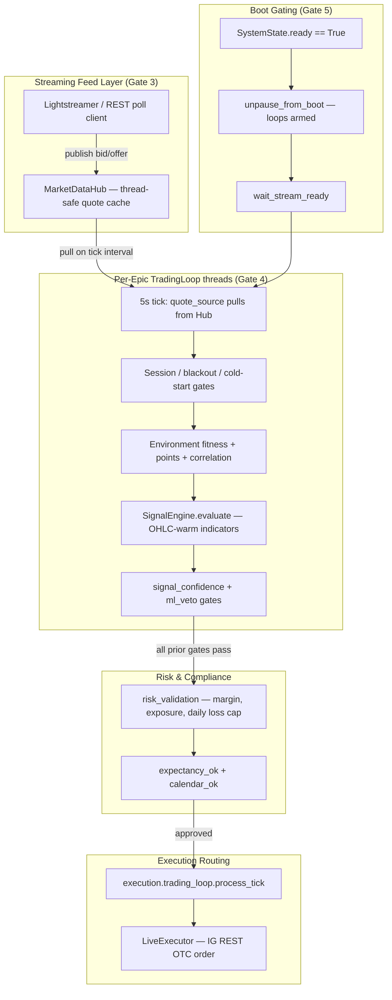

# Algorithmic Trading Execution Pipeline (v29.1)

This document maps out the post-launch execution pipeline from the streaming market feed to order placement on the IG Trading platform.

## 1. Structural Architecture

## 2. Core Execution Invariants

### 2.1 The Hub-Pull Model

Instead of a push queue architecture that is prone to backlog congestion, the agent uses a **Pull model**.

- The `Lightstreamer` socket thread writes updates directly to the `MarketDataHub` cache.
- Individual `TradingLoop` threads independently poll the hub every `~5s` (`refresh_seconds`).
- **Consequence:** Performance slowdown or lock contention in one specific epic thread cannot lag, starve, or crash other epic market loops.

### 2.2 Gate 5 Activation Control

`TradingLoop` threads do not query `SystemState.ready` on every evaluation tick. Instead, they handle initialization as a single blocking checkpoint:

1. Spin up at Gate 4 and wait on `paused_at_boot`.
2. When Gate 5 trips, loops awaken and call `wait_stream_ready(timeout=120.0)`.
3. Once the target stream is confirmed stable, threads proceed to fire the internal processing function `_run_tick()`.

### 2.3 Comprehensive Pre-Trade Gate Array

Trading loops must satisfy 12 explicit structural compliance gates before executing a position. The compliance gates execute in strict chronological sequence:

`session_open` ➔ ... ➔ `signal_confidence` ➔ `ml_veto` ➔ `risk_validation` ➔ `execution`.
